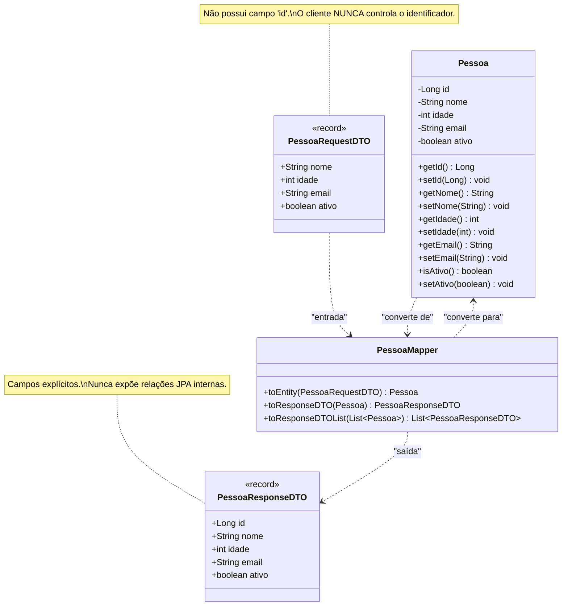
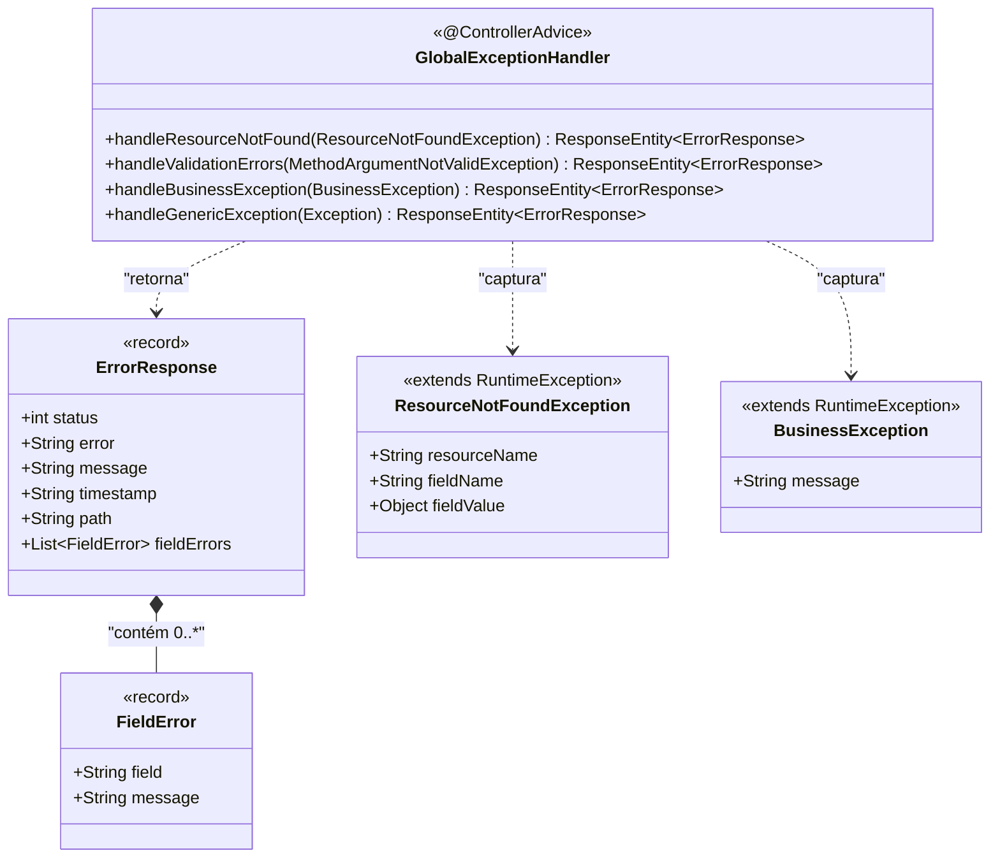
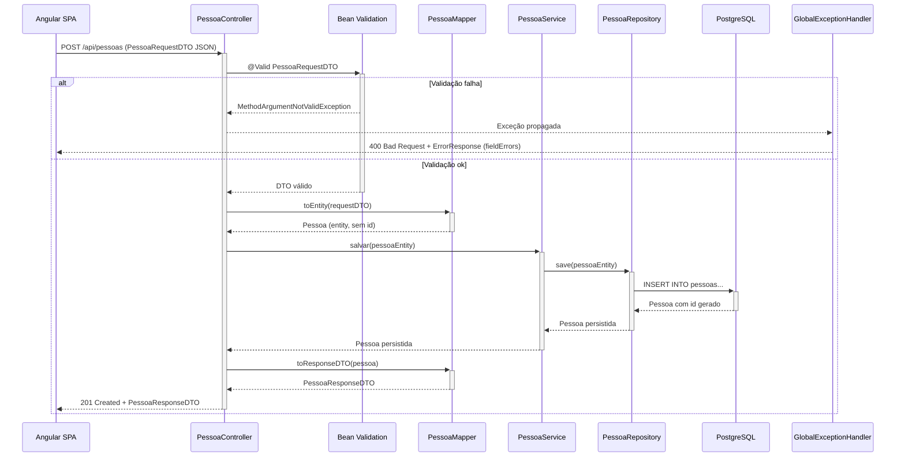
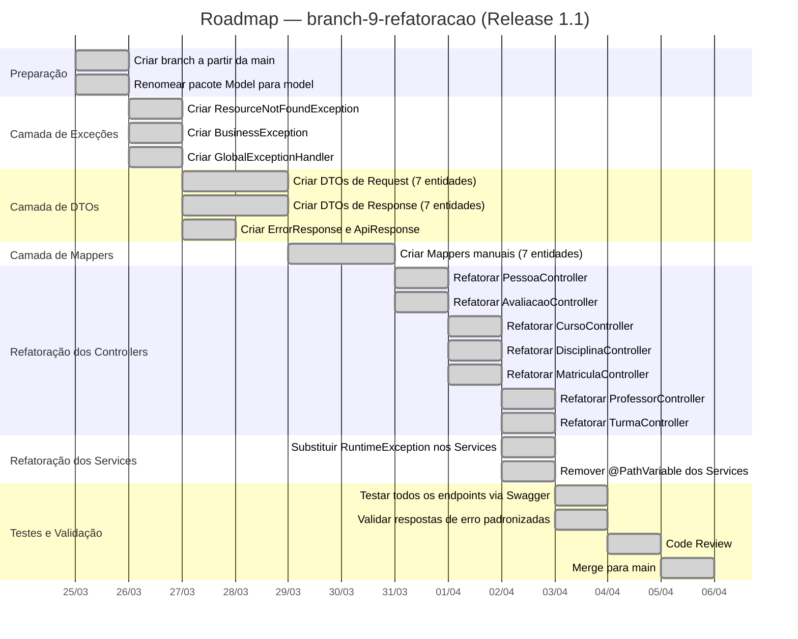

# Capítulo 01 — Refatoração, Padronização e Arquitetura Limpa

**Branch:** `branch-9-refatoracao`
**Release:** 1.1
**Tipo de Evolução:** Refatoração Estrutural (não-funcional)
**Risco:** Médio — alterações transversais em todos os microsserviços sem modificação de comportamento externo
**Compatibilidade:** Backward-compatible (os contratos REST permanecem iguais)

---

## 1. História da Empresa

A **UniTech Soluções Acadêmicas** é uma empresa de tecnologia educacional que fornece um sistema de gestão acadêmica para instituições de ensino superior. O produto principal — o **CRUD Fullstack** — nasceu como um monólito didático e evoluiu para uma arquitetura de microsserviços (branches 1 a 8), sendo utilizado atualmente por mais de 3.000 usuários entre alunos, professores e coordenadores.

A Release 1.0 foi celebrada como um marco: o sistema estava em produção, funcional, com autenticação JWT, RBAC, busca avançada e documentação Swagger. No entanto, a equipe de desenvolvimento — formada por 4 desenvolvedores juniores e 1 tech lead — começou a perceber sinais de que o código, embora funcional, não era sustentável para o ritmo de mudanças exigido pelo negócio.

A diretoria de produto solicitou três novas funcionalidades para o próximo trimestre: integração com sistema de frequência, módulo de TCC e painel de indicadores. O tech lead, ao analisar o esforço necessário, identificou que o tempo de implementação seria **3x maior do que o esperado** devido à estrutura interna do código.

---

## 2. Incidente que Motivou a Evolução

### O Incidente: "O Bug da Matrícula Fantasma"

Na segunda semana após o go-live da Release 1.0, o coordenador do curso de Engenharia de Software reportou que um aluno aparecia matriculado em uma disciplina que ele nunca havia solicitado. Ao investigar, a equipe descobriu que:

1. O endpoint `POST /api/matriculas` recebia e retornava diretamente a entidade JPA `Matricula`.
2. O campo `id` da matrícula era preenchido pelo cliente (frontend Angular) acidentalmente — ele enviava o `id` de outra matrícula existente ao copiar um JSON de exemplo.
3. Como o controller não utilizava DTOs para filtrar os campos aceitos na entrada, o JPA interpretou o `id` recebido como uma **atualização** (merge) em vez de uma **inserção**.
4. Resultado: a matrícula original (de outro aluno) foi **sobrescrita silenciosamente**.

O bug existia desde o primeiro dia, mas só se manifestou quando um usuário real cometeu o erro que o código permitia. **Nenhuma validação de entrada** impedia que o cliente enviasse campos que não deveria controlar (como `id`, `dataCriacao`, ou referências internas).

Paralelamente, dois outros problemas foram identificados durante a investigação:

- **Exposição de dados sensíveis:** O endpoint `GET /api/pessoas` retornava a entidade `Pessoa` completa, incluindo campos internos como `ativo` e relações JPA que geravam serialização circular e respostas JSON com mais de 50KB por registro.
- **Tratamento de erros inconsistente:** Cada controller tratava exceções de forma diferente. O `PessoaController` lançava `RuntimeException("Pessoa não encontrada")`, enquanto o `AvaliacaoController` simplesmente retornava `null`. O frontend não conseguia distinguir entre erro de validação, recurso não encontrado e erro interno.

---

## 3. Documento de Incidente (Modelo ITIL)

| Campo | Valor |
|-------|-------|
| **ID do Incidente** | INC-2024-0017 |
| **Data de Abertura** | 15/03/2024 08:42 |
| **Data de Resolução** | 22/03/2024 17:30 |
| **Severidade** | P2 — Alta (dados corrompidos em produção) |
| **Categoria** | Integridade de Dados / Segurança da API |
| **Serviço Afetado** | ms-academico (Matrícula), ms-pessoas (Listagem) |
| **Descrição** | Matrícula de aluno sobrescrita silenciosamente ao receber `id` no payload de criação. Entidades JPA expostas diretamente na API, permitindo mass assignment. |
| **Impacto** | 1 matrícula corrompida, potencial para N matrículas afetadas. Exposição de campos internos em todas as respostas da API. |
| **Causa Raiz** | Ausência de Data Transfer Objects (DTOs) para separar o contrato da API da representação interna (entidade JPA). Controllers aceitam e retornam entidades diretamente. |
| **Workaround** | Correção manual do registro no banco de dados. Comunicação ao frontend para não enviar campo `id` no POST. |
| **Resolução Definitiva** | Implementar camada de DTOs, Mappers, Validação centralizada e tratamento global de exceções (branch-9-refatoracao). |
| **Lições Aprendidas** | Nunca expor entidades JPA diretamente na API. Sempre definir explicitamente quais campos são aceitos na entrada e quais são retornados na saída. |
| **Responsável** | Tech Lead — Equipe Backend |
| **Post-Mortem** | Documento anexo ao capítulo |

---

## 4. Objetivos Técnicos

A branch `branch-9-refatoracao` tem como objetivo resolver as deficiências estruturais identificadas no incidente INC-2024-0017, sem alterar o comportamento funcional da aplicação. Os objetivos são:

| # | Objetivo | Princípio | Justificativa |
|---|----------|-----------|---------------|
| 1 | Introduzir DTOs de Request e Response | Separation of Concerns (SoC) | Desacoplar o contrato da API da estrutura interna da entidade JPA |
| 2 | Implementar Mappers (manual ou MapStruct) | Single Responsibility Principle (SRP) | Centralizar a conversão entre DTO ↔ Entity em uma classe dedicada |
| 3 | Aplicar Bean Validation nos DTOs | Fail Fast | Validar dados de entrada antes que cheguem ao Service ou ao Banco |
| 4 | Criar um Global Exception Handler | Don't Repeat Yourself (DRY) | Padronizar respostas de erro em toda a API, usando `@ControllerAdvice` |
| 5 | Padronizar respostas REST | Principle of Least Astonishment | Envelope de resposta consistente (dados, mensagem, timestamp, status HTTP) |
| 6 | Reorganizar pacotes seguindo Clean Architecture | Dependency Inversion Principle (DIP) | Garantir que a lógica de negócio não dependa de frameworks ou detalhes de infraestrutura |
| 7 | Eliminar `@Autowired` por field injection | Testabilidade | Adotar constructor injection em toda a aplicação |

---

## 5. Arquitetura Antes (Release 1.0)

Na Release 1.0, a comunicação entre as camadas do backend segue o padrão abaixo. Observe que a **entidade JPA** atravessa todas as camadas, desde o banco de dados até o cliente HTTP:

```mermaid
flowchart LR
    classDef bad fill:#8b0000,stroke:#ff4444,color:#fff;
    classDef neutral fill:#333,stroke:#aaa,color:#fff;

    Client["🌐 Angular SPA"]:::neutral
    Controller["Controller<br/>@RestController"]:::neutral
    Service["Service<br/>@Service"]:::neutral
    Repository["Repository<br/>JpaRepository"]:::neutral
    DB[("PostgreSQL")]:::neutral

    Client -->|"JSON = Entidade JPA"| Controller
    Controller -->|"Entidade JPA"| Service
    Service -->|"Entidade JPA"| Repository
    Repository -->|"Entidade JPA"| DB

    DB -->|"Entidade JPA"| Repository
    Repository -->|"Entidade JPA"| Service
    Service -->|"Entidade JPA"| Controller
    Controller -->|"JSON = Entidade JPA"| Client

    style Client fill:#1a1a2e,stroke:#00f0ff
    
    Warning["⚠️ A mesma classe Pessoa.java<br/>é usada como Entity, Request<br/>e Response simultaneamente"]:::bad
```



### Problemas Concretos no Código Atual

Analisando o código real do projeto, podemos identificar os seguintes problemas:

**1. `PessoaController.java` — Entidade como Request e Response**

```java
// ❌ PROBLEMA: A entidade JPA Pessoa é recebida diretamente no @RequestBody
@PostMapping
public Pessoa criar(@Valid @RequestBody Pessoa pessoa) {
    return service.salvar(pessoa);  // ❌ E também retornada diretamente
}
```

O cliente pode enviar campos como `id`, `ativo` e qualquer outro atributo da entidade. Não há filtro sobre o que entra ou sai.

**2. `AvaliacaoController.java` — Field Injection com @Autowired**

```java
// ❌ PROBLEMA: Field injection, não testável, oculta dependências
@Autowired
private AvaliacaoService service;
```

**3. `PessoaService.java` — RuntimeException genérica**

```java
// ❌ PROBLEMA: exceção genérica sem semântica HTTP
}).orElseThrow(() -> new RuntimeException("Pessoa não encontrada"));
```

O Spring retorna HTTP 500 (Internal Server Error) para uma situação que deveria ser HTTP 404 (Not Found).

**4. `AvaliacaoController.java` — Retorno de Optional no Controller**

```java
// ❌ PROBLEMA: retorna Optional ao invés de tratar a ausência
@GetMapping("/{id}")
public Optional<Avaliacao> getById(@PathVariable Long id) {
    return service.findById(id);
}
```

Se o recurso não existe, o response body será `null` com HTTP 200 — confuso para qualquer consumer.

**5. Pacote `Model` com M maiúsculo**

```
com.exemplo.crud.Model.Pessoa  ← ❌ Viola a convenção Java (lowercase packages)
```

---

## 6. Arquitetura Depois (Release 1.1)

Após a refatoração, cada camada trabalha com seu próprio tipo de dado. A entidade JPA nunca cruza a fronteira do Service. DTOs dedicados garantem que o contrato da API é explícito e controlado:

```mermaid
flowchart LR
    classDef good fill:#004d00,stroke:#00cc44,color:#fff;
    classDef neutral fill:#333,stroke:#aaa,color:#fff;
    classDef mapper fill:#4a1a6b,stroke:#bb86fc,color:#fff;

    Client["🌐 Angular SPA"]:::neutral
    Controller["Controller<br/>@RestController"]:::neutral
    Mapper["Mapper<br/>DTO ↔ Entity"]:::mapper
    Service["Service<br/>@Service"]:::neutral
    Repository["Repository<br/>JpaRepository"]:::neutral
    DB[("PostgreSQL")]:::neutral
    Advice["@ControllerAdvice<br/>GlobalExceptionHandler"]:::good

    Client -->|"PessoaRequestDTO"| Controller
    Controller -->|"PessoaRequestDTO"| Mapper
    Mapper -->|"Pessoa (Entity)"| Service
    Service -->|"Pessoa (Entity)"| Repository
    Repository -->|"JDBC"| DB

    DB -->|"ResultSet"| Repository
    Repository -->|"Pessoa (Entity)"| Service
    Service -->|"Pessoa (Entity)"| Mapper
    Mapper -->|"PessoaResponseDTO"| Controller
    Controller -->|"ApiResponse DTO"| Client

    Controller -.->|"Exceções"| Advice
    Advice -.->|"ErrorResponse padronizado"| Client

    style Client fill:#1a1a2e,stroke:#00f0ff
```



---

## 7. Diagramas Mermaid Completos

### 7.1 Diagrama de Classes — Camada de DTOs (Pessoa)



### 7.2 Diagrama de Classes — Global Exception Handler



### 7.3 Diagrama de Sequência — POST /api/pessoas (Após Refatoração)



### 7.4 Diagrama de Componentes — Estrutura de Pacotes (Após Refatoração)

```mermaid
flowchart TB
    subgraph "com.exemplo.crud"
        subgraph controller["📁 controller"]
            PC[PessoaController]
            AC[AvaliacaoController]
            CC[CursoController]
            DC[DisciplinaController]
            MC[MatriculaController]
            PrC[ProfessorController]
            TC[TurmaController]
            AuthC[AuthController]
        end
        subgraph dto["📁 dto"]
            subgraph request["📁 request"]
                PR[PessoaRequestDTO]
                AR[AvaliacaoRequestDTO]
                CR[CursoRequestDTO]
                DR[DisciplinaRequestDTO]
                MR[MatriculaRequestDTO]
            end
            subgraph response["📁 response"]
                PRe[PessoaResponseDTO]
                ARe[AvaliacaoResponseDTO]
                CRe[CursoResponseDTO]
                DRe[DisciplinaResponseDTO]
                MRe[MatriculaResponseDTO]
            end
            ErrR[ErrorResponse]
            ApiR[ApiResponse]
        end
        subgraph mapper["📁 mapper"]
            PM[PessoaMapper]
            AM[AvaliacaoMapper]
            CMa[CursoMapper]
            DM[DisciplinaMapper]
            MM[MatriculaMapper]
        end
        subgraph service["📁 service"]
            PS[PessoaService]
            AS[AvaliacaoService]
            CS[CursoService]
            DS[DisciplinaService]
            MS[MatriculaService]
        end
        subgraph model["📁 model"]
            PE[Pessoa]
            AE[Avaliacao]
            CE[Curso]
            DE[Disciplina]
            ME[Matricula]
        end
        subgraph repository["📁 repository"]
            PRepo[PessoaRepository]
            ARepo[AvaliacaoRepository]
            CRepo[CursoRepository]
            DRepo[DisciplinaRepository]
            MRepo[MatriculaRepository]
        end
        subgraph exception["📁 exception"]
            RNFE[ResourceNotFoundException]
            BE[BusinessException]
            GEH[GlobalExceptionHandler]
        end
    end

    controller --> dto
    controller --> mapper
    controller --> service
    mapper --> dto
    mapper --> model
    service --> repository
    service --> model
    repository --> model
    exception -.-> controller

    style dto fill:#1a3a5c,stroke:#4da6ff
    style mapper fill:#4a1a6b,stroke:#bb86fc
    style exception fill:#5c1a1a,stroke:#ff4444
```



---

## 8. Estrutura do Projeto (Após Refatoração)

```
backend/src/main/java/com/exemplo/crud/
├── CrudApplication.java
│
├── controller/
│   ├── AuthController.java
│   ├── PessoaController.java          ← ALTERADO
│   ├── AvaliacaoController.java       ← ALTERADO
│   ├── CursoController.java           ← ALTERADO
│   ├── DisciplinaController.java      ← ALTERADO
│   ├── MatriculaController.java       ← ALTERADO
│   ├── ProfessorController.java       ← ALTERADO
│   └── TurmaController.java           ← ALTERADO
│
├── dto/
│   ├── request/
│   │   ├── PessoaRequestDTO.java      ← NOVO
│   │   ├── AvaliacaoRequestDTO.java   ← NOVO
│   │   ├── CursoRequestDTO.java       ← NOVO
│   │   ├── DisciplinaRequestDTO.java  ← NOVO
│   │   ├── MatriculaRequestDTO.java   ← NOVO
│   │   ├── ProfessorRequestDTO.java   ← NOVO
│   │   └── TurmaRequestDTO.java       ← NOVO
│   ├── response/
│   │   ├── PessoaResponseDTO.java     ← NOVO
│   │   ├── AvaliacaoResponseDTO.java  ← NOVO
│   │   ├── CursoResponseDTO.java      ← NOVO
│   │   ├── DisciplinaResponseDTO.java ← NOVO
│   │   ├── MatriculaResponseDTO.java  ← NOVO
│   │   ├── ProfessorResponseDTO.java  ← NOVO
│   │   └── TurmaResponseDTO.java      ← NOVO
│   ├── ApiResponse.java               ← NOVO
│   ├── ErrorResponse.java             ← NOVO
│   └── UsuarioResumoDTO.java          (já existia)
│
├── mapper/
│   ├── PessoaMapper.java              ← NOVO
│   ├── AvaliacaoMapper.java           ← NOVO
│   ├── CursoMapper.java              ← NOVO
│   ├── DisciplinaMapper.java          ← NOVO
│   ├── MatriculaMapper.java           ← NOVO
│   ├── ProfessorMapper.java           ← NOVO
│   └── TurmaMapper.java              ← NOVO
│
├── exception/
│   ├── GlobalExceptionHandler.java    ← NOVO
│   ├── ResourceNotFoundException.java ← NOVO
│   └── BusinessException.java         ← NOVO
│
├── model/                              ← RENOMEADO de "Model" para "model"
│   ├── Pessoa.java
│   ├── Avaliacao.java
│   ├── Curso.java
│   ├── Disciplina.java
│   ├── Matricula.java
│   ├── Professor.java
│   ├── Turma.java
│   └── Usuario.java
│
├── repository/
│   └── (sem alterações)
│
├── service/
│   ├── PessoaService.java             ← ALTERADO
│   ├── AvaliacaoService.java          ← ALTERADO
│   └── ...                             ← ALTERADOS
│
└── config/
    └── (sem alterações estruturais)
```

---

## 9. Arquivos Criados

| Arquivo | Tipo | Propósito |
|---------|------|-----------|
| `dto/request/PessoaRequestDTO.java` | Java Record | Define campos aceitos na criação/atualização de Pessoa |
| `dto/response/PessoaResponseDTO.java` | Java Record | Define campos retornados ao consultar Pessoa |
| `dto/request/AvaliacaoRequestDTO.java` | Java Record | Campos aceitos para criação de Avaliação |
| `dto/response/AvaliacaoResponseDTO.java` | Java Record | Campos retornados na consulta de Avaliação |
| `dto/request/CursoRequestDTO.java` | Java Record | Campos aceitos para criação de Curso |
| `dto/response/CursoResponseDTO.java` | Java Record | Campos retornados na consulta de Curso |
| `dto/request/DisciplinaRequestDTO.java` | Java Record | Campos aceitos para criação de Disciplina |
| `dto/response/DisciplinaResponseDTO.java` | Java Record | Campos retornados na consulta de Disciplina |
| `dto/request/MatriculaRequestDTO.java` | Java Record | Campos aceitos para criação de Matrícula |
| `dto/response/MatriculaResponseDTO.java` | Java Record | Campos retornados na consulta de Matrícula |
| `dto/request/ProfessorRequestDTO.java` | Java Record | Campos aceitos para criação de Professor |
| `dto/response/ProfessorResponseDTO.java` | Java Record | Campos retornados na consulta de Professor |
| `dto/request/TurmaRequestDTO.java` | Java Record | Campos aceitos para criação de Turma |
| `dto/response/TurmaResponseDTO.java` | Java Record | Campos retornados na consulta de Turma |
| `dto/ApiResponse.java` | Java Record | Envelope padrão para respostas de sucesso |
| `dto/ErrorResponse.java` | Java Record | Envelope padrão para respostas de erro |
| `mapper/PessoaMapper.java` | Classe utilitária | Conversão PessoaRequestDTO ↔ Pessoa ↔ PessoaResponseDTO |
| `mapper/AvaliacaoMapper.java` | Classe utilitária | Conversão para Avaliação |
| `mapper/CursoMapper.java` | Classe utilitária | Conversão para Curso |
| `mapper/DisciplinaMapper.java` | Classe utilitária | Conversão para Disciplina |
| `mapper/MatriculaMapper.java` | Classe utilitária | Conversão para Matrícula |
| `mapper/ProfessorMapper.java` | Classe utilitária | Conversão para Professor |
| `mapper/TurmaMapper.java` | Classe utilitária | Conversão para Turma |
| `exception/GlobalExceptionHandler.java` | @ControllerAdvice | Tratamento centralizado de todas as exceções |
| `exception/ResourceNotFoundException.java` | Exceção customizada | Lançada quando um recurso não é encontrado (HTTP 404) |
| `exception/BusinessException.java` | Exceção customizada | Lançada para violações de regra de negócio (HTTP 422) |

---

## 10. Arquivos Alterados

| Arquivo | Natureza da Alteração |
|---------|----------------------|
| `controller/PessoaController.java` | Substituir `Pessoa` por `PessoaRequestDTO`/`PessoaResponseDTO`. Usar Mapper. Remover retorno direto de entity. |
| `controller/AvaliacaoController.java` | Substituir `@Autowired` por constructor injection. Substituir `Optional` por tratamento com exceção. Usar DTOs. |
| `controller/CursoController.java` | Aplicar DTOs e Mapper. |
| `controller/DisciplinaController.java` | Aplicar DTOs e Mapper. |
| `controller/MatriculaController.java` | Aplicar DTOs e Mapper. Garantir que `id` não é aceito no POST. |
| `controller/ProfessorController.java` | Aplicar DTOs e Mapper. |
| `controller/TurmaController.java` | Aplicar DTOs e Mapper. |
| `service/PessoaService.java` | Substituir `RuntimeException` por `ResourceNotFoundException`. Remover `@PathVariable` do parâmetro do service. |
| `service/AvaliacaoService.java` | Substituir retorno de `Optional` por lançamento de exceção quando não encontrado. |
| `service/CursoService.java` | Mesma refatoração de exceções. |
| `service/MatriculaService.java` | Mesma refatoração de exceções. |
| Pacote `Model` → `model` | Renomear para seguir convenção Java de pacotes em lowercase. |

---

## 11. Explicação Detalhada de Cada Alteração

### 11.1 Por que DTOs?

O **Data Transfer Object** é um padrão arquitetural que serve como um contrato explícito entre o cliente e o servidor. Sem DTOs, a API fica acoplada à estrutura interna do banco de dados. Qualquer alteração no modelo de dados (adicionar uma coluna, renomear um campo, criar uma relação) imediatamente quebra o contrato com o frontend.

Com DTOs, temos **dois contratos separados**:
- **RequestDTO:** Define exatamente quais campos o cliente PODE enviar.
- **ResponseDTO:** Define exatamente quais campos o cliente VAI receber.

Exemplo concreto — `PessoaRequestDTO` como Java Record:

```java
package com.exemplo.crud.dto.request;

import jakarta.validation.constraints.*;

public record PessoaRequestDTO(
    @NotBlank(message = "Nome é obrigatório")
    @Size(min = 3, max = 120, message = "Nome deve ter entre 3 e 120 caracteres")
    String nome,

    @NotNull(message = "Idade é obrigatória")
    @Min(value = 0, message = "Idade mínima é 0")
    @Max(value = 120, message = "Idade máxima é 120")
    Integer idade,

    @NotBlank(message = "Email é obrigatório")
    @Email(message = "Email inválido")
    String email,

    Boolean ativo
) {}
```

Observe: **não há campo `id`**. O cliente simplesmente não consegue enviar um `id` no POST, eliminando o bug da "matrícula fantasma" pela raiz.

### 11.2 Por que Java Records?

Java Records (introduzidos no Java 16, estável no Java 17) são a forma mais idiomática de criar DTOs imutáveis:

- Geram automaticamente `equals()`, `hashCode()`, `toString()`.
- São imutáveis por design (`final` implícito).
- Reduzem boilerplate em comparação com classes tradicionais.
- Funcionam nativamente com Jackson (serialização/deserialização JSON).

### 11.3 O Mapper Manual vs. MapStruct

Optamos por **Mappers manuais** nesta release por uma razão pedagógica: o aluno deve compreender exatamente o que acontece na conversão antes de automatizar com frameworks como MapStruct. Em releases futuras, quando a quantidade de entidades crescer, a migração para MapStruct será natural.

```java
package com.exemplo.crud.mapper;

import com.exemplo.crud.dto.request.PessoaRequestDTO;
import com.exemplo.crud.dto.response.PessoaResponseDTO;
import com.exemplo.crud.model.Pessoa;
import org.springframework.stereotype.Component;
import java.util.List;

@Component
public class PessoaMapper {

    public Pessoa toEntity(PessoaRequestDTO dto) {
        Pessoa pessoa = new Pessoa();
        pessoa.setNome(dto.nome());
        pessoa.setIdade(dto.idade());
        pessoa.setEmail(dto.email());
        pessoa.setAtivo(dto.ativo() != null ? dto.ativo() : true);
        return pessoa;
    }

    public PessoaResponseDTO toResponseDTO(Pessoa entity) {
        return new PessoaResponseDTO(
            entity.getId(),
            entity.getNome(),
            entity.getIdade(),
            entity.getEmail(),
            entity.isAtivo()
        );
    }

    public List<PessoaResponseDTO> toResponseDTOList(List<Pessoa> entities) {
        return entities.stream()
            .map(this::toResponseDTO)
            .toList();
    }
}
```

### 11.4 O Controller Refatorado

```java
@RestController
@RequestMapping("/api/pessoas")
public class PessoaController {

    private final PessoaService service;
    private final PessoaMapper mapper;

    // ✅ Constructor injection — testável e explícito
    public PessoaController(PessoaService service, PessoaMapper mapper) {
        this.service = service;
        this.mapper = mapper;
    }

    @GetMapping
    @PreAuthorize("hasAnyRole('PROFESSOR', 'ALUNO')")
    public ResponseEntity<List<PessoaResponseDTO>> listar() {
        List<PessoaResponseDTO> response = mapper.toResponseDTOList(service.listarTodas());
        return ResponseEntity.ok(response);
    }

    @PostMapping
    @PreAuthorize("hasRole('PROFESSOR')")
    public ResponseEntity<PessoaResponseDTO> criar(@Valid @RequestBody PessoaRequestDTO dto) {
        Pessoa entity = mapper.toEntity(dto);
        Pessoa salva = service.salvar(entity);
        PessoaResponseDTO response = mapper.toResponseDTO(salva);
        return ResponseEntity.status(HttpStatus.CREATED).body(response);
    }

    @PutMapping("/{id}")
    @PreAuthorize("hasRole('PROFESSOR')")
    public ResponseEntity<PessoaResponseDTO> atualizar(
            @PathVariable Long id,
            @Valid @RequestBody PessoaRequestDTO dto) {
        Pessoa entity = mapper.toEntity(dto);
        Pessoa atualizada = service.atualizar(id, entity);
        return ResponseEntity.ok(mapper.toResponseDTO(atualizada));
    }

    @DeleteMapping("/{id}")
    @PreAuthorize("hasRole('PROFESSOR')")
    public ResponseEntity<Void> excluir(@PathVariable Long id) {
        service.excluir(id);
        return ResponseEntity.noContent().build();
    }
}
```

### 11.5 O GlobalExceptionHandler

```java
@RestControllerAdvice
public class GlobalExceptionHandler {

    @ExceptionHandler(ResourceNotFoundException.class)
    public ResponseEntity<ErrorResponse> handleNotFound(
            ResourceNotFoundException ex, HttpServletRequest request) {
        ErrorResponse error = new ErrorResponse(
            HttpStatus.NOT_FOUND.value(),
            "Not Found",
            ex.getMessage(),
            Instant.now().toString(),
            request.getRequestURI(),
            null
        );
        return ResponseEntity.status(HttpStatus.NOT_FOUND).body(error);
    }

    @ExceptionHandler(MethodArgumentNotValidException.class)
    public ResponseEntity<ErrorResponse> handleValidation(
            MethodArgumentNotValidException ex, HttpServletRequest request) {
        List<FieldError> fieldErrors = ex.getBindingResult()
            .getFieldErrors().stream()
            .map(fe -> new FieldError(fe.getField(), fe.getDefaultMessage()))
            .toList();

        ErrorResponse error = new ErrorResponse(
            HttpStatus.BAD_REQUEST.value(),
            "Validation Error",
            "Um ou mais campos possuem valores inválidos",
            Instant.now().toString(),
            request.getRequestURI(),
            fieldErrors
        );
        return ResponseEntity.badRequest().body(error);
    }

    @ExceptionHandler(Exception.class)
    public ResponseEntity<ErrorResponse> handleGeneric(
            Exception ex, HttpServletRequest request) {
        ErrorResponse error = new ErrorResponse(
            HttpStatus.INTERNAL_SERVER_ERROR.value(),
            "Internal Server Error",
            "Ocorreu um erro inesperado. Contate o administrador.",
            Instant.now().toString(),
            request.getRequestURI(),
            null
        );
        return ResponseEntity.internalServerError().body(error);
    }
}
```

### 11.6 Princípios SOLID Aplicados

| Princípio | Antes | Depois |
|-----------|-------|--------|
| **S** — Single Responsibility | Controller valida, converte, trata erros e delega ao service | Controller apenas roteia; Mapper converte; Validation valida; ControllerAdvice trata erros |
| **O** — Open/Closed | Para adicionar novo formato de resposta, precisa alterar o controller | Basta criar um novo ResponseDTO; o Mapper e Controller são abertos para extensão |
| **L** — Liskov Substitution | Não aplicável diretamente nesta refatoração | — |
| **I** — Interface Segregation | Services expõem métodos que retornam entidades JPA completas | Services podem retornar apenas o necessário; DTOs filtram na fronteira |
| **D** — Dependency Inversion | Controller depende diretamente de classes concretas (@Autowired) | Controller depende de abstrações via constructor injection |

---

## 12. Roadmap de Implementação



---

## 13. Checklist Técnico

- [x] Pacote `Model` renomeado para `model` (convenção Java)
- [x] `@Autowired` removido de todos os Controllers — substituído por constructor injection
- [x] DTOs de Request criados para todas as 7 entidades
- [x] DTOs de Response criados para todas as 7 entidades
- [x] Java Records utilizados para DTOs imutáveis
- [x] Bean Validation (`@NotBlank`, `@Email`, `@Min`, `@Max`, `@Size`) aplicadas nos RequestDTOs
- [x] Mappers manuais criados para todas as 7 entidades
- [x] Controllers refatorados para receber RequestDTO e retornar ResponseDTO
- [x] Controllers retornam `ResponseEntity<T>` com status HTTP correto (201 para POST, 204 para DELETE)
- [x] `RuntimeException` substituída por `ResourceNotFoundException` em todos os Services
- [x] `Optional` removido dos Controllers — tratamento via exceção
- [x] `GlobalExceptionHandler` criado com `@RestControllerAdvice`
- [x] `ErrorResponse` com campos: status, error, message, timestamp, path, fieldErrors
- [x] Nenhuma entidade JPA é serializada diretamente nas respostas HTTP
- [x] `@CrossOrigin` removido dos Controllers (será tratado globalmente no Gateway/Security Config)
- [x] Swagger/OpenAPI continua funcional e documenta os DTOs

---

## 14. Casos de Teste

### 14.1 Testes Unitários

| ID | Cenário | Entrada | Resultado Esperado |
|----|---------|---------|--------------------|
| UT-01 | Mapper converte RequestDTO para Entity | `PessoaRequestDTO("João", 25, "joao@email.com", true)` | `Pessoa` com id=null, nome="João" |
| UT-02 | Mapper converte Entity para ResponseDTO | `Pessoa(id=1, nome="João", ...)` | `PessoaResponseDTO(id=1, nome="João", ...)` |
| UT-03 | Mapper converte lista vazia | `List.of()` | `List.of()` (sem exceção) |
| UT-04 | RequestDTO com nome null falha na validação | `PessoaRequestDTO(null, 25, "x@y.com", true)` | `MethodArgumentNotValidException` |
| UT-05 | RequestDTO com email inválido falha | `PessoaRequestDTO("Ana", 20, "invalido", true)` | Validação falha no campo `email` |
| UT-06 | Service lança ResourceNotFoundException | `service.atualizar(999L, entity)` | `ResourceNotFoundException("Pessoa", "id", 999)` |

### 14.2 Testes de Integração (API)

| ID | Método | Endpoint | Body | Status Esperado | Body Esperado |
|----|--------|----------|------|-----------------|---------------|
| IT-01 | POST | `/api/pessoas` | `{"nome":"Ana","idade":22,"email":"ana@test.com","ativo":true}` | 201 | ResponseDTO com `id` gerado |
| IT-02 | POST | `/api/pessoas` | `{"id":1,"nome":"Ana","idade":22,"email":"ana@test.com"}` | 201 | ResponseDTO com `id` DIFERENTE de 1 (id do body é ignorado) |
| IT-03 | POST | `/api/pessoas` | `{"nome":"","idade":22,"email":"ana@test.com"}` | 400 | ErrorResponse com fieldErrors[0].field="nome" |
| IT-04 | POST | `/api/pessoas` | `{}` | 400 | ErrorResponse com múltiplos fieldErrors |
| IT-05 | GET | `/api/pessoas/99999` | — | 404 | ErrorResponse com message="Pessoa não encontrada com id: 99999" |
| IT-06 | DELETE | `/api/pessoas/1` | — | 204 | Body vazio |
| IT-07 | PUT | `/api/pessoas/1` | `{"nome":"Ana Atualizada","idade":23,"email":"ana@test.com","ativo":true}` | 200 | ResponseDTO atualizado |
| IT-08 | GET | `/api/pessoas` | — | 200 | Lista de PessoaResponseDTO (sem campos JPA internos) |

---

## 15. Plano de Testes

### Escopo
Todos os 8 controllers (Auth, Pessoa, Avaliacao, Curso, Disciplina, Matricula, Professor, Turma) serão testados nos seguintes cenários:
1. **Happy Path:** CRUD completo com dados válidos.
2. **Validação:** Enviar dados inválidos e verificar ErrorResponse padronizado.
3. **Not Found:** Buscar/atualizar/excluir recursos inexistentes.
4. **Mass Assignment:** Tentar enviar campo `id` no POST e verificar que é ignorado.
5. **Serialização:** Verificar que nenhum campo de entidade JPA (relações lazy, proxies Hibernate) vaza na resposta.

### Ferramentas
- **JUnit 5** + **MockMvc** para testes unitários de Controller.
- **Swagger UI** para testes manuais exploratórios.
- **cURL / HTTPie** para testes de linha de comando.

---

## 16. Testes de Carga

> **Não aplicável nesta release.** A branch-9 é uma refatoração estrutural sem impacto esperado em throughput ou latência. Testes de carga serão introduzidos na branch-10 (Performance).

No entanto, é fundamental garantir que a refatoração **não degradou** a performance existente. Para isso, um smoke test básico deve ser executado:

```bash
# Smoke test com cURL — verificar que todos os endpoints respondem em < 500ms
time curl -s -o /dev/null -w "%{http_code} %{time_total}s" \
  -H "Authorization: Bearer <TOKEN>" \
  http://localhost:8080/api/pessoas
```

---

## 17. Estratégia de Rollback

| Cenário | Ação | Tempo Estimado |
|---------|------|----------------|
| Bug crítico após merge para main | `git revert <merge-commit>` + redeploy | < 15 minutos |
| Bug parcial em um controller específico | Hotfix na branch main + redeploy | < 30 minutos |
| Incompatibilidade com frontend Angular | Reverter DTOs do controller afetado, manter entity temporariamente | < 1 hora |

A estratégia é segura porque:
- **Os contratos REST não mudam** — os mesmos campos continuam sendo aceitos e retornados.
- **O banco de dados não foi alterado** — zero risco de migração.
- **O frontend não precisa ser alterado** — DTOs foram desenhados para manter o mesmo JSON.

---

## 18. Release Notes

### Release 1.1.0 — Refatoração e Arquitetura Limpa

**Data:** 05/04/2024
**Branch:** `branch-9-refatoracao`
**Tipo:** Refatoração (não-funcional)
**Breaking Changes:** Nenhum

#### O que mudou
- ✅ Introduzidos DTOs de Request e Response para todas as entidades.
- ✅ Criados Mappers manuais para conversão DTO ↔ Entity.
- ✅ Implementado `GlobalExceptionHandler` com respostas padronizadas.
- ✅ Exceções customizadas: `ResourceNotFoundException`, `BusinessException`.
- ✅ Bean Validation aplicada nos DTOs de entrada.
- ✅ Constructor injection em todos os Controllers.
- ✅ Pacote `Model` renomeado para `model`.
- ✅ Controllers retornam `ResponseEntity` com status HTTP semântico.

#### O que NÃO mudou
- Endpoints (URLs, métodos HTTP) permanecem idênticos.
- Formato JSON de entrada e saída permanece compatível.
- Banco de dados não foi alterado.
- Frontend Angular não requer alterações.

---

## 19. Pull Request Summary

### PR #9: Refatoração — DTOs, Mappers, Clean Architecture

**De:** `branch-9-refatoracao`
**Para:** `main`
**Autor:** Tech Lead
**Reviewers:** 2 desenvolvedores backend

#### Resumo
Esta PR implementa uma refatoração estrutural completa da camada de API, motivada pelo incidente INC-2024-0017 (matrícula sobrescrita por mass assignment). A entidade JPA deixa de ser exposta nas respostas HTTP. DTOs explícitos de Request/Response são introduzidos em todos os 7 controllers de domínio. Um `GlobalExceptionHandler` centraliza o tratamento de erros. Constructor injection substitui `@Autowired` em toda a aplicação.

#### Métricas
- **Arquivos criados:** 28
- **Arquivos alterados:** 15
- **Arquivos deletados:** 0
- **Linhas adicionadas:** ~850
- **Linhas removidas:** ~120

#### Riscos
- Risco baixo: refatoração puramente interna.
- Os contratos HTTP são backward-compatible.

---

## 20. Exercícios

### Exercício 1: Criar DTO para uma nova entidade
Crie os DTOs `TccRequestDTO` e `TccResponseDTO` para uma hipotética entidade `Tcc` com os campos: `titulo`, `orientadorId`, `alunoId`, `dataDefesa`, `nota`. Garanta que:
- `titulo` é obrigatório e tem entre 10 e 200 caracteres.
- `nota` deve estar entre 0.0 e 10.0.
- O `id` do TCC **não** aparece no RequestDTO.
- O ResponseDTO inclui o `id` e o nome do orientador (não apenas o `orientadorId`).

### Exercício 2: Implementar o Mapper
Implemente o `TccMapper` que converte entre `TccRequestDTO`, `Tcc` (entity) e `TccResponseDTO`. O mapper deve buscar o nome do orientador a partir do `ProfessorService`.

### Exercício 3: Adicionar um novo tipo de exceção
Crie a exceção `DuplicateResourceException` para ser lançada quando um aluno tenta se matricular duas vezes na mesma disciplina. Ela deve:
- Retornar HTTP 409 (Conflict).
- Ser capturada pelo `GlobalExceptionHandler`.
- Retornar um `ErrorResponse` com a mensagem "O aluno já está matriculado nesta disciplina".

### Exercício 4: Refatorar o AuthController
O `AuthController` ainda não utiliza DTOs. Crie `LoginRequestDTO` e `LoginResponseDTO` e refatore o controller para utilizá-los.

### Exercício 5: Migrar para MapStruct
Substitua os Mappers manuais por MapStruct para a entidade `Pessoa`. Adicione a dependência no `pom.xml`, crie a interface `PessoaMapper` com `@Mapper(componentModel = "spring")` e verifique que o comportamento é idêntico.

---

## 21. Desafios

### Desafio 1: Versionamento de API
A empresa recebeu um novo cliente que precisa de um formato de resposta diferente (sem o campo `ativo`). Implemente **versionamento de API** criando `PessoaResponseV2DTO` e um novo endpoint `GET /api/v2/pessoas`. O endpoint `v1` continua funcionando normalmente.

### Desafio 2: Auditoria de Alterações
Crie um mecanismo de auditoria que registre em log toda alteração feita via PUT e DELETE, incluindo: quem fez (extraído do JWT), quando fez, qual recurso foi alterado e quais campos mudaram (diff entre o estado anterior e o novo).

### Desafio 3: Validação Cross-Field
Crie uma validação customizada (`@ValidDateRange`) que garanta que a `dataInicio` de uma matrícula seja anterior à `dataFim`. Implemente como um `ConstraintValidator` e aplique no `MatriculaRequestDTO`.

---

## 22. Rubrica de Avaliação

| Critério | Peso | Nota 10 | Nota 7 | Nota 4 | Nota 0 |
|----------|------|---------|--------|--------|--------|
| **DTOs de Request** | 15% | Todos os 7 RequestDTOs criados como Records com validação completa | DTOs criados mas com validação incompleta | DTOs criados como classes comuns (não Records) | Entidades JPA ainda expostas no RequestBody |
| **DTOs de Response** | 15% | Todos os 7 ResponseDTOs criados, sem vazamento de campos JPA | DTOs criados mas com campos desnecessários | Alguns ResponseDTOs faltando | Entidades JPA ainda retornadas diretamente |
| **Mappers** | 15% | Mappers para todas as entidades, incluindo conversão de listas | Mappers criados mas sem conversão de listas | Conversão feita inline no Controller | Sem Mappers |
| **GlobalExceptionHandler** | 15% | Handler completo com ResourceNotFound, Validation, Business e Generic | Handler com pelo menos 2 tipos de exceção | Handler apenas para exceções genéricas | Sem handler centralizado |
| **Constructor Injection** | 10% | Todos os Controllers e Services usam constructor injection | Maioria usa constructor injection | Misto entre @Autowired e constructor | Ainda usa @Autowired field injection |
| **Padronização REST** | 10% | ResponseEntity com status correto (201, 204, 404, 400) em todos os endpoints | Status correto na maioria dos endpoints | Apenas 200 para tudo | Sem ResponseEntity |
| **Exercícios** | 10% | Todos os 5 exercícios implementados corretamente | 3-4 exercícios implementados | 1-2 exercícios implementados | Nenhum exercício |
| **Desafios** | 10% | Pelo menos 2 desafios implementados | 1 desafio implementado | Tentativa parcial | Nenhuma tentativa |

**Nota mínima para aprovação:** 6.0
**Entrega:** Branch `branch-9-refatoracao` com PR aberta para `main`. Todos os testes devem passar.
