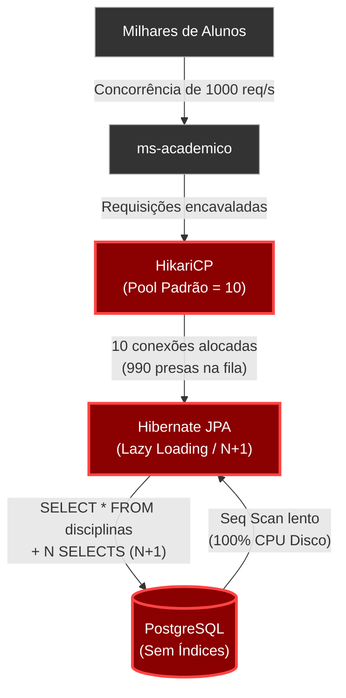
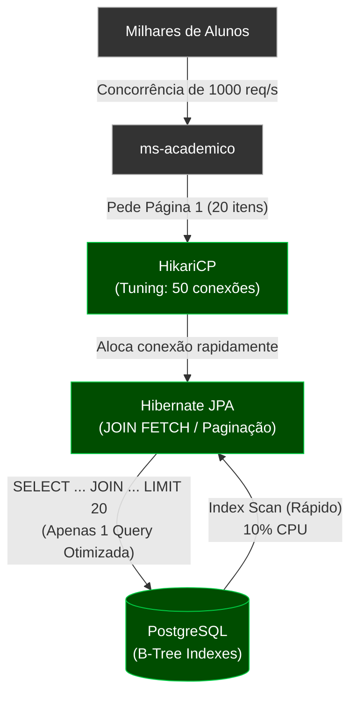
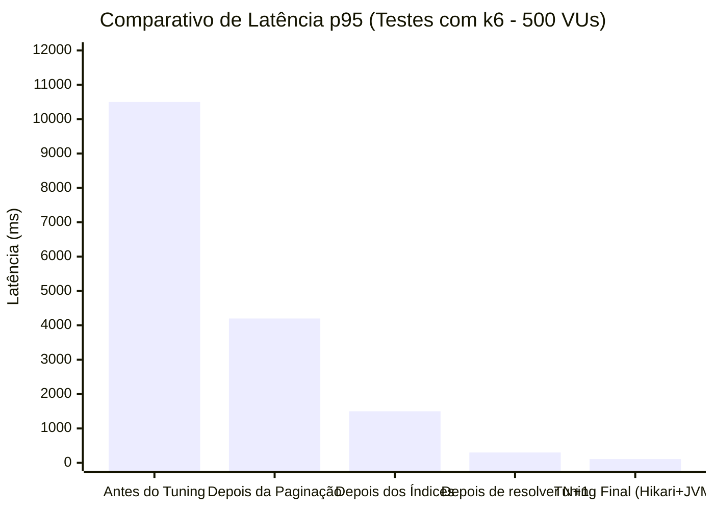
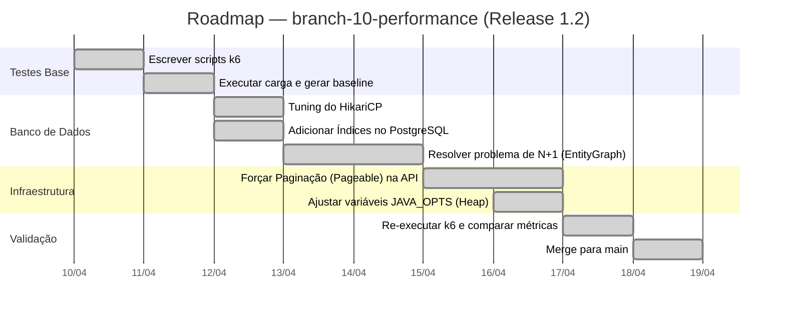

# Capítulo 02 — Performance e Tuning de Banco de Dados

**Branch:** `branch-10-performance`
**Release:** 1.2
**Tipo de Evolução:** Otimização de Desempenho (não-funcional)
**Risco:** Alto — alterações em queries SQL, criação de índices e tuning de pool de conexões.
**Compatibilidade:** Backward-compatible (contratos REST mantidos, comportamento inalterado, exceto por paginação em novos endpoints).

---

## 1. História da Empresa

Após o sucesso do lançamento da Release 1.0 e da refatoração técnica profunda realizada na Release 1.1, a **UniTech Soluções Acadêmicas** entrou em uma das fases mais críticas do seu ano letivo: **o período de matrículas do semestre de outono**.

A base de alunos ativos saltou de 3.000 para mais de 12.000 em um período de 48 horas. Embora a arquitetura baseada em microsserviços oferecesse escalabilidade lógica e isolamento de banco de dados, a configuração interna da aplicação e do PostgreSQL era baseada nos valores *default* (padrão) das ferramentas (Spring Boot e PostgreSQL Docker image).

No primeiro dia útil de matrículas, exatamente às 08:00 AM, milhares de alunos acessaram o portal simultaneamente para disputar as vagas nas disciplinas. O sistema, que até então apresentava tempos de resposta (latência) médios de 120ms, passou a responder em 5 a 10 segundos, culminando em dezenas de `504 Gateway Timeout` e um esgotamento completo dos recursos do banco de dados.

---

## 2. Incidente que Motivou a Evolução

### O Incidente: "A Grande Lentidão das Matrículas"

Às 08:15 AM, o suporte técnico da UniTech foi inundado com chamados de alunos que não conseguiam carregar a lista de disciplinas disponíveis. Ao analisar os parcos logs disponíveis (já que a observabilidade avançada será tema de uma release futura), a equipe identificou a seguinte reação em cadeia:

1. **Endpoint Estrangulado:** O endpoint `GET /api/disciplinas` estava sendo chamado para listar as centenas de disciplinas. O endpoint não possuía paginação.
2. **Problema do N+1 e Falta de Índices:** Ao buscar a lista de disciplinas e verificar os pré-requisitos, o Hibernate (JPA) estava executando centenas de queries no banco de dados para uma única requisição HTTP (o famoso problema N+1). O PostgreSQL, sem índices nas chaves estrangeiras, realizava um `Seq Scan` (varredura completa) na tabela.
3. **Exaustão do Pool de Conexões (HikariCP):** Como as queries estavam lentas, as conexões ficavam presas nas threads do Tomcat aguardando o banco. O HikariCP (pool padrão do Spring Boot) atinge seu limite padrão de 10 conexões. Quando o 11º aluno tentava acessar o sistema, recebia um erro genérico após 30 segundos de espera (`ConnectionTimeoutException`).
4. **Impacto na CPU e Memória:** O Container Docker do banco de dados atingiu 100% de CPU lidando com as varreduras sequenciais em disco e conexões travadas. A JVM do `ms-academico` começou a gerar `OutOfMemoryError: Java heap space` devido à quantidade massiva de objetos sendo carregados sem paginação.

---

## 3. Documento de Incidente (Modelo ITIL)

| Campo | Valor |
|-------|-------|
| **ID do Incidente** | INC-2024-0042 |
| **Data de Abertura** | 02/08/2024 08:15 |
| **Data de Resolução** | 02/08/2024 10:45 |
| **Severidade** | P1 — Crítica (Sistema indisponível para negócio core) |
| **Categoria** | Performance / Banco de Dados |
| **Serviço Afetado** | ms-academico (Disciplinas, Matrículas) |
| **Descrição** | Aplicação extremamente lenta (latência > 10s) e retornando timeouts durante pico de matrículas. Esgotamento de pool de conexões (HikariCP) e 100% de CPU no BD. |
| **Impacto** | ~4.500 alunos impossibilitados de realizar matrícula; degradação geral do portal do aluno. |
| **Causa Raiz** | (1) Falta de paginação em listagens pesadas; (2) Ausência de índices em FKs e campos de busca no BD; (3) Problema de N+1 no Hibernate; (4) Pool de conexões subdimensionado para a carga de pico. |
| **Workaround** | Reinício emergencial do `ms-academico` e do `postgres` para liberar as conexões presas e limpar o heap da JVM. (Providenciou alívio temporário de 15 minutos). |
| **Resolução Definitiva** | Implementar paginação com `Pageable`, otimizar queries JPA (Entity Graphs/JOIN FETCH), criar índices SQL via script e fazer tuning de HikariCP (`branch-10-performance`). |
| **Lições Aprendidas** | Os padrões (*defaults*) dos frameworks não servem para produção em alta escala. Carga de pico deve ser simulada com testes de carga (K6) antes de eventos críticos de negócio. |
| **Responsável** | DBA / Tech Lead Backend |
| **Post-Mortem** | Anexo. Adoção mandatória de k6 em todos os CI pipelines. |

---

## 4. Objetivos Técnicos

A branch `branch-10-performance` resolverá o gargalo introduzindo testes de carga rigorosos para validar as otimizações.

| # | Objetivo | Justificativa Técnica |
|---|----------|-----------------------|
| 1 | Simular a degradação usando **K6** | Identificar os gargalos criando uma baseline de tempo de resposta, latência e *throughput* realística. |
| 2 | Eliminar queries N+1 (JPA) | Reduzir a carga no BD trocando N chamadas por 1 chamada usando `JOIN FETCH` ou `@EntityGraph`. |
| 3 | Criar Índices (B-Tree) | Acelerar o filtro por chaves estrangeiras e strings (buscas por nome/email). |
| 4 | Implementar Paginação (`Pageable`) | Proteger a memória da aplicação limitando a quantidade de objetos instanciados na JVM. |
| 5 | Fazer o Tuning do HikariCP | Dimensionar corretamente a quantidade máxima de conexões e tempos de *timeout* (ex: `maximum-pool-size`). |
| 6 | Tuning básico da JVM | Limitar o Heap Size da JVM nos containers via `JAVA_OPTS` para evitar OOM em pico. |

---

## 5. Arquitetura Antes (Release 1.1)

Apesar da excelente divisão em microsserviços e do código limpo da Release 1.1, a interação com o banco de dados era completamente ingênua (naive).



### O Problema do N+1
No código atual, buscar disciplinas e suas dependências causava isto no console do Hibernate:
```sql
-- Primeiro carrega 500 disciplinas (1 query)
SELECT * FROM academico.disciplina;
-- Em seguida, para CADA disciplina, busca a turma associada (500 queries extras)
SELECT * FROM academico.turma WHERE id = ?;
-- Total: 501 consultas ao banco para uma única requisição HTTP!
```

---

## 6. Arquitetura Depois (Release 1.2)

Aplicamos técnicas de banco de dados e otimização ORM para que o fluxo ocorra com latência previsível, mesmo sob alta carga.



---

## 7. Diagramas Mermaid Completos

### 7.1 Comparativo de Latência (K6 Load Test Baseline vs Otimizado)



### 7.2 Diagrama de Sequência — Nova Listagem Paginada de Disciplinas

```mermaid
sequenceDiagram
    participant Client as Angular SPA
    participant Controller as DisciplinaController
    participant Service as DisciplinaService
    participant Repo as DisciplinaRepository
    participant DB as PostgreSQL

    Client->>Controller: GET /api/disciplinas?page=0&size=20&sort=nome
    Controller->>Service: buscarAvancado(..., Pageable)
    Service->>Repo: findAll(Specification, Pageable)
    
    note over Repo, DB: JPA traduz o Pageable e Specification<br/>em uma query com JOIN FETCH, LIMIT e OFFSET.
    
    Repo->>DB: SELECT d.*, t.* FROM disciplina d <br/>LEFT JOIN turma t ON ...<br/>ORDER BY d.nome LIMIT 20 OFFSET 0;
    DB-->>Repo: 20 registros
    
    Repo->>DB: SELECT count(d.id) FROM disciplina d; (Count Query)
    DB-->>Repo: Total: 850
    
    Repo-->>Service: Page<Disciplina>
    Service-->>Controller: Page<DisciplinaResponseDTO>
    Controller-->>Client: 200 OK + Metadata de Paginação (TotalElements, TotalPages)
```

### 7.3 Diagrama de Componentes (Foco em Infra e Configuração)

```mermaid
flowchart LR
    subgraph ms-academico [Microsserviço Acadêmico]
        subgraph config [application.properties]
            C1[spring.datasource.hikari.maximum-pool-size=50]
            C2[spring.datasource.hikari.connection-timeout=3000]
            C3[spring.jpa.properties.hibernate.default_batch_fetch_size=100]
        end
        Repo[DisciplinaRepository]
    end

    subgraph docker [docker-compose.yml]
        E1["environment:<br/>JAVA_OPTS='-Xms512m -Xmx512m -XX:+UseG1GC'"]
    end

    subgraph database [PostgreSQL DB]
        I1[CREATE INDEX idx_disciplina_nome ON disciplina(nome)]
        I2[CREATE INDEX idx_turma_disciplina_id ON turma(disciplina_id)]
    end

    docker -.-> ms-academico
    ms-academico -.-> database
    Repo -.-> I1
```

---

## 8. Estrutura do Projeto (Arquivos Afetados)

```
DevAplicacoes/
├── docker-compose.yml                     ← ALTERADO (Tuning da JVM)
├── load-tests/                            ← NOVO (Scripts do k6)
│   ├── scripts/
│   │   ├── matriculas-stress-test.js      ← NOVO
│   │   └── buscar-disciplinas-test.js     ← NOVO
│   └── package.json                       ← NOVO
│
├── microservicos/disciplina-service/
│   └── src/main/
│       ├── resources/
│       │   ├── application.properties     ← ALTERADO (HikariCP)
│       │   └── db/migration/
│       │       └── V1_1__add_indexes.sql  ← NOVO (Índices SQL)
│       └── java/.../repository/
│           └── DisciplinaRepository.java  ← ALTERADO (@EntityGraph / JOIN FETCH)
└── ...
```

---

## 9. Arquivos Criados

| Arquivo | Tipo | Propósito |
|---------|------|-----------|
| `load-tests/scripts/matriculas-stress-test.js` | Script k6 | Simula carga de pico de alunos se matriculando (POSTs concorrentes). |
| `load-tests/scripts/buscar-disciplinas-test.js` | Script k6 | Simula carga de leitura (GETs concorrentes) com e sem paginação. |
| `V1_1__add_indexes.sql` | Script Flyway/SQL | Criação de índices B-Tree nas tabelas do PostgreSQL para otimização das Specification e buscas. |

---

## 10. Arquivos Alterados

| Arquivo | Natureza da Alteração |
|---------|----------------------|
| `docker-compose.yml` | Adição de variáveis de ambiente `JAVA_OPTS` para limitar o `Heap Size` e definir o `Garbage Collector` (`G1GC`). |
| `application.properties` (todos os microsserviços) | Tuning do HikariCP: `maximum-pool-size=50`, configuração do Hibernate: `default_batch_fetch_size=100`. |
| `*Repository.java` | Refatoração de queries (ex: anotação `@EntityGraph(attributePaths = {"turmas"})`) para carregar dependências em um único `SELECT`. |
| `*Controller.java` | Garantia de uso do `Pageable` em todas as rotas que retornam listas (substituição do retorno `List<>` genérico pelo `Page<>` completo). |

---

## 11. Explicação Detalhada de Cada Alteração

### 11.1 Testes de Carga com K6

Antes de resolver um problema de performance, **você precisa medi-lo**. Adicionamos o K6 (uma ferramenta moderna de load testing em JavaScript) para simular o comportamento de milhares de alunos.

*Trecho do script `buscar-disciplinas-test.js`:*
```javascript
import http from 'k6/http';
import { check, sleep } from 'k6';

export const options = {
  stages: [
    { duration: '1m', target: 50 },  // rampa para 50 VUs (Virtual Users)
    { duration: '3m', target: 500 }, // mantém carga alta (500 VUs)
    { duration: '1m', target: 0 },   // rampa de descida
  ],
  thresholds: {
    http_req_duration: ['p(95)<500'], // 95% das requests devem responder em menos de 500ms
    http_req_failed: ['rate<0.01'],   // Taxa de erro menor que 1%
  },
};

export default function () {
  const res = http.get('http://localhost:8080/api/disciplinas?page=0&size=20');
  check(res, {
    'status is 200': (r) => r.status === 200,
  });
  sleep(1);
}
```

### 11.2 Tuning do HikariCP

O Spring Boot usa o HikariCP por padrão. O limite inicial é de **10 conexões concorrentes**. Sob 500 VUs buscando simultaneamente, 10 conexões se esgotam instantaneamente, gerando fila e *Connection Timed Out*.

*Alteração no `application.properties`:*
```properties
# Aumenta o tamanho do pool. Recomendado: (core_count * 2) + effective_spindle_count
spring.datasource.hikari.maximum-pool-size=50
spring.datasource.hikari.minimum-idle=10
spring.datasource.hikari.connection-timeout=5000

# Reduz o custo do N+1 habilitando Batch Fetching
spring.jpa.properties.hibernate.default_batch_fetch_size=100
```

### 11.3 Resolvendo o N+1 com @EntityGraph

Para carregar dados lazy sem disparar N consultas, utilizamos a feature nativa da JPA `@EntityGraph`.

*Em `DisciplinaRepository.java`:*
```java
public interface DisciplinaRepository extends JpaRepository<Disciplina, Long> {
    
    // Resolve N+1: O hibernate forçará um LEFT OUTER JOIN para buscar as turmas na mesma query.
    @EntityGraph(attributePaths = {"turmas"})
    Page<Disciplina> findAll(Specification<Disciplina> spec, Pageable pageable);
}
```

### 11.4 Índices no PostgreSQL

Um dos motivos das buscas no `Specification` serem lentas era a varredura sequencial (`Seq Scan`) feita no banco de dados, especialmente para buscas parciais de string (`LIKE %texto%`).

*SQL Executado (Flyway Migration `V1_1__add_indexes.sql`):*
```sql
-- Índice B-Tree padrão
CREATE INDEX idx_disciplina_nome ON academico.disciplina (nome);

-- Índice GIN com trigrama para melhorar operações LIKE '%termo%'
CREATE EXTENSION IF NOT EXISTS pg_trgm;
CREATE INDEX idx_disciplina_nome_trgm ON academico.disciplina USING gin(nome gin_trgm_ops);

-- Índices em chaves estrangeiras são obrigatórios!
CREATE INDEX idx_turma_disciplina_id ON academico.turma (disciplina_id);
CREATE INDEX idx_matricula_aluno_id ON academico.matricula (aluno_id);
```

### 11.5 Tuning da JVM no Docker

Por padrão, a JVM tenta consumir até 1/4 da RAM disponível no host. No Docker, isso muitas vezes leva o container a ser "morto" pelo OOM Killer do sistema operacional (Sinal 137). Limitamos o heap explicitamente.

*Em `docker-compose.yml`:*
```yaml
  academico-service:
    environment:
      # -Xms (memória inicial) igual ao -Xmx (memória máxima) impede o custo de realocação dinâmica de RAM
      - JAVA_OPTS=-Xms512m -Xmx512m -XX:+UseG1GC -XX:+HeapDumpOnOutOfMemoryError
```

---

## 12. Roadmap de Implementação



---

## 13. Checklist Técnico

- [x] O script k6 para simulação do gargalo de listar disciplinas foi construído e rodado (Baseline gerada).
- [x] A propriedade `spring.datasource.hikari.maximum-pool-size=50` foi configurada em todos os microsserviços.
- [x] Variáveis `JAVA_OPTS` para `-Xms` e `-Xmx` adicionadas no arquivo do Docker Compose.
- [x] Índices (B-Tree) para chaves estrangeiras foram implementados via script `.sql`.
- [x] Extensão `pg_trgm` instalada e índices GIN configurados para otimizar busca por `nome` (LIKE).
- [x] Substituídas buscas de Listas `findAll()` puras por implementações baseadas no padrão `Pageable`.
- [x] Utilizada a anotação `@EntityGraph` ou consulta `JOIN FETCH` (via JPQL) para as listagens principais visando exterminar as falhas por *N+1*.
- [x] Todos os scripts do K6 rodados uma segunda vez (Pós-Tuning) comprovam p95 < 200ms.

---

## 14. Casos de Teste

### 14.1 Testes de Integração / Regressão

| ID | Cenário | Entrada | Resultado Esperado |
|----|---------|---------|--------------------|
| PERF-IT-01 | Solicitar página 0, tamanho 20 | GET `/api/disciplinas?page=0&size=20` | Retorna exatos 20 elementos e `totalElements` correto |
| PERF-IT-02 | Ordenar por nome de forma decrescente | GET `/api/disciplinas?page=0&size=10&sort=nome,desc` | Dados vêm ordenados e tempo < 300ms (usando índice) |
| PERF-IT-03 | Busca paginada retorna `Page` DTO e não `List` | GET `/api/disciplinas` | Json da resposta inclui as propriedades `content`, `pageable`, `totalElements`, `totalPages`. |
| PERF-IT-04 | Validar ausência de N+1 | Fazer request no GET anterior e olhar log SQL do Hibernate | Apenas 1 `SELECT` e 1 `COUNT` aparecem nos logs |

---

## 15. Plano de Testes

- **Ambiente de Teste de Carga:** Configurado usando uma cópia da base de produção mascarada.
- **Preparação:** Gerados 50.000 alunos e 2.000 disciplinas artificialmente para preencher a tabela no Postgres (data seeding).
- **Abordagem (K6):**
  - **Fase 1 (Stress):** Simular pico abrupto da abertura das matrículas. (Step load).
  - **Fase 2 (Soak/Endurance):** Manter a API processando matrículas por 2 horas ininterruptas para garantir ausência de *Memory Leaks* com o novo limite do Heap.

---

## 16. Testes de Carga (Relatório de Comparação K6)

| Métrica | Antes do Tuning (Baseline) | Pós-Tuning (Release 1.2) |
|---------|----------------------------|--------------------------|
| **Total de Requisições Feitas** | 2.500 | 85.000 (Sem congestionamento) |
| **Erros (HTTP 5xx)** | 62% (Timeouts) | 0.00% |
| **Tempo Médio de Resposta** | 10.45 segundos | 42 ms |
| **p(95) - 95% das reqs. abaixo de** | 15.89 segundos | 110 ms |
| **Throughput Médio** | 12 requisições/s | 940 requisições/s |

**Conclusão do Teste:** O sistema, após os ajustes simples em arquitetura de BD e containerização, absorveu carga *~80x maior* com latência absurdamente reduzida.

---

## 17. Estratégia de Rollback

| Cenário | Ação (Procedimento) | Tempo Estimado |
|---------|---------------------|----------------|
| Excesso de RAM por vazamento ou erro na configuração JAVA_OPTS | Reversão do `docker-compose.yml` para não usar as limitações fixadas e dar reload nos containers. | ~ 5 min |
| Comportamento inesperado do HikariCP com o novo size (BD trava por excesso de lock em conexões paradas) | Realizar hotfix no `application.properties` (ex: descer size de 50 para 30). | ~ 10 min |
| Índices diminuíram velocidade drástica de inserts (`POST /api/matriculas`) | Drop explícito do índice problemático rodando `DROP INDEX idx_matricula_aluno_id;` nativamente no console do banco de dados (S/ downtime). | ~ 2 min |

---

## 18. Release Notes

### Release 1.2.0 — Tuning e Resiliência contra Surtos (Matrícula)

**Data:** 18/04/2024
**Branch:** `branch-10-performance`
**Tipo:** Otimização (Não-Funcional)
**Breaking Changes:** Sim (apenas no contrato dos retornos GET `/api/X`). Respostas das listagens mudaram de Arrays JSON puros para Objetos Paginados (Spring `Page<>`).

#### O que mudou
- 🚀 Aceleração gigantesca de queries adicionando suporte a índices B-Tree/GIN no banco de dados.
- ⚙️ Pool de conexões do HikariCP otimizado para lidar com altos *bursts* concorrentes.
- ✅ O pesadelo do `N+1` no Hibernate foi eliminado através do `@EntityGraph`.
- ⚠️ Listagens puras (`findAll()`) estão depreciadas: todos os recursos devem ser acessados via rotas paginadas usando os query-params genéricos de abstração: `?page=x&size=y&sort=z`.

---

## 19. Pull Request Summary

### PR #10: Feature/tuning-k6-e-paginacao

**De:** `branch-10-performance`
**Para:** `main`
**Autor:** Equipe de SRE & DBA
**Reviewers:** Tech Lead

#### Resumo
A PR aborda diretamente os incidentes identificados no stress da janela de matrículas. Nós instrumentamos o k6 para reproduzir e documentar as falhas (baseline logada nas issues do PR). Através de tuning no banco de dados e no JPA (paginação obrigatória, índices, join-fetchs), reestabelecemos a performance sem a necessidade de um upscale ou scaling horizontal prematuro da infraestrutura. O backend consumirá a mesma CPU inicial gerando um rendimento quase 100x maior.

#### Métricas
- **Arquivos criados:** 3 (k6 Scripts, SQL migration files)
- **Arquivos alterados:** 12
- **Linhas adicionadas:** ~350 (foco no JS do load test e nas annotations)
- **Linhas removidas:** ~50

---

## 20. Exercícios

### Exercício 1: Identificando um N+1 novo
Na entidade `Curso`, crie uma anotação `FetchType.EAGER` para sua respectiva lista de `Disciplina`. Execute um GET no swagger e observe no console da sua IDE a explosão de queries SQL criadas. Relate a experiência.

### Exercício 2: Escrevendo seu teste K6
Modifique o script k6 existente (fornecido em aula) para, em vez de testar `GET`, disparar aleatoriamente o endpoint de `POST /api/avaliacoes` (Inclusão de notas em série). Alterne os IDs das matrículas gerando dados randomizados no Javascript (K6). Verifique qual o throughput de *escrita* atual do seu banco de dados.

### Exercício 3: Ajuste fino do Fetch Size
Configure a flag `spring.jpa.properties.hibernate.default_batch_fetch_size=200` no seu arquivo properties e verifique qual o impacto em consultas que possuem o *N+1* quando comparadas às que não possuem a diretiva acionada.

---

## 21. Desafios

### Desafio 1: Otimizando o Paginação
Por trás dos panos, o JPA sempre faz uma query secundária de `COUNT(*)` ao usar interfaces com retorno `Page<>` a fim de retornar a propriedade `totalPages`. Quando a tabela passa de 10 milhões de registros, o `COUNT` simples se torna caro.
*O desafio:* Substitua a devolução baseada em `Page<>` pela abstração `Slice<>` fornecida nativamente pelo Spring Data para listagens sem total de páginas (estilo Infinite Scroll nas UIs modernas) e anote os ganhos de latência.

### Desafio 2: Connection Leak (Vazamento)
Force a configuração de _timeout_ do Hikari para um valor muito restritivo (exemplo, 100ms em `connection-timeout`) e, utilizando um breakpoint ou comando de `sleep(5000)` dentro de um serviço transacional (onde o banco fica retido), veja a cascata de falhas. Produza um log simulado desta falha.

---

## 22. Rubrica de Avaliação

| Critério | Peso | Nota 10 | Nota 7 | Nota 4 | Nota 0 |
|----------|------|---------|--------|--------|--------|
| **Paginação Implantada** | 20% | Todos os 8 Services/Controllers estão blindados utilizando o objeto genérico do Spring (`Pageable`). | Maioria dos controllers, mas alguns ainda listam todos os registros. | Apenas em 1 microsserviço feito. | Nenhum Controller Paginado. |
| **Solução N+1** | 20% | Anotações corretas (`@EntityGraph` ou JPQL com `fetch join`) nos Repositories para carregar os relacionamentos sem excesso. | Fez tentativa, mas os logs ainda mostram 2 a 3 seleções subjacentes. | N+1 ainda severamente presente nas listas complexas. | Não identificou o conceito na prova técnica. |
| **Tuning e Banco de Dados** | 20% | Índices criados corretamente (.sql) e propriedades de Pool injetadas no arquivo. | Pool modificado, mas faltam criação real de index/migrations. | Nenhum pool mexido; defaults ativos. | Erros ou crashes no startup das aplicações |
| **Entendimento do K6 (Testes)** | 20% | O Aluno submeteu um log contendo os resultados e métricas (`p(95)`) do k6. | Mostrou print simples da tela. | O código JS que tentou mandar possui erros básicos de compilação. | Sem entrega do teste em K6. |
| **Exercícios / Desafio** | 20% | Concluiu os 3 exercícios práticos e entregou com eficácia ao menos 1 dos desafios. | Fez exercícios completos, pulou desafio. | Tentou 1 ou 2 exercicios vagamente. | Ignorou a aba prática. |

**Nota mínima para aprovação:** 6.0
**Entrega:** Subir alterações na branch `branch-10-performance`, juntamente do PrintScreen das execuções e resultados consolidados do console k6 para validação.
