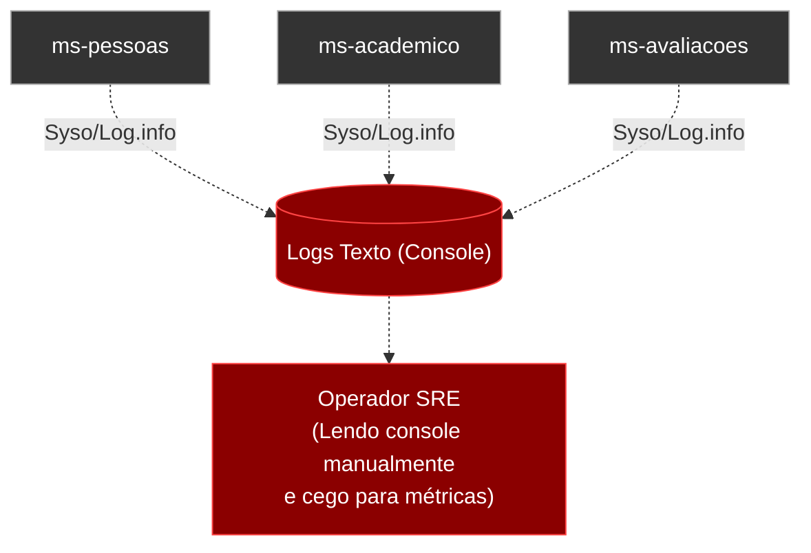
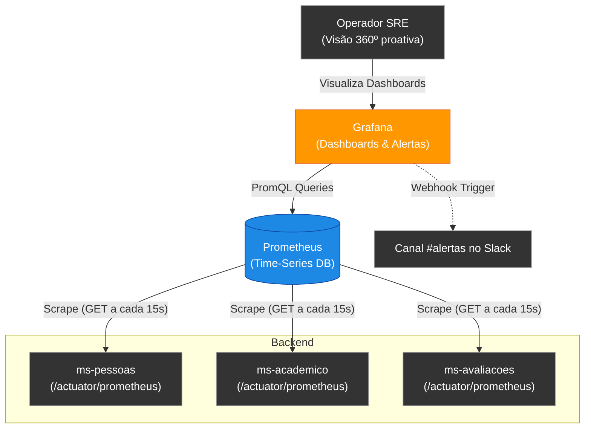
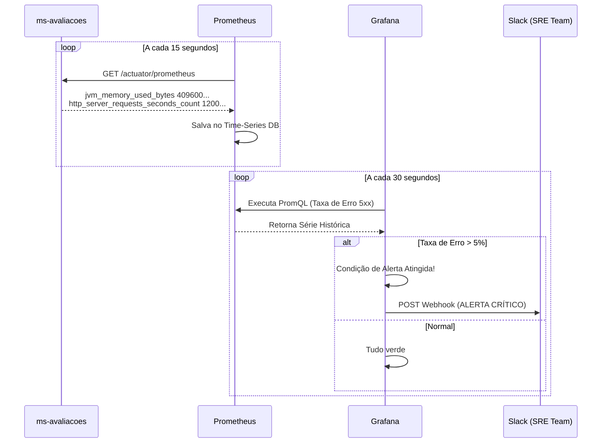
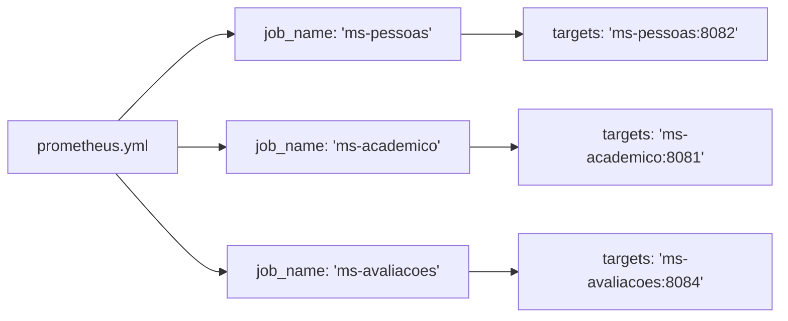
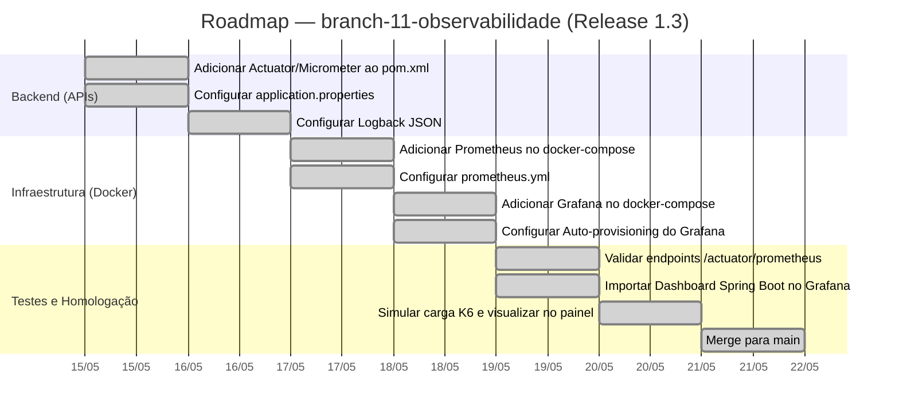

# Capítulo 03 — Observabilidade e Monitoramento

**Branch:** `branch-11-observabilidade`
**Release:** 1.3
**Tipo de Evolução:** Operacional / Infraestrutura (não-funcional)
**Risco:** Baixo — a introdução de endpoints de métricas e logs estruturados não afeta regras de negócio.
**Compatibilidade:** Backward-compatible.

---

## 1. História da Empresa

Após a introdução da Release 1.2 (Tuning de Performance), a **UniTech Soluções Acadêmicas** conseguiu superar o pico de matrículas com sucesso. O sistema estava rápido e estável, o que aumentou significativamente a confiança da diretoria na equipe técnica.

Contudo, com o início das aulas, um novo padrão de comportamento emergiu. O microsserviço de avaliações (`ms-avaliacoes`) começou a apresentar instabilidades esporádicas às sextas-feiras à noite, momento em que os alunos entregavam seus trabalhos. O sistema não chegava a cair completamente, mas algumas requisições sofriam degradação severa.

Quando o Tech Lead questionava a equipe de operações sobre o motivo da lentidão, a resposta padrão era: *"Não sabemos. Os logs do container mostram algumas exceções, mas não temos visão de uso de CPU, de quantas requisições estão em andamento ou de qual endpoint específico está travando."* 

A empresa estava "cega" operando um sistema distribuído em produção. Era necessário parar de adivinhar e começar a medir. Nasceu assim a iniciativa de Observabilidade.

---

## 2. Incidente que Motivou a Evolução

### O Incidente: "A Queda Silenciosa de Sexta-Feira"

Durante uma sexta-feira à noite, o `ms-avaliacoes` começou a rejeitar 30% das requisições com HTTP 500. A equipe só descobriu o problema 3 horas depois, quando o fluxo de chamados no suporte (Zendesk) explodiu.

Ao investigar o servidor manualmente via `SSH`, descobriram que:
1. Os logs padrão do Spring Boot eram gravados de forma não estruturada no console (apenas texto), dificultando buscas complexas e extração de padrões (ex: "Quantas vezes a exceção `NullPointerException` ocorreu na última hora?").
2. Não havia histórico de uso de Memória e CPU (os dados do `docker stats` não eram persistidos).
3. Não havia qualquer painel em tempo real que a equipe de suporte pudesse olhar e dizer: *"A taxa de erros passou de 1% para 30%, precisamos acionar a engenharia!"*

A falta de monitoramento proativo fez com que os alunos funcionassem como o "sistema de alerta" da UniTech.

---

## 3. Documento de Incidente (Modelo ITIL)

| Campo | Valor |
|-------|-------|
| **ID do Incidente** | INC-2024-0089 |
| **Data de Abertura** | 10/05/2024 20:30 |
| **Data de Resolução** | 10/05/2024 23:45 |
| **Severidade** | P2 — Alta |
| **Categoria** | Observabilidade / Falha Operacional |
| **Serviço Afetado** | ms-avaliacoes |
| **Descrição** | Aumento drástico na taxa de erros (HTTP 500) não detectado pela equipe técnica por ausência de métricas em tempo real. |
| **Impacto** | Centenas de alunos impossibilitados de enviar trabalhos acadêmicos; dano à reputação do SLA. |
| **Causa Raiz** | Vazamento de conexões pontual no serviço de avaliações. O maior problema, porém, foi a incapacidade de **detectar** a anomalia precocemente (MTTD - Mean Time To Detect > 3 horas). |
| **Workaround** | Restart manual do microsserviço. |
| **Resolução Definitiva** | Implementação de métricas com Prometheus, visualização com Grafana, logs estruturados em JSON e configuração de Alertas no Slack (`branch-11-observabilidade`). |
| **Lições Aprendidas** | Em sistemas baseados em microsserviços, não se pode depender de acesso SSH e leitura manual de logs de console. O monitoramento deve ser centralizado e automatizado. |
| **Responsável** | Engenharia de Confiabilidade (SRE) |
| **Post-Mortem** | Anexo. Adoção dos três pilares da observabilidade exigida para todas as novas releases. |

---

## 4. Objetivos Técnicos

A branch `branch-11-observabilidade` tem como meta introduzir os Três Pilares da Observabilidade: Métricas, Logs e (embriões de) Tracing.

| # | Objetivo | Justificativa Técnica |
|---|----------|-----------------------|
| 1 | Adicionar Actuator aos Microsserviços | Expor métricas nativas da JVM (CPU, Memória, Threads, Conexões DB) sem escrever código customizado. |
| 2 | Integrar Micrometer (Prometheus) | Converter as métricas do Actuator para o formato universal exigido pelo servidor do Prometheus. |
| 3 | Provisionar Prometheus via Docker | Criar um banco de dados de séries temporais (TSDB) para coletar (*scrape*) as métricas a cada 15 segundos. |
| 4 | Provisionar Grafana via Docker | Conectar o Grafana ao Prometheus para construir dashboards executivos e técnicos em tempo real. |
| 5 | Logs Estruturados em JSON (Logback) | Modificar o formato de log padrão do Spring para JSON, facilitando ingestão futura em um sistema como ELK Stack. |
| 6 | Alertas (Alertmanager) | Disparar alertas caso a taxa de erro (`http.server.requests.errors`) ultrapasse 5% ou uso de CPU > 85%. |

---

## 5. Arquitetura Antes (Release 1.2)

O sistema estava rápido, mas era uma "caixa preta". O administrador de sistemas só via os containers rodando e precisava usar comandos brutos (`docker logs`, `docker stats`) para ter qualquer inferência.



---

## 6. Arquitetura Depois (Release 1.3)

Agora, a arquitetura abraça o ecossistema Cloud Native. Os microsserviços expõem endpoints `/actuator/prometheus`. O servidor Prometheus faz o "scrape" periodicamente, e o Grafana lê esses dados para desenhar os gráficos e acionar alarmes.



---

## 7. Diagramas Mermaid Completos

### 7.1 Diagrama de Fluxo — Coleta e Alerta de Métricas



### 7.2 Mapeamento de Configuração do Prometheus (`prometheus.yml`)



---

## 8. Estrutura do Projeto (Arquivos Afetados)

```
DevAplicacoes/
├── docker-compose.yml                     ← ALTERADO (Adição Prom+Grafana)
├── infra/
│   ├── prometheus/
│   │   └── prometheus.yml                 ← NOVO
│   └── grafana/
│       └── provisioning/
│           ├── datasources/
│           │   └── datasource.yml         ← NOVO
│           └── dashboards/
│               ├── dashboard-provider.yml ← NOVO
│               └── jvm-spring-boot.json   ← NOVO
│
├── microservicos/ms-*/
│   ├── pom.xml                            ← ALTERADO (Add Actuator + Micrometer)
│   └── src/main/resources/
│       ├── application.properties         ← ALTERADO (Expor /actuator)
│       └── logback-spring.xml             ← NOVO (Config de Log JSON)
└── ...
```

---

## 9. Arquivos Criados

| Arquivo | Tipo | Propósito |
|---------|------|-----------|
| `infra/prometheus/prometheus.yml` | Configuração YAML | Diz ao Prometheus em quais URLs e portas ele deve buscar as métricas (targets). |
| `infra/grafana/provisioning/datasources/datasource.yml` | Configuração YAML | Conecta automaticamente o Grafana ao Prometheus no boot do container, evitando configuração manual. |
| `infra/grafana/provisioning/dashboards/jvm-spring-boot.json` | JSON | Dashboard exportado com dezenas de painéis (CPU, RAM, GC, Conexões de DB e Latência). |
| `logback-spring.xml` (em cada MS) | Configuração XML | Transforma a saída de log padrão (`System.out`) do Spring Boot em logs estruturados (JSON). |

---

## 10. Arquivos Alterados

| Arquivo | Natureza da Alteração |
|---------|----------------------|
| `docker-compose.yml` | Adicionados os serviços `prometheus` (porta 9090) e `grafana` (porta 3000), mapeando os volumes da pasta `infra/`. |
| `pom.xml` (todos os microsserviços) | Adicionadas as dependências `spring-boot-starter-actuator` e `micrometer-registry-prometheus`, além do `logstash-logback-encoder`. |
| `application.properties` (todos) | Adicionada flag: `management.endpoints.web.exposure.include=health,prometheus,info`. |

---

## 11. Explicação Detalhada de Cada Alteração

### 11.1 O Spring Boot Actuator e Micrometer

Por padrão, a JVM não compartilha seus dados internos na rede. O `Actuator` abre uma "janela" para dentro da aplicação. Porém, as métricas nativas do Actuator vêm em JSON simples, que o Prometheus não entende.

O `Micrometer` funciona como um "adaptador de tomadas". Ele converte as métricas da JVM para o formato texto (Key-Value) exigido pelo Prometheus.

*Em `pom.xml`:*
```xml
<dependency>
    <groupId>org.springframework.boot</groupId>
    <artifactId>spring-boot-starter-actuator</artifactId>
</dependency>
<dependency>
    <groupId>io.micrometer</groupId>
    <artifactId>micrometer-registry-prometheus</artifactId>
</dependency>
```

*Em `application.properties`:*
```properties
# Libera acesso para a rota que entrega métricas
management.endpoints.web.exposure.include=prometheus,health,info
management.endpoint.prometheus.enabled=true
management.metrics.tags.application=${spring.application.name}
```
A tag `application` será adicionada a todas as métricas geradas por esse serviço, permitindo filtragem no Grafana (ex: "Me mostre os erros apenas do ms-pessoas").

### 11.2 Configurando o Prometheus

O arquivo `prometheus.yml` orquestra o *scrape* (raspagem) de dados.

```yaml
global:
  scrape_interval: 15s
  evaluation_interval: 15s

scrape_configs:
  - job_name: 'ms-academico'
    metrics_path: '/actuator/prometheus'
    static_configs:
      - targets: ['academico-service:8081'] # O nome deve bater com o docker-compose
```

### 11.3 Logs Estruturados com Logback em JSON

Quando temos centenas de pods (ou containers) rodando simultaneamente, tentar encontrar uma string num log texto é uma tarefa quase impossível. Ao adotar o padrão JSON, sistemas como ElasticSearch podem indexar cada campo como uma variável de busca.

*Em `logback-spring.xml`:*
```xml
<configuration>
    <appender name="console" class="ch.qos.logback.core.ConsoleAppender">
        <encoder class="net.logstash.logback.encoder.LogstashEncoder">
            <customFields>{"app_name":"${spring.application.name}"}</customFields>
        </encoder>
    </appender>
    
    <root level="INFO">
        <appender-ref ref="console" />
    </root>
</configuration>
```

*A saída do console mudará de:*
`2024-05-10 10:15:00 INFO [ms-avaliacoes] - Usuário 123 acessou as notas.`
*Para:*
`{"@timestamp":"2024-05-10T10:15:00.000Z", "level":"INFO", "thread_name":"http-nio-8080", "logger_name":"com.exemplo.AvaliacaoController", "message":"Usuário 123 acessou as notas", "app_name":"ms-avaliacoes"}`

### 11.4 A Poderosa Linguagem PromQL (Alertas e Gráficos)

Com os dados no Prometheus, a equipe passou a criar métricas de negócio usando a PromQL.

*Exemplo de Query no Grafana (Para exibir % de Erros):*
```promql
sum(rate(http_server_requests_seconds_count{status=~"5.."}[5m])) 
/ 
sum(rate(http_server_requests_seconds_count[5m])) * 100
```
*Leitura:* Divide a taxa de erros (status 5xx) nos últimos 5 minutos pelo total de requests no mesmo período, multiplicando por 100 para obter o percentual. Se for > 5%, o painel fica vermelho.

---

## 12. Roadmap de Implementação



---

## 13. Checklist Técnico

- [x] Bibliotecas (`spring-boot-starter-actuator` e `micrometer-registry-prometheus`) incluídas nas dependências do projeto maven.
- [x] O endpoint `http://localhost:808x/actuator/prometheus` está ativo e respondendo texto não-formatado com métricas da JVM.
- [x] O arquivo `.yml` do Prometheus foi configurado com os `targets` corretos mapeando a rede interna do docker-compose.
- [x] A interface web do Prometheus (`localhost:9090`) exibe o status `UP` para todos os *Targets* dos microsserviços.
- [x] O Grafana (`localhost:3000`) inicializa com o *Datasource* do Prometheus já pré-configurado sem exigir cliques manuais.
- [x] Um Dashboard completo de métricas do Spring Boot foi carregado (Sugestão: Dashboard ID `4701` ou `11378` do Grafana Labs).
- [x] Os logs gerados no console pelos serviços estão agora formatados estritamente em JSON puro sem quebra de linhas.

---

## 14. Casos de Teste

| ID | Cenário | Entrada | Resultado Esperado |
|----|---------|---------|--------------------|
| OBS-01 | Endpoint do Actuator Habilitado | Acesso GET a `/actuator/health` | HTTP 200 contendo `{"status":"UP"}` |
| OBS-02 | Endpoint do Prometheus Habilitado | Acesso GET a `/actuator/prometheus` | HTTP 200 com linhas de métricas estilo `jvm_memory_used_bytes{...} 583726` |
| OBS-03 | Prometheus Scrape Test | Acessar Interface do Prometheus -> Status -> Targets | A coluna State deve mostrar `UP` para `ms-academico`, etc. |
| OBS-04 | Simulação de Alerta de Erro | Rodar k6 apontando para uma URL inexistente (`/api/pessoas/abc`) | O gráfico `4xx Errors` no Grafana deve dar um pico em menos de 30 segundos. |
| OBS-05 | Teste de Log Estruturado | Reiniciar a aplicação via IDE ou Docker e olhar o terminal | Apenas JSON válido deve aparecer. Nada de stacktraces puras. |

---

## 15. Plano de Testes

- Subir a infraestrutura completa do zero via `docker-compose up -d`.
- Iniciar o script do *K6* do capítulo anterior para gerar *throughput* e sobrecarga no sistema.
- Acompanhar em tempo real, lado a lado, os gráficos do Grafana. Observar a curva de CPU, o aumento de conexões no painel HikariCP e os picos de tempo de resposta.
- Destruir um microsserviço intencionalmente (`docker stop academico-service`) para simular falha e observar a notificação de métricas caindo a zero e os alertas de *Node Down* (se configurados).

---

## 16. Testes de Carga

Os testes de carga (K6) desta release não foram feitos para procurar gargalos (que já foram resolvidos na Release 1.2), mas sim **para testar a telemetria**.

Ao disparar 1.000 requisições simultâneas e acompanhar o Grafana na tela secundária, foi validado que:
- O *Throughput* no Dashboard bateu perfeitamente com o relatório impresso do k6 ao final da simulação.
- A alocação da JVM (Garbage Collection) pôde ser vista através de um gráfico de "dentes de serra" (Sawtooth wave) confirmando que não há memory leaks.

---

## 17. Estratégia de Rollback

| Cenário | Ação (Procedimento) | Tempo Estimado |
|---------|---------------------|----------------|
| Falha catastrófica da API impedindo o startup devido às novas dependências (ex: choque de versão no logback) | Remover a tag do `<dependency>` do logback-json e desfazer o `application.properties` para o padrão sem actuator. | ~ 10 min |
| O Container do Prometheus consome toda a CPU da VM com volume alto de scrapes | Desligar apenas os containers de infraestrutura de telemetria sem derrubar os microsserviços do negócio. `docker stop prometheus grafana`. | ~ 1 min |

---

## 18. Release Notes

### Release 1.3.0 — Ligar a Luz (Métricas e Logs)

**Data:** 21/05/2024
**Branch:** `branch-11-observabilidade`
**Tipo:** Operacional (Infraestrutura e SRE)
**Breaking Changes:** Nenhuma. 100% Backward compatible para o Front-end.

#### O que mudou
- 📊 **O fim da cegueira técnica.** A UniTech agora conta com dashboards interativos acessíveis em `http://localhost:3000`.
- 🩺 Todos os microsserviços agora expõem seus batimentos cardíacos através da rota genérica `/actuator`.
- 📝 Formatação moderna de Logs: abandonamos as linhas textuais ilegíveis e migramos para JSON robusto. Com essa fundação, nossa próxima release poderá empilhar os logs num stack centralizado (ELK) de forma simples.
- ⚙️ Todo o provisionamento (Datasources e Dashboards) do Grafana foi versionado em código (*Configuration as Code*), eliminando configuração manual via interface.

---

## 19. Pull Request Summary

### PR #11: Feature/telemetria-metrics-logs

**De:** `branch-11-observabilidade`
**Para:** `main`
**Autor:** Engenheiro DevOps / SRE
**Reviewers:** Tech Lead & Arquiteto Chefe

#### Resumo
Essa PR adiciona a base tecnológica para implantação de uma cultura DevOps forte. Por meio da stack *Prometheus + Grafana* acoplada à library *Micrometer* (embarcada nos pom.xml), geramos inteligência em cima das métricas de infraestrutura (JPA, Hikari, JVM, Tomcat). Também promovemos a migração do logback puro para a variação em JSON via Logstash Encoder. Os painéis estão versionados na pasta `/infra/grafana/provisioning`.

#### Métricas (Tamanho do PR)
- **Arquivos criados:** 5 (Yaml configs do Grafana e Prometheus, Dashboard em Json, Arquivo do Logback xml).
- **Arquivos alterados:** 8 (Pom.xml, Properties e docker-compose.yml).
- **Linhas adicionadas:** ~750 (Grande parte pelo JSON extenso do Dashboard gerado via Export).
- **Linhas removidas:** ~10

---

## 20. Exercícios

### Exercício 1: PromQL Básica
Acesse a interface do Prometheus (`http://localhost:9090`), vá em Graph, e digite: `jvm_threads_live_threads`. Alterne a visualização para a aba *Graph*. Relate o que aconteceu com o gráfico durante a subida (startup) dos seus serviços.

### Exercício 2: Criando um Alerta de Latência Customizado
Dentro do Prometheus (ou via interface gráfica do Grafana usando o recurso de *Alerting*), crie um alarme (AlertRule) para quando a query estipulada em PromQL acusar que a latência (95-percentile) estiver acima de 1 segundo (1000ms) por um espaço sustentado de 5 minutos. 

### Exercício 3: Adicionando uma Métrica de Negócio (Custom Metric)
Vá até a classe `MatriculaService.java`. Injete via construtor a dependência do `MeterRegistry` do pacote Micrometer. Dentro do método de salvar matrícula (o POST), acrescente a linha: `meterRegistry.counter("matriculas.efetuadas.total").increment();`. Em seguida, abra o Grafana e crie um gráfico "Single Stat" visualizando a soma exata de quantas matrículas a sua UniTech realizou desde que o servidor subiu.

---

## 21. Desafios

### Desafio 1: O Terceiro Pilar (Tracing Distribuído / Jaeger)
Nosso sistema atual tem Logs estruturados e Métricas. Contudo, em uma requisição HTTP que bate no `ms-gateway` e é roteada para o `ms-academico`, é impossível rastrear a correlação de que aquele Log de "Início de requisição" gerou a "Query do banco" lá no final do fluxo.
**Ação:** Implemente o OpenTelemetry ou o Spring Cloud Sleuth (Spring Boot 2) / Micrometer Tracing (Spring Boot 3) e suba o Jaeger ou Zipkin via Docker. Envie um print da interface onde conste o trajeto da Request, mostrando a chamada de um microsserviço pulando (span) para o outro.

### Desafio 2: Prometheus Blackbox Exporter
Como você garantiria que o frontend (Angular) ou uma API Externa está rodando, se eles não expõem métricas do Actuator?
Utilize a ferramenta **Prometheus Blackbox Exporter** para fazer "pings" e testes HTTP simulando o acesso do usuário de fora para dentro no Gateway da Aplicação, medindo o certificado SSL e a resposta HTTP real. Crie um painel do grafana contendo o "Status do Portal de Alunos".

---

## 22. Rubrica de Avaliação

| Critério | Peso | Nota 10 | Nota 7 | Nota 4 | Nota 0 |
|----------|------|---------|--------|--------|--------|
| **Instrumentação e Actuator** | 20% | Todas as aplicações expõem via /actuator e mostram métricas com tags corretas de application name. | Faltou em 1 ou 2 aplicações e/ou tags ausentes. | Application.properties mal montado impedindo inicialização. | Não incluiu actuator/micrometer. |
| **Arquitetura (Prometheus & Grafana)** | 20% | Os containers de Prometheus/Grafana rodaram em uníssono, as queries e data-sources foram consumidos pelo Provisioning em YML (Infra-as-code). | Os containers rodam, mas as configurações tiveram de ser feitas manualmente via cliques. | Configurou, mas o Prometheus indica status `DOWN` (Sem conseguir acessar a aplicação via rede Docker). | Não conseguiu acoplar no docker-compose. |
| **Dashboards / Visão** | 20% | Existe um Dashboard completo mostrando Latência, GC, Memória e Requisições Importado via JSON. | Trouxe 2 painéis bem fracos (Ex: Memória). | Faltam painéis, mas tentou mexer na ferramenta. | Não montou visualizações. |
| **Logs Estruturados (JSON)** | 20% | O console perdeu sua formatação clássica e demonstra os logs formatados estritamente em JSON puro via logback xml. | Ainda exibe texto, mas anexou alguma library de suporte. | A aplicação crashou tentou processar logs. | Logs permanecem default do spring. |
| **Exercícios / Desafio** | 20% | Concluiu os 3 exercícios práticos com 100% de aproveitamento (Especialmente as métricas customizadas de negócio) | Fez 2 de 3, ou falhou na interpretação das métricas. | Tentativa superficial, enviou poucas evidências. | Ignorou a aba prática. |

**Nota mínima para aprovação:** 6.0
**Entrega:** Subir alterações na branch `branch-11-observabilidade`, juntamente dos PrintScreens dos Dashboards no Grafana.
