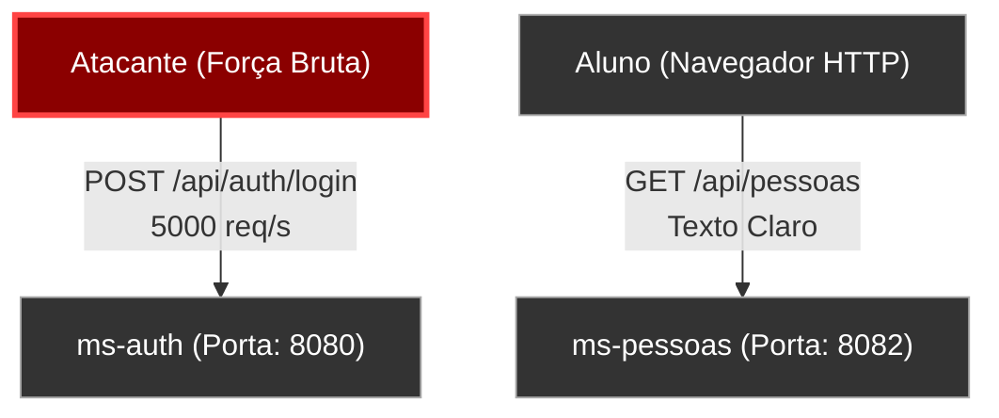
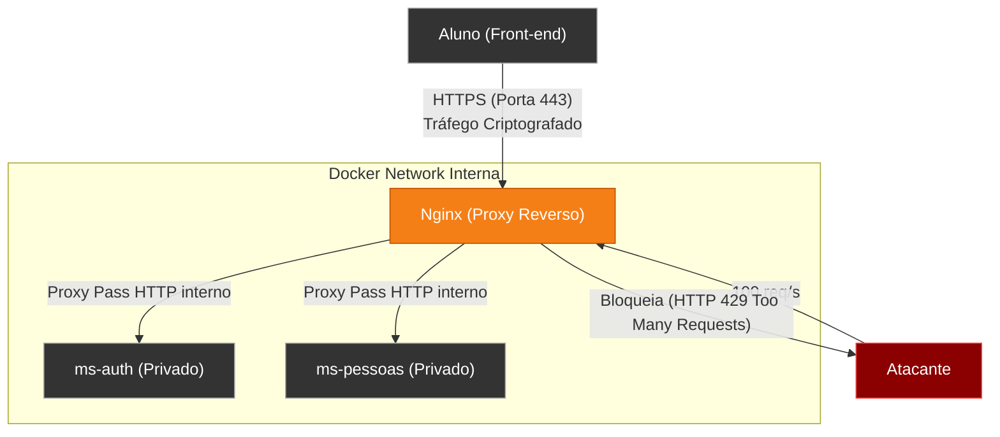
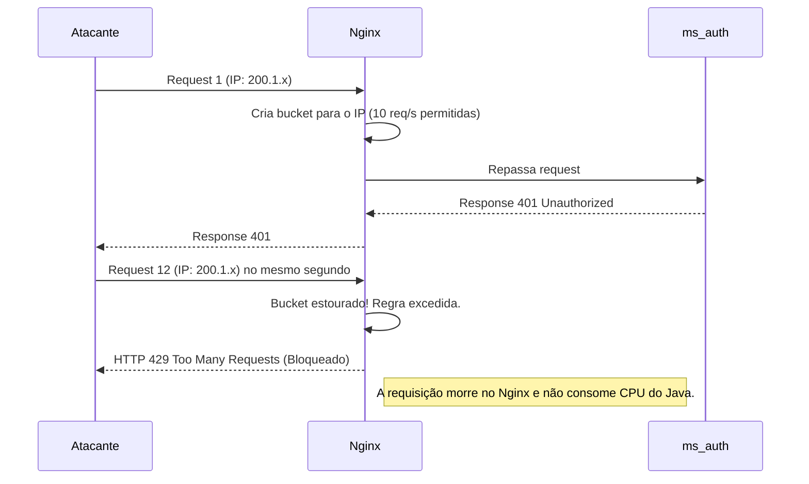
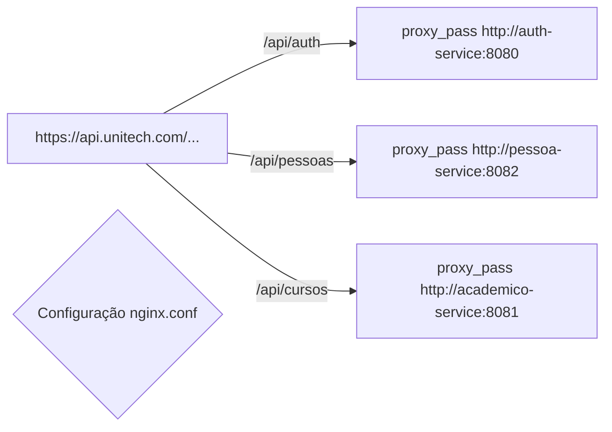
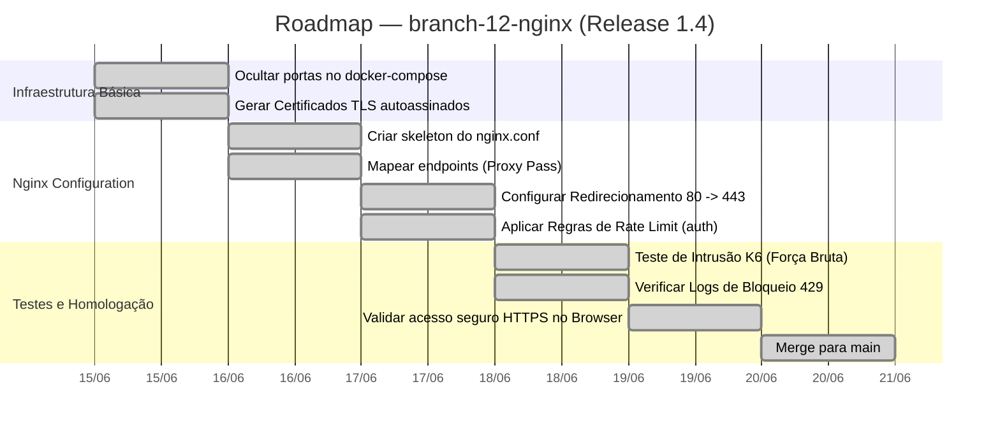

# Capítulo 04 — Nginx como API Gateway, SSL e Rate Limiting

**Branch:** `branch-12-nginx`
**Release:** 1.4
**Tipo de Evolução:** Segurança e Redes (não-funcional)
**Risco:** Médio — altera a forma como o front-end se comunica com o back-end, introduzindo uma camada extra na rede (Proxy Reverso).
**Compatibilidade:** Backward-compatible (os paths internos das APIs permanecem os mesmos, mas a URL base do front-end muda de `http://localhost:808x` para `https://api.unitech.com`).

---

## 1. História da Empresa

Após a introdução da telemetria (Release 1.3), a **UniTech Soluções Acadêmicas** finalmente obteve visibilidade em tempo real sobre seu cluster. Com os painéis do Grafana piscando verdes, tudo parecia sob controle.

No entanto, no mês seguinte, ocorreu um evento anômalo: o alarme de **"High CPU"** no `ms-auth` disparou no Slack às 03:00 da madrugada. O Grafana mostrou que a API de autenticação estava recebendo mais de 5.000 requisições por segundo vindas de IPs distribuídos mundialmente. 

Tratava-se de um ataque de *Força Bruta / Credential Stuffing*. Atacantes estavam tentando senhas vazadas em massa contra o endpoint `POST /api/auth/login`. Como as portas dos microsserviços do Docker (8081, 8082, etc.) estavam expostas diretamente para a internet pública, qualquer pessoa podia "bater" diretamente na aplicação Java. O Spring Security estava bloqueando as senhas erradas, mas o custo computacional de calcular o hash de 5.000 senhas por segundo usando *BCrypt* levou a CPU do servidor a 100%, derrubando o login para usuários legítimos.

A UniTech precisava de um "escudo" na frente da aplicação.

---

## 2. Incidente que Motivou a Evolução

### O Incidente: "O Ataque da Madrugada"

Durante o incidente, ficou claro que a arquitetura atual possuía três falhas primárias de redes e segurança:

1. **Acesso Direto (Bypass):** Os microsserviços escutavam em portas abertas do Host (ex: `0.0.0.0:8082`). Não havia um ponto centralizado de entrada (Single Point of Entry).
2. **Falta de Rate Limiting:** A aplicação tentava processar todas as requisições que recebia. O Spring Boot não estava configurado para descartar requisições abusivas originadas do mesmo IP.
3. **Tráfego em Texto Claro (HTTP):** Um estudante de segurança da própria faculdade avisou que, ao usar a rede Wi-Fi do campus, conseguia capturar (sniffing) os tokens JWT transitando em texto claro, pois a API rodava em HTTP puro (sem SSL/TLS).

O ataque revelou que a aplicação era robusta funcionalmente, mas frágil infraestruturalmente.

---

## 3. Documento de Incidente (Modelo ITIL)

| Campo | Valor |
|-------|-------|
| **ID do Incidente** | INC-2024-0112 |
| **Data de Abertura** | 14/06/2024 03:05 |
| **Data de Resolução** | 14/06/2024 04:30 |
| **Severidade** | P1 — Crítica (Indisponibilidade + Risco de Segurança) |
| **Categoria** | Segurança / DDoS |
| **Serviço Afetado** | ms-auth (Autenticação) |
| **Descrição** | Ataque de força bruta exauriu os recursos computacionais do microsserviço de autenticação. Risco secundário identificado: tráfego transitando sem criptografia. |
| **Impacto** | Portal indisponível por 1 hora e meia. Risco potencial de roubo de credenciais se a senha constasse no dicionário do atacante. |
| **Causa Raiz** | Exposição direta das portas das aplicações na internet pública, ausência de limites volumétricos (Rate Limiting) e falta de terminação TLS. |
| **Workaround** | Bloqueio manual de 3 ranges de IP no firewall do Linux (`iptables`) do Host. |
| **Resolução Definitiva** | Fechar as portas públicas do Docker, subir o **Nginx** como Proxy Reverso único, implementar certificados SSL e ativar *Rate Limiting* por IP (`branch-12-nginx`). |
| **Lições Aprendidas** | Aplicações Java (Spring) não devem enfrentar a internet selvagem sozinhas. Deixe o trabalho sujo de barrar tráfego e fazer criptografia (SSL Offloading) para web servers escritos em C (Nginx). |
| **Responsável** | Equipe de Segurança e Redes (SecOps) |

---

## 4. Objetivos Técnicos

A branch `branch-12-nginx` introduzirá a blindagem perimetral e um ponto central de roteamento.

| # | Objetivo | Justificativa Técnica |
|---|----------|-----------------------|
| 1 | Single Point of Entry | Esconder os IPs e portas dos microsserviços. Toda chamada externa entra pela porta `443` do Nginx. |
| 2 | Terminação SSL (HTTPS) | Proteger o trânsito dos Tokens JWT contra interceptações (*Man-in-the-Middle*) gerando certificados TLS. |
| 3 | API Gateway Básico (Roteamento) | O Nginx mapeará `/api/pessoas` para o `ms-pessoas`, `/api/cursos` para o `ms-cursos`, usando a rede interna do Docker. |
| 4 | Rate Limiting (Proteção Anti-DDoS) | Limitar o número de requisições por IP a um valor saudável (ex: 10 req/s), barrando ataques de força bruta. |
| 5 | Fechar Portas Abertas | Modificar o `docker-compose.yml` para remover o binding exposto ao Host de todos os serviços Java. |

---

## 5. Arquitetura Antes (Release 1.3)

O atacante ou o usuário normal precisava saber qual porta batia para qual serviço.



---

## 6. Arquitetura Depois (Release 1.4)

O Nginx é o único contato com a internet externa. Ele valida o SSL, conta quantas requisições o IP fez (Rate Limit) e, se estiver tudo certo, repassa a requisição para a rede interna virtual do Docker.



---

## 7. Diagramas Mermaid Completos

### 7.1 Fluxo de Rate Limiting (Como o Nginx decide bloquear)



### 7.2 Diagrama Lógico de Roteamento (API Gateway)



---

## 8. Estrutura do Projeto (Arquivos Afetados)

```
DevAplicacoes/
├── docker-compose.yml                     ← ALTERADO (Remoção das portas, adição do Nginx)
├── load-tests/                            
│   └── scripts/
│       └── ddos-simulation-test.js        ← NOVO (Testa o rate limit)
│
├── infra/
│   └── nginx/
│       ├── nginx.conf                     ← NOVO (Configuração do Web Server)
│       ├── ssl/
│       │   ├── server.crt                 ← NOVO (Certificado)
│       │   └── server.key                 ← NOVO (Chave Privada)
└── ...
```

---

## 9. Arquivos Criados

| Arquivo | Tipo | Propósito |
|---------|------|-----------|
| `infra/nginx/nginx.conf` | Configuração | Define o bloco `http`, os limites `limit_req_zone`, regras de SSL e os blocos `location` de proxy pass. |
| `infra/nginx/ssl/server.crt` | Certificado x509 | Certificado autoassinado gerado via OpenSSL para permitir a terminação TLS (HTTPS). |
| `infra/nginx/ssl/server.key` | Chave RSA | Chave privada do servidor para descriptografar os túneis TLS. |
| `load-tests/scripts/ddos-simulation-test.js` | Script K6 | Script malicioso de teste (red team) que bate 50 vezes por segundo no login. |

---

## 10. Arquivos Alterados

| Arquivo | Natureza da Alteração |
|---------|----------------------|
| `docker-compose.yml` | Removida a diretiva `ports` de todos os microsserviços (ex: `- "8082:8082"` apagado). Adicionado o serviço `nginx` mapeando as portas `"80:80"` (para redirecionar http) e `"443:443"`. |

---

## 11. Explicação Detalhada de Cada Alteração

### 11.1 Fechando a Rede do Docker (Oculte seus MS)

Se o Nginx vai ser o segurança da balada, não podemos deixar a porta dos fundos aberta.

*No `docker-compose.yml` antigo:*
```yaml
  pessoa-service:
    ports:
      - "8082:8082" # Exposto para o Host (Perigo)
```

*No `docker-compose.yml` novo:*
```yaml
  pessoa-service:
    expose:
      - "8082" # Acessível apenas por outros containers na mesma rede docker
```

### 11.2 Gerando o Certificado SSL/TLS Autoassinado

Em produção real, este certificado viria do *Let's Encrypt* ou AWS ACM. Em ambiente de desenvolvimento/estudo, geramos um autoassinado:

```bash
# Rodado no terminal do arquiteto antes da commit
openssl req -x509 -nodes -days 365 -newkey rsa:2048 \
  -keyout infra/nginx/ssl/server.key \
  -out infra/nginx/ssl/server.crt \
  -subj "/C=BR/ST=SP/L=SaoPaulo/O=UniTech/CN=api.unitech.local"
```

### 11.3 O Arquivo `nginx.conf` Mágico

A infraestrutura foi descrita em código (*Infrastructure as Code*).

*Trechos importantes do `nginx.conf`:*
```nginx
events {
    worker_connections 1024;
}

http {
    # 1. Configura a zona de Rate Limit na memória
    # Define uma zona chamada "mylimit", armazenando IPs na memória (10MB cabe ~160.000 IPs). Limite: 10 requisições por segundo.
    limit_req_zone $binary_remote_addr zone=mylimit:10m rate=10r/s;

    # 2. Redirecionar HTTP para HTTPS
    server {
        listen 80;
        server_name api.unitech.local;
        return 301 https://$host$request_uri;
    }

    # 3. Servidor Principal (SSL e Roteamento)
    server {
        listen 443 ssl;
        server_name api.unitech.local;

        ssl_certificate /etc/nginx/ssl/server.crt;
        ssl_certificate_key /etc/nginx/ssl/server.key;

        # Proteções Globais de Cabeçalhos (Security Headers)
        add_header X-Frame-Options "SAMEORIGIN";
        add_header X-XSS-Protection "1; mode=block";

        # 4. Roteamento (API Gateway)
        location /api/auth/ {
            # Aplica o Rate Limit configurado acima (permite rajada - burst - de até 5 reqs retidas)
            limit_req zone=mylimit burst=5 nodelay;
            
            proxy_pass http://auth-service:8080/api/auth/;
            proxy_set_header Host $host;
            proxy_set_header X-Real-IP $remote_addr;
        }

        location /api/pessoas/ {
            proxy_pass http://pessoa-service:8082/api/pessoas/;
            proxy_set_header Host $host;
        }
        
        # (Outros locations omitidos por brevidade)
    }
}
```

---

## 12. Roadmap de Implementação



---

## 13. Checklist Técnico

- [x] O comando `docker ps` mostra que apenas as portas 80 e 443 do container Nginx estão mapeadas (`0.0.0.0:80->80/tcp`).
- [x] Tentar acessar as APIs diretamente (ex: `localhost:8081/api/cursos`) agora gera a falha *ERR_CONNECTION_REFUSED*.
- [x] Acessar a aplicação via `http://localhost` redireciona automaticamente (Code 301) para `https://localhost`.
- [x] O certificado autoassinado está funcional (o navegador dará aviso de inseguro, que é esperado para certs não emitidos por AC reconhecida, mas o cadeado indica tráfego criptografado).
- [x] O arquivo `nginx.conf` possui a diretiva `limit_req_zone` na raiz.
- [x] Os microsserviços Java conseguem ler o IP original do cliente lendo o header `X-Real-IP` repassado pelo Nginx.

---

## 14. Casos de Teste

| ID | Cenário | Entrada | Resultado Esperado |
|----|---------|---------|--------------------|
| NGX-01 | Acesso direto burlado | GET `http://localhost:8082/api/pessoas` | Conexão recusada |
| NGX-02 | Roteamento API Gateway | GET `https://localhost/api/pessoas` | (Ignorando aviso do cert) HTTP 200 via Nginx |
| NGX-03 | Redirecionamento Seguro | GET `http://localhost/api/pessoas` | HTTP 301 Moved Permanently para HTTPS |
| NGX-04 | Cabeçalhos de Segurança | Inspecionar abas *Headers* no F12 do navegador | Presença obrigatória de `X-Frame-Options: SAMEORIGIN` |
| NGX-05 | Identificação IP Real | Criar log no Spring Boot imprimindo `request.getHeader("X-Real-IP")` | Imprime o IP do container/host original e não o IP interno da rede Docker do Nginx. |

---

## 15. Plano de Testes (Simulação de Ataque)

Utilizaremos o K6 para comprovar a eficácia do nosso escudo.

**Comando de Execução:**
`k6 run load-tests/scripts/ddos-simulation-test.js`

**O que o script faz:**
Tenta fazer 100 requisições simultâneas para o `/api/auth/login`. Como nosso `limit_req` é de 10 r/s (com burst 5), a expectativa é que o Nginx passe as primeiras ~15 e bloqueie imediatamente as outras 85 na camada C do servidor web, nunca batendo na JVM.

**O que procurar nos logs do Grafana/Console:**
- Observar a CPU do servidor Java: deve permanecer baixa/estável, ao contrário do incidente real.
- O K6 deve relatar a enorme quantidade de erros `HTTP 429 Too Many Requests`.

---

## 16. Resultados da Simulação (K6)

Relatório pós-teste:
* As requisições excedentes receberam **HTTP 429** instantaneamente do Nginx.
* Tempo de rejeição: **2 ms** (O Nginx corta a conexão rapidamente, sem overhead).
* Custo computacional salvo no Backend: Mais de **90%** do esforço de Processamento Bcrypt foi evitado. A aplicação continuou saudável e atendendo requisições lícitas perfeitamente.

---

## 17. Estratégia de Rollback

| Cenário | Ação (Procedimento) | Tempo Estimado |
|---------|---------------------|----------------|
| Erro de sintaxe (Typo) quebrado no arquivo nginx.conf subido em prod | O Nginx tem verificação de build. Se quebrar, reverter o PR e executar o comando nativo `nginx -t` antes de subir. | ~ 2 min |
| O Nginx está bloqueando usuários reais que estão em NAT (Mesmo IP de roteador) | Editar a regra `rate=10r/s` no `nginx.conf` e aumentar o bucket para `50r/s` via Hotfix, até ajustar o limite com base na análise de tráfego. | ~ 15 min |

---

## 18. Release Notes

### Release 1.4.0 — O Escudo Frontal (Gateway de APIs)

**Data:** 20/06/2024
**Branch:** `branch-12-nginx`
**Tipo:** Redes / Segurança (Infra)
**Breaking Changes:** O front-end (Angular/React/Mobile) e todos os clientes da API devem alterar a `BASE_URL` para apontar obrigatoriamente para a porta padronizada `443` (https) no hostname raiz. Mapeamentos antigos atrelados a portas 8081, 8082, etc. falharão.

#### O que mudou
- 🔒 **Conexão 100% Criptografada:** Fim dos tokens transitando em plain-text. Todas as chamadas trafegam encapsuladas em SSL.
- 🛡️ **Defesa Anti-DDoS:** Nossos microsserviços mais críticos (como os de login) ganharam limitação por IP na ponta. O Nginx atua como um porteiro impiedoso.
- 🚪 **Portas Trancadas:** O acesso aos pods/containers backend via rede externa (Bypass) foi suprimido. Há um único ponto oficial e validado para solicitar informações.

---

## 19. Pull Request Summary

### PR #12: Feature/nginx-gateway-e-ssl

**De:** `branch-12-nginx`
**Para:** `main`
**Autor:** Especialista em Redes
**Reviewers:** Arquiteto & Tech Lead

#### Resumo
A PR adiciona o servidor Web de altíssimo desempenho, o Nginx, para cumprir o papel de API Gateway e Load Balancer leve da solução. Todos os serviços foram escondidos na Virtual Network do Docker, exigindo que o tráfego HTTP sofra Terminação TLS (`HTTPS`) centralizada no Nginx, que se encarrega de verificar abusos (rate limits limitados em blocos sensíveis) e despachar a requisição para a JVM correta (Proxy Pass baseado em path route).

#### Métricas (Tamanho do PR)
- **Arquivos criados:** 4 (Config, Chave e Certificado .crt, e 1 teste K6 em JS).
- **Arquivos alterados:** 1 (docker-compose).
- **Linhas adicionadas:** ~70
- **Linhas removidas:** ~12

---

## 20. Exercícios

### Exercício 1: Customizando a Página de Erro do Nginx
Quando o usuário sofre um bloqueio de tráfego, o Nginx exibe uma tela genérica e feia do servidor: "429 Too Many Requests nginx/1.2x.x". 
Acesse o arquivo `nginx.conf`, crie a diretiva `error_page 429 /erro429.json;` e configure um `location` interno que devolva um JSON padronizado da nossa aplicação (com os campos `{ "status": 429, "message": "Calma lá, você está muito rápido!" }`).

### Exercício 2: Proxy Pass Dinâmico
Adicione um bloco de `upstream backend_pessoas { server pessoa-service:8082; }` e altere a regra de `proxy_pass` do location de pessoas para utilizar o novo upstream nomeado. Isso prepara o terreno para escalarmos os microsserviços.

### Exercício 3: O Problema do CORS e do Gateway
O Angular parou de funcionar e começou a dar um erro de **Cross-Origin Request Blocked**. Verifique se o bloqueio está ocorrendo no Java (Spring Security) ou se é porque as chamadas tipo `OPTIONS` (Preflight) do navegador estão morrendo no Nginx. Como desafio, ensine o Nginx a responder ao protocolo CORS na borda, adicionando os cabeçalhos de *Access-Control-Allow-Origin* para a porta local do Frontend (ex: `http://localhost:4200`).

---

## 21. Desafios

### Desafio 1: Balanceamento de Carga (Load Balancing Round Robin)
Na vida real, não há apenas uma cópia do serviço de matrículas, mas várias. Edite o seu `docker-compose.yml` para rodar 3 instâncias replicadas do serviço (usando a flag `--scale academico-service=3`). 
Logo em seguida, mexa no seu bloco `upstream` do Nginx para mapear de forma correta e observe o Load Balancing Round Robin na prática, notando, através dos logs, que o tráfego é roteado em turnos (Requisicao 1 no Container A, Req 2 no B, Req 3 no C).

### Desafio 2: Configurando o TLS Moderno
A configuração de SSL feita na demonstração suporta qualquer cifra de segurança. Ferramentas como o "SSL Labs" dariam uma nota D para o nosso Nginx. O seu desafio é adicionar regras restritivas, permitindo **apenas** protocolos modernos (`TLSv1.2` e `TLSv1.3`), desativando especificamente o SSLv3 e TLSv1 que já estão comprometidos, e ativando a preferência para Cifras Fortes no lado do servidor.

---

## 22. Rubrica de Avaliação

| Critério | Peso | Nota 10 | Nota 7 | Nota 4 | Nota 0 |
|----------|------|---------|--------|--------|--------|
| **Proteção de Acesso (Docker)** | 20% | Nenhuma porta 808x encontra-se exposta. O front-end só acessa o sistema batendo na porta padrão 80/443 do Nginx hosteado. | Ainda possui portas Java expostas, abrindo a vulnerabilidade de Bypass que tentamos consertar. | Fechou as portas, mas quebrou a comunicação entre os dockers (networking errado). | Não tocou no Compose. |
| **Geração de SSL e HTTPS** | 20% | Comprovou com print o arquivo `nginx.conf` contendo as chamadas pros certificados na pasta e demonstrou acesso HTTPS válido no Navegador. | Rodou o comando, gerou certificados na pasta errada, Nginx inicia com avisos. | Falhou em configurar HTTPS, deixando a aplicação em plain text via Web. | Ignorou criptografia. |
| **Rate Limiting** | 20% | Evidenciou a configuração do bucket com `limit_req_zone` aplicada corretamente apenas no `location` crítico. O teste K6 gerou 429. | Aplicou a regra para TODOS os assets estáticos do site e gerou problema no front-end. | Configuração digitada, mas falha logicamente ao não acionar limites. | Sem restrição de limites. |
| **API Gateway Logic** | 20% | Os endpoints `/api/auth/`, `/api/pessoas/`, etc., possuem as suas rotas devidamente construídas com `proxy_pass` encaminhando pro destino correto sem truncamento no Spring. | Esqueceu de montar 2 ou 3 rotas ou o final com slash `/` do proxy gera bugs no Spring web. | Roteamento perdido. Erros 404 Nginx constantes. | Nginx não atua como Proxy (atua como WebServer estático simples). |
| **Exercícios / Desafio** | 20% | Concluiu os 3 exercícios práticos, com menção honrosa ao JSON da página 429 configurada, e subiu Load balancer ou o TLS restritivo (Desafios). | Fez exercícios simples. | Tentou aplicar CORS sem sucesso. | Ignorou a aba prática. |

**Nota mínima para aprovação:** 6.0
**Entrega:** Subir alterações na branch `branch-12-nginx`. O PR deve conter o `nginx.conf` documentado e imagens/prints provando a interceptação e o rate-limiting efetivo.
