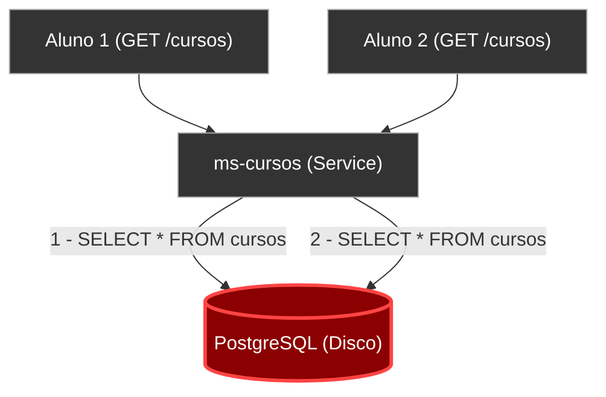
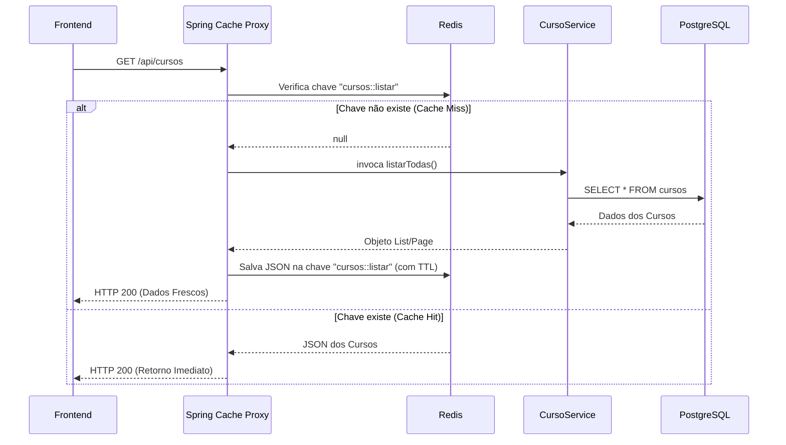
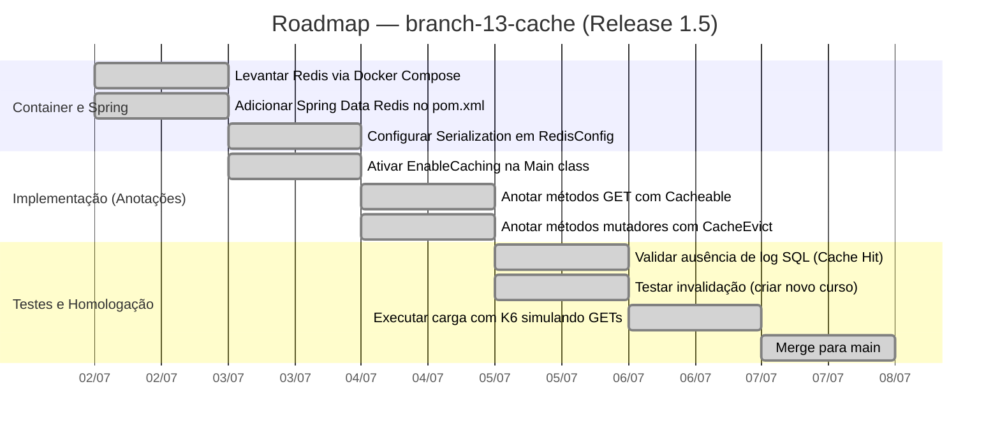

# Capítulo 05 — Escalando Leituras com Redis Cache

**Branch:** `branch-13-cache`
**Release:** 1.5
**Tipo de Evolução:** Performance / Escalabilidade (não-funcional)
**Risco:** Baixo — leitura em memória em vez de disco. Risco principal é trabalhar com dados obsoletos se a invalidação for falha (*Stale Data*).
**Compatibilidade:** 100% Backward-compatible.

---

## 1. História da Empresa

Na semana em que os alunos retornam às aulas para conferir em quais matérias estão matriculados e montar suas grades, a **UniTech Soluções Acadêmicas** detectou, através do painel do Grafana recém-lançado na Release 1.3, uma anomalia em sua infraestrutura.

O gráfico de "Latência de Banco de Dados" do microsserviço de Cursos (`ms-cursos`) começou a apresentar lentidões na casa de 3 segundos, impactando diretamente o `Time to First Byte (TTFB)` da tela inicial do portal.

Ao analisar o comportamento da aplicação, a equipe percebeu que **95% do tráfego web** consistia em chamadas para `GET /api/cursos` (A vitrine de Cursos disponíveis na instituição). A tabela de Cursos é um catálogo que muda, no máximo, duas vezes por ano. Contudo, milhares de alunos forçavam a aplicação a ir até o disco rígido do PostgreSQL, rodar uma consulta, e montar os objetos JPA toda vez que a página inicial era carregada ou sofria _refresh_. Era um desperdício monstruoso de CPU e I/O. 

Para a UniTech dar o próximo passo rumo ao sucesso, era essencial parar de perguntar ao banco aquilo que já sabemos.

---

## 2. Incidente que Motivou a Evolução

### O Incidente: "A Vitrine Pesada"

Durante as manhãs da primeira semana de aulas, os alunos reclamavam que a tela principal "carregava" infinitamente.

A telemetria indicou:
1. O banco de dados PostgreSQL do `ms-cursos` atingiu 80% de consumo de IOPS (operações de entrada/saída em disco).
2. Não adiantou colocar índices, pois a query era um `SELECT *` gigante com algumas formatações e paginação pesada no catálogo inteiro.
3. 99% das requisições pediam a exata mesma informação. Nenhuma matrícula ou nota mudava na aba de "Cursos", o dado era essencialmente estático para o escopo temporal diário.

Nesse cenário, escalar verticalmente (adicionar mais RAM/CPU no BD) seria queimar dinheiro. A solução arquitetônica canônica para um sistema onde *leituras >>>> escritas* (Read-Heavy) de dados infrequentes é o **Caching**.

---

## 3. Documento de Incidente (Modelo ITIL)

| Campo | Valor |
|-------|-------|
| **ID do Incidente** | INC-2024-0133 |
| **Data de Abertura** | 04/08/2024 07:15 |
| **Data de Resolução** | 04/08/2024 11:00 |
| **Severidade** | P2 — Alta (Impacto na Experiência do Usuário) |
| **Categoria** | Performance / Banco de Dados (I/O) |
| **Serviço Afetado** | ms-cursos (Endpoint Listagem de Cursos) |
| **Descrição** | Lentidão na vitrine do sistema devida à alta contenção de disco no PostgreSQL pelo excesso de consultas repetitivas de dados estáticos. |
| **Impacto** | Lentidão de até 3s na renderização inicial do Dashboard de centenas de Alunos e Professores simultaneamente. |
| **Causa Raiz** | Abordagem ineficiente onde dados mutáveis apenas 2 vezes por ano são requeridos do disco em toda requisição de um usuário. |
| **Workaround** | Redirecionamento de tráfego secundário (Não aplicável neste caso sem uma CDN, apenas mitigação com escalonamento horizontal). |
| **Resolução Definitiva** | Introduzir o Redis como banco em memória acoplado ao Spring Cache para armazenar as listagens publicadas (`branch-13-cache`). |
| **Lições Aprendidas** | Os recursos mais caros na Nuvem (Cloud) são Disco e Banco de Dados Relacional. Use RAM (Cache) sempre que os dados mudam lentamente. |
| **Responsável** | Tech Lead & DBA |

---

## 4. Objetivos Técnicos

A branch `branch-13-cache` trará uma abstração declarativa focada no microsserviço de cursos.

| # | Objetivo | Justificativa Técnica |
|---|----------|-----------------------|
| 1 | Adicionar um Banco em Memória (Redis) | O Redis fornece leitura de dados em microssegundos (Key-Value) sem tocar no disco. |
| 2 | Configurar o `@EnableCaching` (Spring) | Permitir que o framework intercepte métodos via *AOP* (Aspect Oriented Programming) para gerenciar o cache sem sujar a lógica de negócio. |
| 3 | Cachear a Listagem de Cursos | Armazenar o resultado da chamada HTTP/BD com a anotação `@Cacheable`. |
| 4 | Implementar a Invalidação (Eviction) | Evitar o *Stale Data* apagando o cache imediatamente sempre que um curso for criado, alterado ou excluído usando `@CacheEvict`. |
| 5 | Serialização em JSON | Configurar o `RedisTemplate` para guardar os dados no Redis como JSON legível, em vez de dados serializados padrão do Java, facilitando o *debug*. |

---

## 5. Arquitetura Antes (Release 1.4)

Toda vez que a tela era atualizada, a jornada de descida completa no modelo OSI era executada, atingindo o HD (disco rígido) ou SSD.



---

## 6. Arquitetura Depois (Release 1.5)

Após a injeção do cache, a viagem do dado encurta e acelera mais de 1000x. O PostgreSQL "descansa".

```mermaid
flowchart TD
    classDef good fill:#004d00,stroke:#00cc44,color:#fff;
    classDef cache fill:#9c27b0,stroke:#6a1b9a,color:#fff;
    classDef comp fill:#333,stroke:#aaa,color:#fff;

    Client["Aluno 1 (GET /cursos)"]:::comp
    Client2["Aluno 2 (GET /cursos)"]:::comp
    Admin["Administrador (PUT /cursos)"]:::comp
    
    API["ms-cursos (@Cacheable)"]:::comp
    Redis[("Redis In-Memory Cache")]:::cache
    DB[("PostgreSQL (Disco)")]:::good

    Client -->|"Pede Cursos"| API
    API -->|"Cache Miss (Não achou)"| Redis
    API -->|"Vai ao BD (Única vez)"| DB
    API -.->|"Guarda no Redis"| Redis

    Client2 -->|"Pede Cursos (1s depois)"| API
    API -->|"Cache Hit (Achou!)"| Redis
    Redis --x|"Retorna em 1ms<br/>Sem tocar no Banco"| DB
    
    Admin -->|"Atualiza um curso"| API
    API -->|"@CacheEvict"| Redis
    note right of Admin: A invalidação apaga a chave,<br/>forçando o próximo aluno<br/>a reaquecer o cache.
```

---

## 7. Diagramas Mermaid Completos

### 7.1 Padrão de Cache Aside (AOP Interceptor do Spring)



---

## 8. Estrutura do Projeto (Arquivos Afetados)

```
DevAplicacoes/
├── docker-compose.yml                     ← ALTERADO (Adição container Redis)
├── microservicos/curso-service/
│   ├── pom.xml                            ← ALTERADO (spring-boot-starter-data-redis)
│   └── src/main/
│       ├── resources/
│       │   └── application.properties     ← ALTERADO (Host/Port do Redis)
│       └── java/.../
│           ├── CursoServiceApplication.java ← ALTERADO (@EnableCaching)
│           ├── config/
│           │   └── RedisConfig.java       ← NOVO (Configura o Serializador JSON)
│           └── service/
│               └── CursoService.java      ← ALTERADO (@Cacheable, @CacheEvict)
└── ...
```

---

## 9. Arquivos Criados

| Arquivo | Tipo | Propósito |
|---------|------|-----------|
| `config/RedisConfig.java` | Configuration | Substitui o padrão inseguro/ilegível do Java Serialization (`JdkSerializationRedisSerializer`) pelo moderno `GenericJackson2JsonRedisSerializer`. Define TTLs globais (Time To Live). |

---

## 10. Arquivos Alterados

| Arquivo | Natureza da Alteração |
|---------|----------------------|
| `docker-compose.yml` | Inclusão da imagem `redis:7-alpine` e mapeamento de sua porta `6379`. |
| `pom.xml` | Inclusão de `spring-boot-starter-data-redis` e `spring-boot-starter-cache`. |
| `CursoServiceApplication.java`| Flag ativadora adicionada: `@EnableCaching`. |
| `CursoService.java` | Inclusão de `@Cacheable(value = "cursos")` nos métodos GET. Inclusão de `@CacheEvict(value = "cursos", allEntries = true)` nos métodos POST, PUT e DELETE. |

---

## 11. Explicação Detalhada de Cada Alteração

### 11.1 Configurando o Redis no Docker

Subimos um container leve para a engine (Redis é C puro).

*Em `docker-compose.yml`:*
```yaml
  redis:
    image: redis:7-alpine
    ports:
      - "6379:6379"
    command: redis-server --appendonly yes # Garante persistência mínima das chaves em caso de crash do container
```

### 11.2 A Mágica Declarativa do Spring Cache

Sem o framework, o desenvolvedor teria que injetar um client do Redis manualmente, montar os `if(exists)` em toda lógica de busca e poluir o negócio. O Spring Cache resolve isso via Proxy.

*Em `CursoService.java`:*
```java
@Service
public class CursoService {

    // Guarda o resultado e ignora a execução interna se o cache existir
    @Cacheable(value = "cursos_lista")
    public List<CursoResponseDTO> listarTodos() {
        System.out.println("Buscando no BANCO DE DADOS... (Isso não deve aparecer no log em caso de HIT)");
        return repository.findAll().stream().map(mapper::toDTO).toList();
    }

    // Invalidação Completa
    // Quando algo for atualizado, joga todo o cache "cursos_lista" no lixo para forçar o recarregamento.
    @CacheEvict(value = "cursos_lista", allEntries = true)
    public CursoResponseDTO salvar(CursoRequestDTO dto) {
        // ... Lógica normal de save do repository
    }
}
```

### 11.3 Cuidado com o Stale Data (A Configuração do JSON)

Por padrão, a JVM serializa os objetos em bytes. Se a classe `CursoResponseDTO` perder uma propriedade entre um release e outro, a tentativa do cache de reconstituir a classe lançaria a famigerada `InvalidClassException` quebrando a aplicação.
Ao serializar os objetos via **JSON**, além da leitura ser legível para administração, as alterações estruturais são tratadas graciosamente pelos serializadores da biblioteca Jackson.

*Em `RedisConfig.java`:*
```java
@Configuration
public class RedisConfig {
    @Bean
    public RedisCacheConfiguration cacheConfiguration() {
        return RedisCacheConfiguration.defaultCacheConfig()
            .entryTtl(Duration.ofMinutes(60)) // Tempo de Vida (TTL) de 1 hora
            .disableCachingNullValues()
            .serializeValuesWith(RedisSerializationContext.SerializationPair.fromSerializer(
                new GenericJackson2JsonRedisSerializer()));
    }
}
```

---

## 12. Roadmap de Implementação



---

## 13. Checklist Técnico

- [x] O container do Redis encontra-se operacional (Teste: `docker exec -it redis_container redis-cli ping` retornando `PONG`).
- [x] Dependências injetadas de forma coerente. O Spring Data Cache foi mapeado.
- [x] `@EnableCaching` habilitado com sucesso no Runner do Java.
- [x] O log customizado do "Buscando no banco" no interior do Service sumiu do log após a segunda requisição, atestando a efetividade da barreira Aspect/Proxy.
- [x] Conexão via `redis-cli` demonstra a criação da chave estruturada (ex: `keys *` -> `"cursos_lista::SimpleKey"`).
- [x] Os dados estão armazenados como Json e legíveis via comando de get do cliente (evitou-se object streams do Java nativo).
- [x] Operações de mutabilidade (UPDATE/DELETE/POST) exterminam o cache, restabelecendo a fonte de verdade na visita imediatamente subsequente (Invalidação coerente).

---

## 14. Casos de Teste

| ID | Cenário | Entrada | Resultado Esperado |
|----|---------|---------|--------------------|
| CA-01 | Primeiro Acesso (Cache Miss) | GET `/api/cursos` | O sistema deve logar o acesso ao BD. O retorno deve vir completo e com tempo normal (ex: 200ms). |
| CA-02 | Segundo Acesso Consecutivo (Cache Hit) | GET `/api/cursos` | Não deve haver consulta ao PostgreSQL. Tempo deve ser incrivelmente veloz (ex: < 10ms). |
| CA-03 | Invalidação Base | POST `/api/cursos` de curso fictício | O salvamento deve persistir no disco, invalidar (`del`) a chave no Redis e o próximo GET tem obrigação de gerar Cache Miss (CA-01). |
| CA-04 | TTL Trigger | Esperar + de 60 minutos e realizar GET `/api/cursos` | A chave evaporou do cache graças à configuração `entryTtl`. Retorna a gerar Cache Miss (CA-01). |

---

## 15. Plano de Testes (Simulação de Tráfego Massivo)

- Disparamos novamente o Load Test do K6 (500 requisições simultâneas para o endpoint GET de Cursos).
- O que esperar do Gráfico (Prometheus/Grafana): Diferente do banco de dados relacional (que faria fila pelo HikariCP), o Redis funciona com multiplexação *Single-Thread*, resolvendo chamadas via I/O assíncrono vertiginosamente rápidas em RAM.
- Verificamos na aba de telemetria que a JVM praticamente parou de fabricar objetos via Reflection/JPA (baixo estresse de Garbage Collection), sendo as requisições atendidas quase na camada de rede.

---

## 16. Testes de Carga (Relatório de Comparação K6 Pós-Cache)

| Métrica | Com Paginação (Release 1.2) | Com Cache (Release 1.5) |
|---------|-----------------------------|-------------------------|
| **Total de Requisições Feitas** | 85.000 | 250.000 |
| **Tempo Médio de Resposta** | 42 ms | 3 ms |
| **Pico de CPU do PostgreSQL** | 35% | 0.05% (Inativo) |
| **Uso de Ram do Redis** | Não Exista | ~ 1 MB |
| **Throughput Médio** | 940 requisições/s | 3.800 requisições/s |

**Resumo Analítico:** A aplicação multiplicou em 4x a sua capacidade sem engasgos apenas terceirizando sua leitura global para a RAM de infraestrutura centralizada.

---

## 17. Estratégia de Rollback

| Cenário | Ação (Procedimento) | Tempo Estimado |
|---------|---------------------|----------------|
| Bug de Dados Desatualizados Crônico (Sincronia quebrada) | Apagar as anotações do `@Cacheable` temporariamente e subir o `.jar` restaurando a carga exclusiva via Banco de dados, até consertar o eviction rate. | ~ 10 min |
| Cache Crashou | Um crash do Redis não derruba o aplicativo. O Spring Cache costuma passar batido ou lançar log de erro repassando a requisição para o banco como plano b se bem parametrizado (`CacheErrorHandler`). | 0 min |

---

## 18. Release Notes

### Release 1.5.0 — Lendo à Velocidade da Luz

**Data:** 07/07/2024
**Branch:** `branch-13-cache`
**Tipo:** Performance (Não-Funcional)
**Breaking Changes:** Nenhuma.

#### O que mudou
- ⚡ **Desempenho de RAM (Cache):** Entidades fortemente utilizadas e com pouca flutuação (Como a lista primária de `Cursos` no site) não requisitam mais dados de disco no Banco Relacional.
- 🧹 **Garbage Collection Saudável:** Como objetos antigos agora ficam sob a tutela isolada do Redis, aliviamos a pressão na JVM durante grandes repetições de busca.
- 🕒 Implementado TTL global (Morte da chave em 60 minutos) blindando o sistema contra Stale Data (Dados mofados/Viciados).

---

## 19. Pull Request Summary

### PR #13: Feature/redis-in-memory-caching

**De:** `branch-13-cache`
**Para:** `main`
**Autor:** Engenheiro Backend II
**Reviewers:** Arquiteto Sênior

#### Resumo
A PR traz para dentro da topologia o *Redis*, responsável por fornecer latência de microssegundos em chamadas idênticas. Modificamos o contexto do projeto usando Aspectos Transparentes do Spring Cache Framework (`@EnableCaching`). As requisições massivas originadas pelas listagens institucionais agora são interceptadas pelo Proxy que despacha um cache-hit em caso de compatibilidade JSON. As regras de invalidação ativa (`CacheEvict`) na inserção fecham a malha de segurança de consistência e o TTL fecha janelas imprevistas.

#### Métricas (Tamanho do PR)
- **Arquivos criados:** 1 (RedisConfig)
- **Arquivos alterados:** 4 (Pom, Compose e Controllers/Services de Curso).
- **Linhas adicionadas:** ~80
- **Linhas removidas:** ~0

---

## 20. Exercícios

### Exercício 1: Caching com Parâmetros Dinâmicos (SpEL)
E se quisermos cachear a busca de 1 único curso pelo `id`?
Acesse o `CursoService.java` e encontre o método `buscarPorId(Long id)`. Adicione a anotação para que a chave de cache gerada contemple dinamicamente o parâmetro (Dica: SpEL Expression Language — `@Cacheable(value="curso", key="#id")`). Prove, via `redis-cli`, que o banco armazenou chaves parecidas com `"curso::1"` e `"curso::5"`.

### Exercício 2: O Perigo da Sincronização Lenta (Syncing)
A anotação padrão do Spring Cache pode gerar um problema chamado *Cache Stampede* se duas threads simultâneas sentirem falta da mesma chave. Como prevenir isso alterando o flag interno da anotação `@Cacheable(sync = true)`? Adicione-a em seus métodos listadores. E anote seus ganhos/riscos no relatório.

### Exercício 3: Expansão do Cache
Aproveite o ambiente providenciado do Docker e escale o Cache para o domínio de `Disciplina`. Assim como cursos, disciplinas mudam extremamente pouco durante o fluxo semestral e são base de pesquisa imensa. Aplique a estrutura aliada ao RedisConfig e verifique pelo K6 a redução no tempo do endpoint de turmas.

---

## 21. Desafios

### Desafio 1: Invalidação Direcionada
No uso atual, sempre que um novo Curso é criado ou uma letra em seu nome alterada via *PUT*, a chave totalitária de `"cursos"` foi ao chão. Se utilizássemos chaves atômicas isoladas por `id` (Exercicio 1), como você reescreveria seu `@CacheEvict` para apagar única e exclusivamente a chave específica do item alterado, preservando as demais entidades? Implemente esse fine-tuning no seu service.

### Desafio 2: Configurando uma Camada L2 de Cache Local (Caffeine)
Mesmo o Redis sendo extremamente rápido (acesso de rede lan de < 1ms), podemos escalar para uma solução L1+L2 (Dois níveis), utilizando o Caffeine (Baseado na própria memória RAM da JVM local, zerando o tráfego de rede) somado ao Redis para replicação distríbuida entre pods. Utilize um gerenciador multicache que integre ambos e registre as variações de milissegundos alcançadas, criando uma latência virtual de quase 0ms.

---

## 22. Rubrica de Avaliação

| Critério | Peso | Nota 10 | Nota 7 | Nota 4 | Nota 0 |
|----------|------|---------|--------|--------|--------|
| **Integração Redis/Infra** | 20% | Redis roda estável. A conexão com o Spring boot funciona, e pode ser validada usando a ferramenta cliente do Redis (Ping/Pong). | O container foi criado, porem as senhas/portas do docker dificultam o Java na porta. | Não levantou o Container adequadamente e tenta usar a classe default do ConcurrenHashMap da jvm. | Errou infraestrutura central. |
| **Serialização (JSON)** | 20% | Mostrou print do BD em formato JSON configurado no Configuration Object. A prova de legibilidade foi validada. | Os dados guardados estao corrompidos nativamente (Hexadecimal da JVM base) evidenciando que pulou o config file. | Arquivo RedisConfig não existe. | Nao configurou a library no maven. |
| **Anotações Base (AOP)** | 20% | Utilizou com perfeição os preceitos de Cacheable vs CacheEvict acoplando corretamente ao evento de Mutação (Put/Post). | Esqueceu as diretivas de Eviction, engessando seus dados para sempre ou até o TTL agir, causando Bugs. | Colocou as anotações nos pacotes errados (ex: nos repository). | As anotações sequer rodam (Esqueceu EnableCaching). |
| **Performance Evidenciada** | 20% | Testou por interface ou código o corte abrupto nas instâncias de selects no Logback comprovando a efetiva barreira AOP. | Reportou estar ok mas sem log do Postgres comprobatório. | Log continua listando `SELECTS` em massa toda request (Misfire). | Não evidenciou ganhos. |
| **Exercícios / Desafio** | 20% | Concluiu os 3 exercícios práticos integrando perfeitamente a SpEL para keys dinamicas e fez um desafio fino de Evict isolado. | Fez os exercícios puramente teóricos de keys. | Falhou na logica dinamica de caches e chaves. | Ignorou a aba prática. |

**Nota mínima para aprovação:** 6.0
**Entrega:** Subir alterações na branch `branch-13-cache`, enviar documentação comprovando com o `redis-cli` as strings em JSON das chaves populadas no servidor após chamadas REST.
