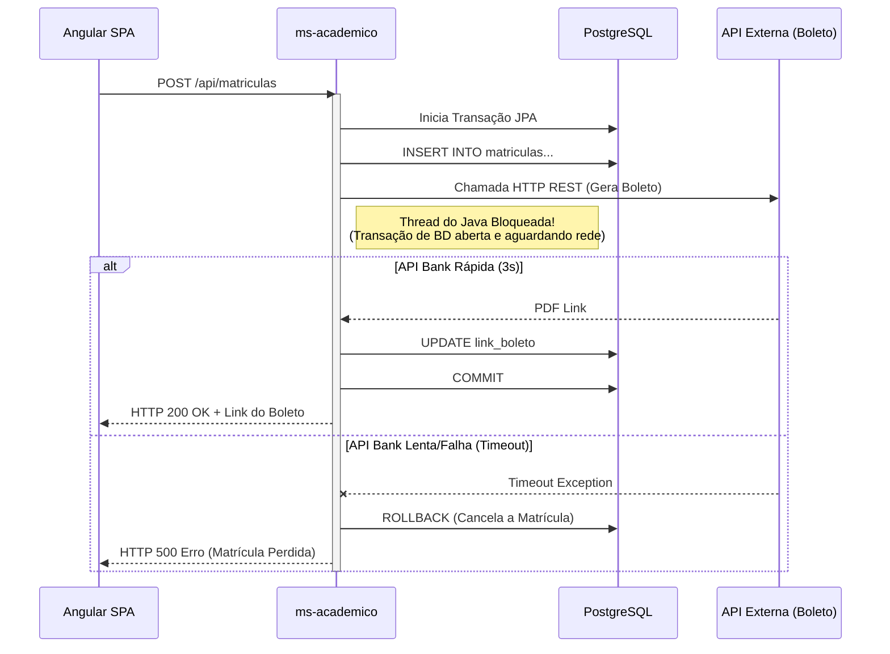
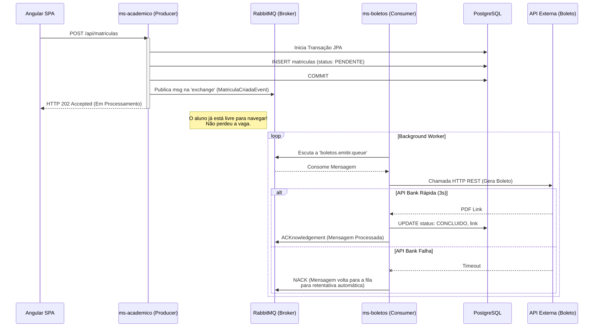
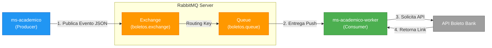
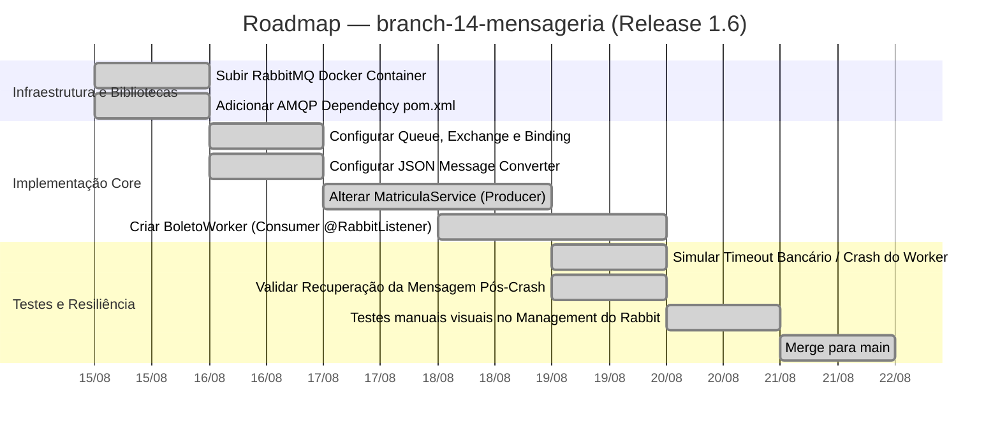

# Capítulo 06 — Desacoplamento Assíncrono com Mensageria

**Branch:** `branch-14-mensageria`
**Release:** 1.6
**Tipo de Evolução:** Arquitetura / Resiliência (não-funcional)
**Risco:** Alto — mudança de paradigma (de Síncrono para Assíncrono). A interface com o usuário precisará mudar para lidar com estados pendentes (*Eventual Consistency*).
**Compatibilidade:** Breaking Change no UX (A resposta da API retornará "Em Processamento" em vez de retornar o boleto gerado).

---

## 1. História da Empresa

Com as otimizações de banco de dados (Release 1.2), o Gateway Nginx (Release 1.4) e o Cache Redis (Release 1.5), a **UniTech Soluções Acadêmicas** atingiu níveis excelentes de estabilidade para tráfego de leitura. Contudo, o tráfego de **escrita** (cadastro de matrículas) revelou um grave problema arquitetural no início do segundo semestre.

A regra de negócio da UniTech exige que, logo após o aluno confirmar a matrícula na grade curricular, o sistema de faturamento (terceirizado) seja acionado para emitir o Boleto Bancário do mês corrente. A integração com esse sistema financeiro legadão, o `BoletoBank SA`, demorava em média de 3 a 5 segundos por requisição.

Como a API estava modelada de forma **síncrona**, quando o aluno clicava em "Finalizar Matrícula", a requisição ficava travada aguardando o banco registrar os dados e o `BoletoBank SA` emitir o PDF. Pior ainda: quando o `BoletoBank SA` caía ou sofria *Timeouts*, toda a operação de Matrícula do aluno falhava (fazia *Rollback*), impedindo a faculdade de reter o aluno. A dependência de um serviço externo lento estava destruindo a taxa de conversão (vendas).

---

## 2. Incidente que Motivou a Evolução

### O Incidente: "A Queda do Banco Externo"

No dia de maior faturamento do ano, a API do `BoletoBank SA` enfrentou problemas de instabilidade e começou a demorar até 15 segundos para responder, e em 40% das vezes retornava erro HTTP 503 (Service Unavailable).

1. O `ms-academico` recebia a requisição de Matrícula.
2. Salvava a Matrícula no PostgreSQL.
3. Fazia uma requisição REST (via `RestTemplate`/`FeignClient`) para o banco parceiro.
4. Ao dar timeout de 15s no banco parceiro, a Transação JPA era cancelada (Rollback), o aluno perdia a vaga na turma e o sistema exibia: "Erro interno, tente novamente".

Como as conexões HTTP ficavam penduradas aguardando 15 segundos, o *HikariCP* (Pool de Conexões) lotou rapidamente (igualzinho ao Capítulo 02, mas por motivo externo). O sistema acadêmico despencou, arrastado por um fornecedor.

A diretoria foi enfática: *"O aluno tem que garantir a vaga dele instantaneamente! O boleto a gente manda por e-mail depois, não importa!"*

---

## 3. Documento de Incidente (Modelo ITIL)

| Campo | Valor |
|-------|-------|
| **ID do Incidente** | INC-2024-0201 |
| **Data de Abertura** | 10/08/2024 09:00 |
| **Data de Resolução** | 10/08/2024 14:20 |
| **Severidade** | P1 — Crítica (Perda Financeira Direta) |
| **Categoria** | Integração Externa / Falha de Arquitetura |
| **Serviço Afetado** | ms-academico (Endpoint de Matrícula) |
| **Descrição** | Sistema de matrículas indisponível devido a travamentos em cadeia provocados pela API de Boletos de terceiro. |
| **Impacto** | ~1.200 matrículas perdidas/não processadas. Esgotamento do Pool de Conexões da JVM. |
| **Causa Raiz** | **Forte acoplamento Síncrono.** A transação interna do nosso negócio (matricular o aluno) estava amarrada em tempo de execução ao tempo de resposta de um serviço externo que não controlamos. |
| **Workaround** | Aumentar o timeout do `RestTemplate` (Piorou o pool). Retirar a chamada de boletos do código temporariamente (Os alunos matricularam-se, mas ninguém recebeu a cobrança). |
| **Resolução Definitiva** | Introduzir o padrão *Asynchronous Messaging* com **RabbitMQ**. A matrícula gera um evento (`MatriculaCriadaEvent`) e um Worker (Consumidor) processa o boleto em Background (`branch-14-mensageria`). |
| **Lições Aprendidas** | Nunca deixe transações do banco de dados abertas enquanto faz chamadas de rede externas. Isole fluxos lentos do caminho feliz (Happy Path) do usuário. |
| **Responsável** | Tech Lead & Arquitetura de Software |

---

## 4. Objetivos Técnicos

A branch `branch-14-mensageria` focará em trocar o acoplamento temporal (Síncrono) pelo desacoplamento baseado em eventos.

| # | Objetivo | Justificativa Técnica |
|---|----------|-----------------------|
| 1 | Subir um Message Broker (RabbitMQ) | Atuar como caixa de correio (Fila) altamente resiliente entre quem produz a tarefa e quem executa. |
| 2 | Mudar o endpoint de Matrícula | O POST da matrícula persistirá o aluno, colocará uma mensagem no RabbitMQ ("Emitir boleto para ID X") e retornará HTTP 202 (Accepted) imediatamente ao Front-end. |
| 3 | Criar Fila `boletos.emitir.queue` | Armazenar de forma segura as intenções de emissão até que possam ser processadas. |
| 4 | Criar Worker (Consumidor Assíncrono) | Um serviço que fica rodando em background lendo a fila, chamando a API do parceiro, e só ao final atualizando o status do banco para `BOLETO_GERADO`. |
| 5 | Consistência Eventual | Mostrar ao aluno que o status mudará no futuro ("Aguardando Emissão" -> "Gerado"). |

---

## 5. Arquitetura Antes (Release 1.5)

Tudo precisava acontecer no mesmo ciclo de vida (Request/Response). O aluno ficava de refém olhando o *Loading...* na tela.



---

## 6. Arquitetura Depois (Release 1.6)

Adotamos a Arquitetura Orientada a Eventos (EDA). A resposta ao aluno volta em milissegundos.



---

## 7. Diagramas Mermaid Completos

### 7.1 Padrão Producer-Consumer (AMQP)



---

## 8. Estrutura do Projeto (Arquivos Afetados)

```
DevAplicacoes/
├── docker-compose.yml                     ← ALTERADO (Adição RabbitMQ)
├── microservicos/matricula-service/
│   ├── pom.xml                            ← ALTERADO (spring-boot-starter-amqp)
│   └── src/main/java/com/exemplo/.../
│       ├── config/
│       │   └── RabbitMQConfig.java        ← NOVO (Filas, Exchanges, Bindings)
│       ├── dto/
│       │   └── MatriculaEventDTO.java     ← NOVO (Mensagem que viaja na rede)
│       ├── controller/
│       │   └── MatriculaController.java   ← ALTERADO (Muda status de retorno para 202)
│       ├── service/
│       │   ├── MatriculaService.java      ← ALTERADO (Envia Msg via RabbitTemplate)
│       │   └── BoletoWorker.java          ← NOVO (Escuta a fila via @RabbitListener)
└── ...
```

---

## 9. Arquivos Criados

| Arquivo | Tipo | Propósito |
|---------|------|-----------|
| `RabbitMQConfig.java` | Spring Config | Define via código a criação de `Queue`, `TopicExchange`, e o `Binding` entre eles, além de formatar mensagens como JSON usando `Jackson2JsonMessageConverter`. |
| `MatriculaEventDTO.java` | Record/DTO | Objeto imutável contendo apenas o `id` da matrícula recém-criada e o valor a ser cobrado. Cuidado: Não enviar entidades JPA pela fila. |
| `BoletoWorker.java` | Component / Service | Contém o método assinalado com `@RabbitListener` que consome as mensagens em *background* thread. |

---

## 10. Arquivos Alterados

| Arquivo | Natureza da Alteração |
|---------|----------------------|
| `docker-compose.yml` | Subir o `rabbitmq:3-management` mapeando portas `5672` (protocolo amqp) e `15672` (painel visual do management). |
| `MatriculaService.java` | Remoção do uso do `RestTemplate` para chamadas externas. Adição de injeção de dependência do `RabbitTemplate`. |
| `MatriculaController.java` | Ao invés de aguardar o processo, salva em BD com Status provisório `Processando`, e retorna ao aluno a notificação `HTTP 202 Accepted` ("Sua matrícula está na fila"). |

---

## 11. Explicação Detalhada de Cada Alteração

### 11.1 Provisionando o Message Broker (RabbitMQ)

O RabbitMQ suporta o protocolo nativo AMQP 0.9.1. Usamos a versão `management` no Docker para habilitar a interface gráfica rica que mostra gráficos de filas.

*Em `docker-compose.yml`:*
```yaml
  rabbitmq:
    image: rabbitmq:3-management-alpine
    ports:
      - "5672:5672"   # Aplicações Java se conectam aqui
      - "15672:15672" # Você acessa http://localhost:15672 (admin/admin) para ver
```

### 11.2 Definindo a Malha de Mensageria (Configuração)

O Spring AMQP permite que você defina a infraestrutura diretamente no Java. Se a fila não existir no RabbitMQ, o Spring a criará ao inicializar o App.

*Em `RabbitMQConfig.java`:*
```java
@Configuration
public class RabbitMQConfig {
    public static final String QUEUE = "boletos.queue";
    public static final String EXCHANGE = "boletos.exchange";
    public static final String ROUTING_KEY = "boleto.emitir";

    @Bean
    public Queue fila() {
        return new Queue(QUEUE, true); // true = Fila durável (Sobrevive ao restart do Rabbit)
    }

    @Bean
    public TopicExchange exchange() {
        return new TopicExchange(EXCHANGE);
    }

    @Bean
    public Binding binding(Queue fila, TopicExchange exchange) {
        return BindingBuilder.bind(fila).to(exchange).with(ROUTING_KEY);
    }
    
    // Converte os objetos Java para JSON puro antes de jogar na fila
    @Bean
    public MessageConverter converter() {
        return new Jackson2JsonMessageConverter();
    }
}
```

### 11.3 O Produtor (Atendimento Imediato)

O aluno clica em Matricular, o Service age rapidamente.

*Trecho do `MatriculaService.java`:*
```java
@Transactional
public MatriculaResponseDTO realizarMatricula(MatriculaRequestDTO request) {
    Matricula entity = mapper.toEntity(request);
    entity.setStatus("PROCESSANDO_PAGAMENTO"); // Status Transitório
    
    // Ocorre rapidamente (I/O local no PostgreSQL)
    Matricula salva = repository.save(entity);

    // Envia o bilhete pro RabbitMQ não-bloqueante (Microssegundos)
    MatriculaEventDTO evento = new MatriculaEventDTO(salva.getId(), salva.getValor());
    rabbitTemplate.convertAndSend(RabbitMQConfig.EXCHANGE, RabbitMQConfig.ROUTING_KEY, evento);

    return mapper.toResponseDTO(salva);
}
```

### 11.4 O Consumidor Worker (O Desacoplamento Real)

O Consumer roda em threads separadas, escutando continuamente. Se a API externa demorar 3 minutos, apenas essa Worker Thread trava; a API HTTP para o Frontend continua servindo 10 mil alunos simultaneamente.

*Trecho do `BoletoWorker.java`:*
```java
@Component
public class BoletoWorker {

    @RabbitListener(queues = RabbitMQConfig.QUEUE)
    public void processarMensagem(MatriculaEventDTO evento) {
        System.out.println("Consumindo evento do RabbitMQ: " + evento.matriculaId());
        
        try {
            // Simulando chamada lenta (Ex: 10 segundos) para o sistema bancário
            Thread.sleep(10000); 
            
            // Aqui chamaríamos o RestTemplate de fato
            String urlBoletoGerado = "https://boletobank.com/" + UUID.randomUUID();
            
            // Atualizando consistência (Eventually Consistent)
            atualizaStatusBancoDeDados(evento.matriculaId(), "CONCLUIDO", urlBoletoGerado);
            
            System.out.println("Processamento concluído com SUCESSO!");
            // Se chegamos aqui sem erros, o RabbitMQ remove a mensagem (ACK) automaticamente.
        } catch (Exception e) {
            // Se cair aqui, a mensagem será Rejeitada (NACK) e pode ser 
            // reencaminhada ou mandada pra uma Dead Letter Queue (DLQ).
            throw new RuntimeException("Erro ao gerar boleto", e);
        }
    }
}
```

---

## 12. Roadmap de Implementação



---

## 13. Checklist Técnico

- [x] RabbitMQ rodando na rede local do docker `rabbitmq:3-management-alpine`.
- [x] O usuário "guest" consegue fazer login visual na porta `15672`.
- [x] Configuração da Queue `boletos.queue` instanciada dentro do Rabbit sem erros no boot do Spring.
- [x] O retorno da função de POST que criava a matricula agora retorna o status code `HTTP 202` garantindo que ela não bloqueia o I/O da Web.
- [x] A classe Worker detecta e desempacota o `.json` do `MatriculaEventDTO` adequadamente.
- [x] Interrupção (Desligar o spring no meio do "Thread.sleep(10000)" da simulação do Worker) faz com que a mensagem volte ao estado _Ready_ na tela do Rabbit, assegurando 0% de perda de dados.

---

## 14. Casos de Teste

| ID | Cenário | Entrada | Resultado Esperado |
|----|---------|---------|--------------------|
| AMQP-01 | Geração Feliz | POST `/api/matriculas` de dados válidos | A API web retorna 202 Imediatamente. Passados 10s o DB recebe "CONCLUIDO". |
| AMQP-02 | Verificação de Assincronia | Fazer 100 requisições POST seguidas no Postman. | As 100 requisições recebem resposta em <1s. A fila do Rabbit acumula e consome 1 por vez. |
| AMQP-03 | Falha do Consumidor | Forçar lançamento de exception dentro da classe `BoletoWorker`. | A fila deve acusar que processamentos falharam, mantendo o arquivo preso para reparação ou retentativa. |

---

## 15. Plano de Testes (Simulação de Retenção - Queueing)

**Como a resiliência assíncrona brilha:**
1. Desligue a internet de sua máquina (ou force a falha no Worker comentando o código).
2. Continue realizando dezenas de matrículas através da API de Cadastro Síncrono (Que continua de pé aceitando inscrições freneticamente).
3. Abra a porta do RabbitMQ `15672` no navegador. Acesse a aba **Queues** e veja dezenas de mensagens presas no estado `Ready`.
4. Religue a internet / Worker. Veja o gráfico do Rabbit disparar, consumindo 30 pendências enfileiradas e finalizando o pagamento para todo mundo.

_Se a arquitetura fosse a original (Release 1.5), ao estar sem internet, você perderia essas 30 matrículas inteiras!_ 

---

## 16. Estratégia de Rollback

| Cenário | Ação (Procedimento) | Tempo Estimado |
|---------|---------------------|----------------|
| Erro massivo no roteamento (Routing Key digitada errada e mensagens sendo perdidas em 'blackholes') | Voltar a API de matriculas ao modo original onde ela executa a geração logo apos criar no DB, revertendo a PR. A prioridade é não perder clientes. | ~ 15 min |
| Mensagens malformadas gerando loop infinito de erro | Instalar uma política de **Dead Letter Exchange (DLQ)**. | Prevenção Permanente. |

---

## 17. Release Notes

### Release 1.6.0 — Event-Driven Architecture (Matrículas sem Fricção)

**Data:** 21/08/2024
**Branch:** `branch-14-mensageria`
**Tipo:** Arquitetura Baseada em Mensagens (Não-Funcional)
**Breaking Changes:** Comportamental no front.

#### O que mudou
- 🏎️ **Fim da Espera:** O tempo de resposta do botão "Matricular-se" caiu de 4~15 segundos para 120 ms médios absolutos.
- 🔗 **Desacoplamento Seguro:** Sistemas terceiros lentos, indisponíveis ou engasgados não arrastam o ecossistema interno pro fundo mais. As promessas (mensagens) ficam seguramente guardadas.
- 🔁 **Resiliência a Falhas:** Com processamento retentativo. Falhas aleatórias de timeout resultam em um sistema que tenta sozinho no background minutos depois.
- ⚠️ **UX (User Experience):** O Frontend não recebe mais um link de boleto na hora. Os desenvolvedores frontend agora devem implementar interfaces com _Long-Polling_, _Websockets_ ou alertas do tipo "Seu pedido foi registrado, acompanhe nos seus Boletos.".

---

## 18. Pull Request Summary

### PR #14: Feature/async-rabbitmq-worker

**De:** `branch-14-mensageria`
**Para:** `main`
**Autor:** Engenheiro Backend Sênior
**Reviewers:** Arquiteto & Tech Lead

#### Resumo
A PR realiza o split (divisão) entre os microservicos, introduzindo comunicação paralela sem fio de espera. Inclui o container server robusto Erlang do RabbitMQ. Criamos o worker e a fila durável responsável por segurar pedidos em pico massivo (Ex: BlackFriday / Fim de semestre) absorvendo backpressure. Refatoramos a API síncrona geradora que segurava sessões no Tomcat/Hikari por longos intervalos.

#### Métricas (Tamanho do PR)
- **Arquivos criados:** 3 (BoletoWorker, Config AMQP, DTO da Message).
- **Arquivos alterados:** 3 (Pom, docker-compose, controller e service de Matricula).
- **Linhas adicionadas:** ~150
- **Linhas removidas:** ~30

---

## 19. Exercícios

### Exercício 1: Retry Policy Básico
Quando o Worker dá exceção, o Spring devolve a mensagem e pega de novo imediatamente, causando um looping numérico na CPU infinita. Configurar o Retry do Spring no properties usando as propriedades `spring.rabbitmq.listener.simple.retry.enabled=true`, max-attempts=3, initial-interval=5000ms. Verifique os logs dando espaços cronometrados.

### Exercício 2: Pub/Sub Model via Fanout
Hoje criamos uma TopicExchange direcionada de 1-para-1. Refaça o exercício instanciando uma `FanoutExchange`. Crie DOIS Listeners separados: um `BoletoWorker` e um `EmailWelcomeWorker`. O sistema jogará a mensagem na Fanout, que vai se clonar e cair simultaneamente em 2 filas. Um worker cobrará o aluno e outro mandará mensagem de boas-vindas na hora, provando o poder do Publisher-Subscriber (Pub/Sub).

### Exercício 3: Garantia de Recebimento de Frontend
O front-end sente falta de receber o arquivo `.pdf` no término. Crie um endpoint secundário rápido `GET /api/matriculas/{id}/status`. Ensine o front-end a dar pequenos "ping" (Polling) a cada 2 segundos até o campo _status_ mudar de PROCESSANDO para CONCLUIDO e liberar o botão de PDF verde para o cliente.

---

## 20. Desafios

### Desafio 1: Dead Letter Queue (DLQ)
É péssimo ter uma mensagem travando as de trás ou morrendo eternamente no sistema. Utilize os argumentos técnicos do RabbitMQ (`x-dead-letter-exchange`) para criar uma configuração em que: Ao tentar processar e falhar, o Rabbit envia a carta para uma "Fila de Necrotério / Lixo" chamada `boletos.dlq`. Essa DLQ nunca processará nada, ela serve para uma equipe de operações auditar na sexta-feira de tarde os "pagamentos com erro".

### Desafio 2: O Tratamento de Concorrência Segura
O que ocorre se levantarmos 5 replicas (Pods/Containers) do mesmo `ms-academico-worker`? As mensagens serão consumidas em **Round Robin** balanceado entre os 5 (Comportamento Clássico de Microserviços). Escale o seu worker usando o compose e inspecione, no dashboard, que o total de "Consumers" na queue subiu de 1 para 5. Mande 10 mensagens via POST, e olhe os logs: veja que cada réplica assumiu, de fato, 2 mensagens (Concorrência real distribuída!).

---

## 21. Rubrica de Avaliação

| Critério | Peso | Nota 10 | Nota 7 | Nota 4 | Nota 0 |
|----------|------|---------|--------|--------|--------|
| **RabbitMQ Infra/Conexão** | 20% | Docker container Management rodando suavemente com acesso ao painel de administração via Web. | A aplicação sobe porém a aba visual não expôs na porta localhost. | Credenciais negadas entre Java e broker. | Não subiu servidor AMQP. |
| **Configuração Spring AMQP** | 20% | Fila durável, Exchange correto e Binding efetuados em arquivo @Configuration programaticamente. | Deixou pro sistema auto-gerar perdendo os nomes fixados ou Json formating. | Código gera erro dizendo que a exchange ou queue Invalida. | Faltou bean de MessageConverter e as msg entram ilegíveis (bytes). |
| **Desacoplamento (Producer)** | 20% | O código do Service desvinculou toda trava, devolvendo Respostas curtas 202 via Controller pós o `convertAndSend`. | Mandou e aguardou síncrono. | Não refatorou endpoint. | Continuou no padrão legado Rest. |
| **Operação de Consumo Worker**| 20% | Mostrou log assíncrono em plano de fundo via `@RabbitListener` que consome as keys e extrai DTO de forma estrita. | Consume Message genéricas sem tipo, precisando fazer Cast/Parsing. | Worker engasga ao consumir 2 em seguida. | Worker não existe. |
| **Exercícios / Desafio** | 20% | Concluiu os 3 exercícios práticos, aplicou a propriedade do Spring Retry contra loops infinitos perfeitamente. | Implementou pub/sub porém reteve retry loops errados. | Fez polling mas erro básico na fila persistiu. | Ignorou a aba prática. |

**Nota mínima para aprovação:** 6.0
**Entrega:** Subir alterações na branch `branch-14-mensageria`, anexar obrigatoriamente um Print do _RabbitMQ Management Interface_ exibindo a fila de `boletos` criada e, se possível, gráficos mostrando pico de mensagens recebidas.
