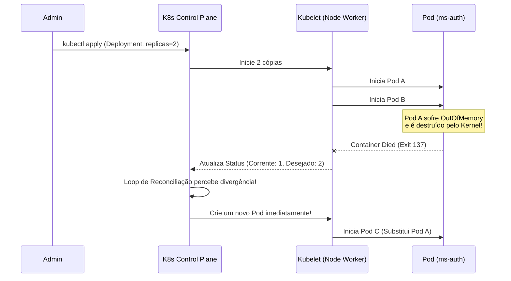
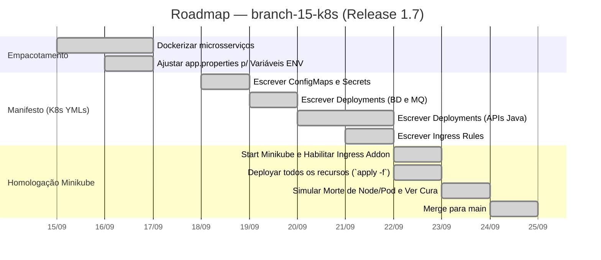

# Capítulo 07 — Alta Disponibilidade e Orquestração com Kubernetes

**Branch:** `branch-15-k8s`
**Release:** 1.7
**Tipo de Evolução:** Infraestrutura / Orquestração (não-funcional)
**Risco:** Alto — mudança completa da plataforma de deployment. Saída de Docker-Compose (imperativo local) para Kubernetes (declarativo distribuído).
**Compatibilidade:** Backward-compatible na visão do aluno. Breaking Change para a equipe de Operações (Infra as Code reescrito).

---

## 1. História da Empresa

Com o sistema totalmente estável no nível de banco de dados (Cache) e de integração (Mensageria), o **UniTech Soluções Acadêmicas** operava de forma exemplar. O `docker-compose` rodava bravamente em um servidor virtual de 32GB de RAM (VM).

Contudo, às vésperas da semana de provas, um problema de infraestrutura estragou a noite do Time de TI. Um dos HDs virtuais da VM onde o `docker-compose` rodava corrompeu. Embora a aplicação estivesse programada com todos os padrões modernos, ela era executada em uma máquina física única (Single Point of Failure).

Para recuperar o sistema, a equipe precisou alocar uma nova VM, instalar o Docker, puxar o projeto do git, buildar tudo e rodar `docker-compose up -d`. Esse processo levou 4 horas de *downtime*.

O Diretor de Tecnologia exigiu que a arquitetura não dependesse mais de "máquinas de estimação" (Pets). O sistema deveria ser composto por "gado" (Cattle) — máquinas descartáveis. Se um servidor pegasse fogo, a aplicação deveria se mover automaticamente para outro sem intervenção humana. A era do `docker-compose` para produção havia chegado ao fim; era hora de evoluir para o padrão ouro da indústria: **Kubernetes**.

---

## 2. Incidente que Motivou a Evolução

### O Incidente: "A VM de Estimação que Faleceu"

Durante as 4 horas de *downtime* do incidente, a equipe percebeu que o `docker-compose` não possuía inteligência de cluster. Ele era um ótimo gerenciador para rodar múltiplas portas em *uma* máquina, mas falhava nos seguintes quesitos exigidos para Alta Disponibilidade (High Availability):

1. **Auto-Healing (Cura Automática):** Quando o processo Java crasheava dentro do container por `OutOfMemory`, o Docker às vezes não subia ele de novo imediatamente, ou se o Host morresse, tudo acabava ali.
2. **Escalonamento Horizontal Desajeitado:** Não havia uma forma fácil de dizer "Quando a CPU passar de 70%, quero que o `ms-academico` ganhe 5 novas réplicas temporárias".
3. **Zero Downtime Deployments:** Toda vez que a equipe fazia uma nova release, havia 1 a 2 minutos de queda no sistema (o tempo de parar o container velho e subir o novo).

---

## 3. Documento de Incidente (Modelo ITIL)

| Campo | Valor |
|-------|-------|
| **ID do Incidente** | INC-2024-0255 |
| **Data de Abertura** | 12/09/2024 02:00 |
| **Data de Resolução** | 12/09/2024 06:15 |
| **Severidade** | P1 — Crítica (Sistema Totalmente Inacessível) |
| **Categoria** | Infraestrutura / Single Point of Failure |
| **Serviço Afetado** | Cluster Docker Inteiro |
| **Descrição** | Falha de hardware na VM Hospedeira derrubou todo o stack da aplicação acadêmica. |
| **Impacto** | 4 horas de Downtime generalizado. |
| **Causa Raiz** | Uso de tecnologia *standalone* (Docker-Compose) para rodar um sistema em ambiente de produção, criando um ponto único de falha no Host SO. |
| **Workaround** | Criação manual (ssh, git clone, build) em uma segunda VM. |
| **Resolução Definitiva** | Migrar a topologia para o **Kubernetes (K8s)**, separando configurações, segredos e réplicas, garantindo Auto-Healing (`branch-15-k8s`). |
| **Lições Aprendidas** | Servidores devem ser descartáveis. O orquestrador deve cuidar de manter o estado desejado sempre ativo independentemente do hardware abaixo. |
| **Responsável** | DevOps / SRE |

---

## 4. Objetivos Técnicos

A branch `branch-15-k8s` traduzirá a topologia atual para a linguagem declarativa do K8s (Manifestos YAML).

| # | Objetivo | Justificativa Técnica |
|---|----------|-----------------------|
| 1 | Mudar de Imperativo para Declarativo | No Kubernetes, você não executa comandos (`run`). Você declara: "Quero 3 cópias do ms-pessoas" e ele se vira para manter isso (State Machine). |
| 2 | Deployment e ReplicaSets | Garantir Alta Disponibilidade. Se 1 Pod (Container) travar, o K8s percebe via Probes (Health Checks) e recria outro instantaneamente. |
| 3 | ConfigMap & Secrets | Separar as senhas do Banco de Dados (`application.properties`) do código compilado, seguindo as premissas do *12-Factor App*. |
| 4 | Services (ClusterIP) | Manter IPs estáveis internos. Os pods morrem e nascem a todo instante, seus IPs mudam, mas o *Service* atua como um DNS fixo. |
| 5 | Ingress (Substituindo Nginx Manual) | O Ingress Controller substitui o nosso `nginx.conf` antigo gerando roteamento de borda nativo (API Gateway do Cluster). |

---

## 5. Arquitetura Antes (Release 1.6)

Docker-Compose monolítico amarrado à máquina hospedeira.

```mermaid
flowchart TD
    classDef bad fill:#8b0000,stroke:#ff4444,color:#fff;
    classDef comp fill:#333,stroke:#aaa,color:#fff;

    Internet["Internet"]:::comp
    
    subgraph VMFísica ["Virtual Machine (Única)"]
        DockerD["Docker Daemon"]:::bad
        Nginx["Nginx"]:::comp
        Auth["ms-auth"]:::comp
        Acad["ms-academico"]:::comp
        DB[("PostgreSQL")]:::comp
        
        Internet --> Nginx
        Nginx --> Auth & Acad
        Auth & Acad --> DB
    end
    
    style VMFísica stroke-width:3px,stroke:#ff0000,stroke-dasharray: 5 5
    note right of VMFísica: Se este servidor queimar,<br/>o sistema inteiro morre.
```

---

## 6. Arquitetura Depois (Release 1.7)

Clusterização Orquestrada. A abstração de máquina some e passa a ser sobre CPU/Memória global da nuvem.

```mermaid
flowchart TD
    classDef good fill:#004d00,stroke:#00cc44,color:#fff;
    classDef pod fill:#1e88e5,stroke:#0d47a1,color:#fff;
    classDef svc fill:#ff9800,stroke:#e65100,color:#fff;
    classDef comp fill:#333,stroke:#aaa,color:#fff;

    Internet["Internet"]:::comp
    
    subgraph ClusterK8s ["Kubernetes Cluster (Múltiplos Nós)"]
        Ingress["Ingress Controller<br/>(Regras de Roteamento)"]:::svc
        
        subgraph Node1
            P1["Pod: ms-academico (v1.7)"]:::pod
            P2["Pod: ms-pessoas (v1.7)"]:::pod
        end
        
        subgraph Node2
            P3["Pod: ms-academico (v1.7)"]:::pod
            P4["Pod: ms-auth (v1.7)"]:::pod
        end
        
        SvcAcad["Service: ms-academico"]:::svc
        SvcPess["Service: ms-pessoas"]:::svc
        
        Ingress -->|/api/academico| SvcAcad
        Ingress -->|/api/pessoas| SvcPess
        
        SvcAcad --> P1 & P3
        SvcPess --> P2
    end
    
    Internet --> Ingress
    
    note left of Node1: Se o Node1 pegar fogo,<br/>o K8s move os Pods<br/>para o Node2 automaticamente.
```

---

## 7. Diagramas Mermaid Completos

### 7.1 Auto-Healing em Ação (Reconciliação de Estado)



---

## 8. Estrutura do Projeto (Arquivos Afetados)

```
DevAplicacoes/
├── docker-compose.yml                     ← APAGADO/DEPRECIADO
├── k8s/                                   ← NOVA PASTA (Todos os manifestos YML)
│   ├── config/
│   │   ├── env-configmap.yml              ← Variáveis globais sem sigilo
│   │   └── secrets.yml                    ← Senhas de BD e Chave JWT em Base64
│   ├── databases/
│   │   └── postgres-deployment.yml        ← BD + Service
│   ├── messaging/
│   │   └── rabbitmq-deployment.yml        ← RabbitMQ + Service
│   ├── microservices/
│   │   ├── academico-deployment.yml       ← Deployment e Service da API
│   │   └── ... (outros services)
│   └── ingress/
│       └── api-ingress.yml                ← Substitui nosso Nginx antigo
└── ...
```

---

## 9. Arquivos Criados

| Arquivo | Tipo | Propósito |
|---------|------|-----------|
| `env-configmap.yml` | K8s ConfigMap | Abstrai o host do banco (`SPRING_DATASOURCE_URL=jdbc:postgresql://postgres-svc:5432/db`) e do rabbit. |
| `secrets.yml` | K8s Secret | Guarda chaves como `SPRING_DATASOURCE_PASSWORD` ofuscadas. |
| `academico-deployment.yml`| K8s Deployment | Define a imagem Docker a ser usada, Limits de CPU/RAM, e Health Checks (Liveness/Readiness probes usando o `/actuator/health` da Release 1.3). |
| `api-ingress.yml` | K8s Ingress | Lê o path HTTP (`/api/auth`) e manda para o Service `auth-svc` na porta 80. |

---

## 10. Arquivos Alterados

| Arquivo | Natureza da Alteração |
|---------|----------------------|
| `docker-compose.yml` | O arquivo foi aposentado e movido para uma pasta `legacy_infra`, marcando a transição oficial para o K8s. |
| `application.properties` | Todas as hardcodeds (ex: `localhost`) substituídas por injeção de variáveis de ambiente (`${DB_HOST}`) para que o K8s possa orquestrar. |

---

## 11. Explicação Detalhada de Cada Alteração

### 11.1 O Fim do Docker-Compose e o Build de Imagens

O K8s não constrói código. Ele puxa imagens prontas de um Registry (como o Docker Hub). Para o projeto funcionar no Minikube, nós "buildamos" a imagem diretamente dentro do ambiente dele:

```bash
# Apontamos o terminal para o Docker interno do Minikube
eval $(minikube docker-env)

# Construímos as imagens
docker build -t unitech/academico:1.7 ./microservicos/matricula-service
```

### 11.2 O Coração da Disponibilidade (Deployment.yml)

A magia da resiliência acontece aqui. Definimos que o sistema DEVE ter 2 réplicas rodando sempre. 

*Em `k8s/microservices/academico-deployment.yml`:*
```yaml
apiVersion: apps/v1
kind: Deployment
metadata:
  name: academico-deploy
spec:
  replicas: 2
  selector:
    matchLabels:
      app: ms-academico
  template:
    metadata:
      labels:
        app: ms-academico
    spec:
      containers:
      - name: ms-academico
        image: unitech/academico:1.7
        imagePullPolicy: Never
        ports:
        - containerPort: 8081
        envFrom:
        - configMapRef:
            name: app-config
        - secretRef:
            name: app-secrets
        
        # Readiness Probe: Só joga tráfego pra esse pod se o Java já inicializou
        readinessProbe:
          httpGet:
            path: /actuator/health
            port: 8081
          initialDelaySeconds: 20
          periodSeconds: 5
        
        # Liveness Probe: Se o pod travar (deadlock), o K8s mata e sobe de novo
        livenessProbe:
          httpGet:
            path: /actuator/health
            port: 8081
          initialDelaySeconds: 40
          periodSeconds: 10
```

### 11.3 Services e DNS Interno

No Docker-Compose, usávamos o nome do serviço. No K8s, um Pod ganha um IP bizarro que muda quando ele morre (ex: `10.1.0.42`). O `Service` cria um nome de domínio fixo dentro do cluster (Ex: `academico-svc`).

```yaml
apiVersion: v1
kind: Service
metadata:
  name: academico-svc
spec:
  selector:
    app: ms-academico
  ports:
    - protocol: TCP
      port: 80
      targetPort: 8081
```

### 11.4 Ingress Controller (O novo Porteiro)

Ao invés de programarmos o `nginx.conf` cru (Release 1.4), usamos a abstração oficial do K8s (Ingress). Ele gera as regras de Nginx sozinho por baixo dos panos!

```yaml
apiVersion: networking.k8s.io/v1
kind: Ingress
metadata:
  name: unitech-ingress
  annotations:
    nginx.ingress.kubernetes.io/rewrite-target: /$2
spec:
  rules:
  - host: api.unitech.local
    http:
      paths:
      - path: /api/academico(/|$)(.*)
        pathType: Prefix
        backend:
          service:
            name: academico-svc
            port:
              number: 80
```

---

## 12. Roadmap de Implementação



---

## 13. Checklist Técnico

- [x] O `minikube` está instalado e rodando via comando `minikube start`.
- [x] O Addon de ingress está ativo via `minikube addons enable ingress`.
- [x] O comando `kubectl get pods -n default` lista todos os pods rodando no estado `Running`.
- [x] O arquivo do sistema operacional (ex: `C:\Windows\System32\drivers\etc\hosts`) contém a entrada: `127.0.0.1 api.unitech.local` (ou o IP providenciado por `minikube ip`).
- [x] Nenhuma senha de Banco de Dados ou secret chave de JWT está descrita em texto puro no código do projeto (foram movidas para `secrets.yml` em Base64 e aplicadas no cluster).
- [x] As *Liveness Probes* estão checando a raiz nativa do Actuator que configuramos na Release 1.3 (`/actuator/health`).

---

## 14. Casos de Teste (The Chaos Monkey)

| ID | Cenário | Ação (kubectl) | Resultado Esperado |
|----|---------|----------------|--------------------|
| K8S-01 | Deploy Básico | `kubectl get deployments` | Mostra `2/2` na coluna READY para `ms-academico`. |
| K8S-02 | Teste de Ingress | Realizar HTTP GET `http://api.unitech.local/api/academico/disciplinas` | Responde 200 OK via Nginx Ingress interno. |
| K8S-03 | Simulação de Pane (Chaos) | Rodar `kubectl delete pod <nome-do-pod>` em produção simulando o servidor pegando fogo. | O comando `kubectl get pods` vai mostrar o pod deletado sumindo e um *Novo Pods (Age: 1s)* surgindo automaticamente para manter as 2 réplicas desejadas. Nenhuma ação humana precisou ser feita para recuperar. |
| K8S-04 | Zero Downtime | Executar um K6 loop infinito no endpoint e deletar um pod no meio. | O Ingress Controller percebe que o Pod morreu e passa 100% do tráfego para a réplica viva, resultando em 0 perdas de requisições. |

---

## 15. Plano de Rollout (Estratégia de Deploy)

Ao contrário do Docker-Compose que para tudo para subir o novo, configuramos o `RollingUpdate` no K8s.

- Na próxima versão do código (`v1.8`), quando o Jenkins (CI/CD) alterar a versão da imagem no K8s, o K8s sobe 1 pod novo, espera ele dar Health OK, desliga 1 pod velho. E repete o ciclo. 
- O aluno usando a aplicação sequer notará que o sistema passou por uma atualização pesada. A transição é "Soft".

---

## 16. Estratégia de Rollback

| Cenário | Ação (Procedimento) | Tempo Estimado |
|---------|---------------------|----------------|
| A nova imagem `v1.7.1` contém erro fatal (Liveness Probe falha em loop / CrashLoopBackOff). | Usar recurso nativo: `kubectl rollout undo deployment/academico-deploy`. O K8s volta instantaneamente a rodar a imagem anterior testada. | ~ 15 Segundos |
| Cluster inteiro (Minikube/EKS/GKE) pega fogo irreparavelmente. | O estado do sistema inteiro agora é código puro na pasta `/k8s`. Basta subir outro cluster vazio e rodar `kubectl apply -f k8s/` que o sistema reconstrói seu império idêntico do zero. | ~ 5 min |

---

## 17. Release Notes

### Release 1.7.0 — Rumo às Nuvens (Plataforma K8s)

**Data:** 24/09/2024
**Branch:** `branch-15-k8s`
**Tipo:** Plataforma (Orquestração)
**Breaking Changes:** Arquitetura imperativa (`docker-compose`) depreciada. Desenvolvimento local necessita agora do `minikube` (ou similar) operando na máquina do Desenvolvedor.

#### O que mudou
- ⚙️ **Automação Absoluta:** Sai a preocupação com servidores únicos, entra o gerenciador declarativo. Você diz o que quer, o Kubernetes faz acontecer.
- 🛡️ **Auto-Healing:** A temida página *502 Bad Gateway* e madrugadas perdidas com Tomcat travado acabaram. O Kubernetes tem autoridade de assassinar instâncias "Zumbis" baseadas nos HealthChecks do Actuator e subir clones novos.
- 🔐 **Segurança via Secrets:** Senhas vazadas no Git nunca mais. Senhas operam injetadas no ambiente pela abstração de *K8s Secrets*.

---

## 18. Pull Request Summary

### PR #15: Infra/migracao-kubernetes-minikube

**De:** `branch-15-k8s`
**Para:** `main`
**Autor:** Especialista DevOps
**Reviewers:** SRE Team & CTO

#### Resumo
Substituição da base docker-compose monolítica em prol da orquestração profissional focada em High-Availability com Kubernetes. Todo o stack Java da UniTech agora suporta provisionamento via Deployments elásticos, comunicação via Servicos fixos, e exposição usando Ingress Controller. Esse é o pilar que libera espaço para as futuras pipelines de CI/CD contínuas da empresa.

#### Métricas (Tamanho do PR)
- **Arquivos criados:** 15+ (Todos os YML manifestos separados na pasta `k8s/`).
- **Arquivos alterados:** ~5 (Aposentadoria de scripts shell velhos e propriedades legadas).
- **Linhas adicionadas:** ~800 
- **Linhas removidas:** ~150

---

## 19. Exercícios

### Exercício 1: Scaling Dinâmico (Magia!)
Abra o seu terminal com o cluster rodando. Digite `kubectl scale deployment academico-deploy --replicas=5`. 
Em seguida, execute um `kubectl get pods -w` e documente, tirando um print-screen, de como a mágica do K8s funcionou em poucos segundos construindo um exército de novas JVMs.

### Exercício 2: Liveness Probe Errada
Altere intencionalmente o `path` do Liveness Probe do Deployment do `ms-auth` de `/actuator/health` para um caminho falso `/actuator/caminho-errado`. Faça o `apply`. Relate o que o Kubernetes pensa que está acontecendo (Dica: ele entra num estado de fúria achando que o pod está quebrado, entrando no loop de *CrashLoopBackOff*). Desfaça a alteração via Rollback command!

### Exercício 3: Port Forwarding de Depuração
Um dev backend precisa acessar o banco PostgreSQL do Cluster usando o DBeaver na máquina local dele, porem o BD está enclausurado em um Service do K8s sem IP Externo (Ingress). Use o utilitário nativo de rede do k8s com o comando `kubectl port-forward svc/postgres-svc 5432:5432` e estabeleça uma conexão SQL limpa pela sua máquina desktop. 

---

## 20. Desafios

### Desafio 1: Horizontal Pod Autoscaler (HPA)
No exercício 1 você fez um escalonamento de réplicas via comando manual (`scale`). O verdadeiro poder do K8s reside no **HPA**.
Pesquise e crie o manifesto YML do tipo `HorizontalPodAutoscaler` para o `ms-academico`. As regras devem ser: "Min 1 pod. Max 5 pods. Scale UP caso a TargetCPU passar de 70%". Com a ferramenta configurada, ligue o K6 de teste de carga (da branch-10) e assista ao Kubernetes criar as 5 réplicas sozinho. Quando o K6 parar, assista ao K8s matar 4 réplicas sozinho (Scale Down)!

### Desafio 2: Resource Limits (A Fome da JVM)
A JVM (Java) consome toda a memória que puder se solta pelo sistema operacional sem rédeas. Quando o K8s tenta rodá-la sem limites declarados, o Node (Servidor) morre (Out Of Memory host level). 
No seu Deployment, implemente os blocos de `resources.requests` e `resources.limits` exigindo da nuvem para o `ms-academico` 500m de CPU e 1GiB de RAM máximo. Combine isso com a tag Java `JAVA_OPTS=-XX:MaxRAMPercentage=75.0` garantindo alinhamento fino de engenharia extrema entre Kernel Linux, Kubernetes, e JVM.

---

## 21. Rubrica de Avaliação

| Critério | Peso | Nota 10 | Nota 7 | Nota 4 | Nota 0 |
|----------|------|---------|--------|--------|--------|
| **Implementação de Deployments** | 20% | Manifestos YAML de *Deployments* submetidos perfeitos, contendo Probes, labels e injetando as configMaps com destreza. | Fez, mas as liveness probes falham na sintaxe e não sobem (Travando). | Nomes, Indentações Yaml ilegais ou labels descombinadas. | Não efetuou o abandono do Docker Compose antigo. |
| **Arquitetura Service & Ingress**| 20% | O sistema resolve requisições via Ingress Controller validado. Print comprova o cluster respondendo à requisições. | Pulou a parte do Ingress, e expôs o K8s via serviços de NodePort. | Não conseguiu rede entre microsserviços. | Deixou off. |
| **Separação Sec. & Config** | 20% | Strings mágicas de config e senhas em base64 isoladas (Secrets.yml/ConfigMap.yml). | Botou as senhas de banco chumbadas puras no meio do Deployment Yaml (Péssima prática). | Repositorio quebrado de dependência. | — |
| **Cenário de Queda/Cura** | 20% | Executou a exclusão e filmou/documentou o processo do Kubelet levantando do chão os pods instantaneamente. | Demonstrou os comandos escritos. | Errou a parte. | Não fez simulação. |
| **Exercícios / Desafio** | 20% | Concluiu os 3 exercícios práticos brilhantemente. Escreveu um HPA formidável capaz de reagir às ondas sonoras do K6 (Desafio concluído!). | Escalou manualmente bem e investigou o dbeaver, ignorou HPA. | Sem sucessos claros nas praticas de kubectl. | Ignorou aba. |

**Nota mínima para aprovação:** 6.0
**Entrega:** Subir código completo dos YAML na subpasta k8s da branch `branch-15-k8s`. Adicionar um pequeno `.md` reportando o teste do "Chaos Monkey" (Derrubada e levantamento automático).
