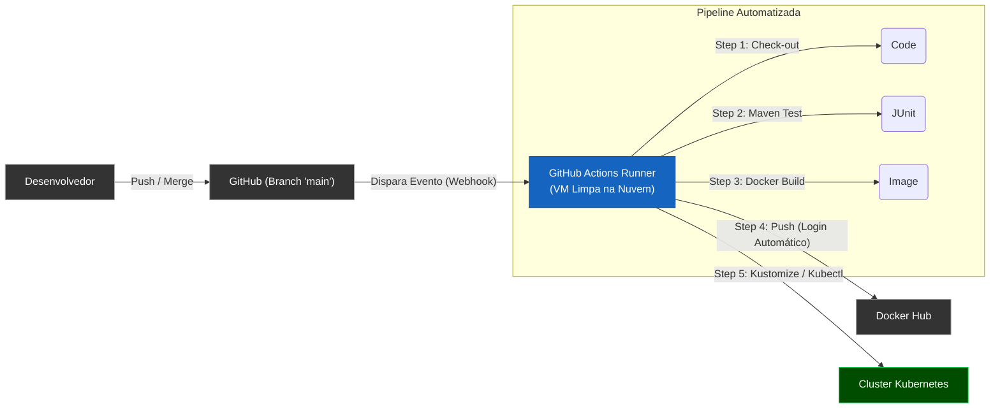
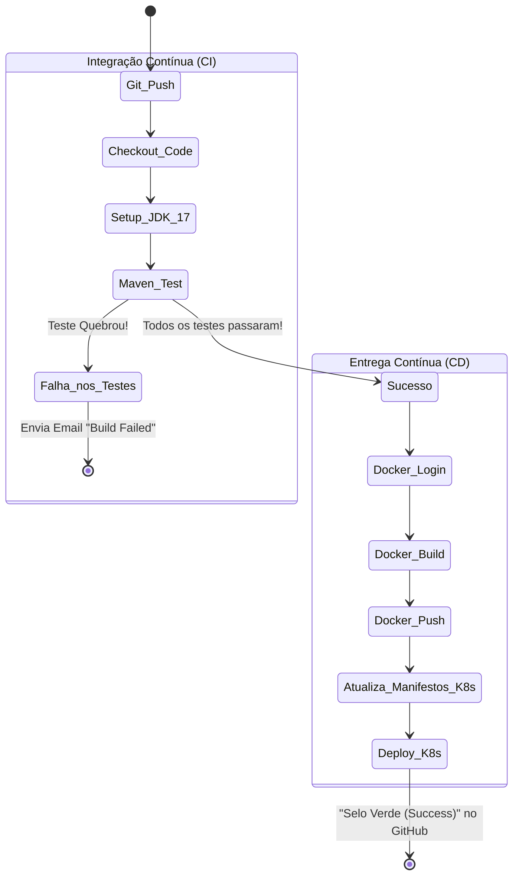
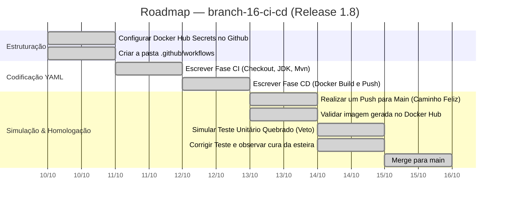

# Capítulo 08 — Automação de Entregas (CI/CD) com GitHub Actions

**Branch:** `branch-16-ci-cd`
**Release:** 1.8
**Tipo de Evolução:** Processos / Automação (não-funcional)
**Risco:** Baixo — altera apenas como o código chega à produção, sem afetar a lógica interna da aplicação.
**Compatibilidade:** Totalmente compatível.

---

## 1. História da Empresa

Após a brilhante migração do ecossistema UniTech para o **Kubernetes** na Release 1.7, a estabilidade em produção atingiu o cobiçado nível de "Five Nines" (99.999% de Uptime). Porém, os bastidores da engenharia revelavam uma frustração imensa.

Sempre que a equipe de desenvolvimento terminava uma funcionalidade e decidia lançar uma versão nova (Release), o Tech Lead gastava quase 2 horas executando um processo **completamente manual**:

1. Puxava o código mais recente na sua máquina (`git pull`).
2. Rodava os testes localmente (`mvn clean test`). Se esquecesse, a versão subia com bugs.
3. Gerava o `.jar` (`mvn clean package`).
4. Compilava a imagem Docker (`docker build ...`).
5. Fazia o push da imagem, muitas vezes numa rede residencial lenta (`docker push ...`).
6. Acessava o cluster Kubernetes de Produção e digitava os comandos para atualizar o Deployment.

Em uma sexta-feira chuvosa, o Tech Lead estava com pressa. Ele pulou a etapa 2 (Testes), buildou uma versão corrompida e executou o Deploy. O Kubernetes até tentou proteger (Health Checks barraram o Pod defeituoso), mas o processo que deveria ser ágil virou uma dor de cabeça de horas tentando reverter a lambança. O diagnóstico era óbvio: humanos não devem fazer trabalho repetitivo de máquina. Era a hora de implementar a cultura **DevOps**.

---

## 2. Incidente que Motivou a Evolução

### O Incidente: "O Deploy Corrompido da Sexta-Feira"

A ausência de um "juiz imparcial" antes da integração do código causou o transtorno. O fluxo da UniTech dependia unicamente da disciplina do Tech Lead.

1. **Testes Opcionais:** A falta de obrigatoriedade fez com que um código que não compilava perfeitamente chegasse a virar um artefato Docker.
2. **"Na minha máquina funciona":** Como o build era feito no notebook de quem aprovava, as dependências podiam estar "viciadas" por cache local.
3. **Falta de Rastreabilidade:** Ninguém da equipe sabia exatamente qual *commit* gerou a versão que estava atualmente no Kubernetes.
4. **Tempo Jogado Fora:** Desenvolvedores caros paravam de produzir features para atuarem como "operadores de terminal de deploy".

O CEO exigiu uma esteira rolante (Pipeline) igual à das grandes montadoras: se a peça for defeituosa, a esteira para automaticamente e avisa a equipe. Se for perfeita, ela chega no usuário final. Sem mãos humanas.

---

## 3. Documento de Incidente (Modelo ITIL)

| Campo | Valor |
|-------|-------|
| **ID do Incidente** | INC-2024-0302 |
| **Data de Abertura** | 04/10/2024 16:00 |
| **Data de Resolução** | 04/10/2024 18:30 |
| **Severidade** | P3 — Média (Risco Evitado, mas Desperdício Altíssimo) |
| **Categoria** | Processo e Release Management |
| **Serviço Afetado** | Todos os serviços |
| **Descrição** | Deploy manual contendo código não-testado quase corrompeu o ambiente de produção devido ao "Human Error" no processo de release. |
| **Impacto** | Atraso no ciclo de entrega; desmotivação da equipe; risco de instabilidade generalizada. |
| **Causa Raiz** | Inexistência de um servidor de Integração Contínua (CI) e Entrega Contínua (CD). Processos de Build e Deploy vinculados à máquina e atenção de uma única pessoa. |
| **Workaround** | Reversão manual do Deployment no Kubernetes usando versão prévia garantida. |
| **Resolução Definitiva** | Adoção do **GitHub Actions** para criação de uma Pipeline robusta que realiza Build, Teste, Linting, Docker Push e K8s Deploy a cada *Push* na branch main (`branch-16-ci-cd`). |
| **Lições Aprendidas** | "Se dói, faça com mais frequência". Deploys manuais doem. Deploys automatizados via CI/CD tornam o lançamento de versões um "não-evento" trivial. |
| **Responsável** | DevOps Engineer |

---

## 4. Objetivos Técnicos

A branch `branch-16-ci-cd` transformará o repositório Git em um agente ativo.

| # | Objetivo | Justificativa Técnica |
|---|----------|-----------------------|
| 1 | Continuous Integration (CI) | Toda vez que alguém der "push" ou abrir "PR", o GitHub subirá um servidor limpo (Ubuntu), fará o download do Java/Maven e testará o código. |
| 2 | O Poder do Veto | Se *UM* único teste JUnit falhar, a pipeline fica "Vermelha" (Failed) e o merge é proibido. O bug nunca chega a virar imagem Docker. |
| 3 | Continuous Delivery (CD) - Containerização | Com o código aprovado e testado, a própria nuvem construirá a Imagem Docker e fará o envio para o **Docker Hub** (Registry Central). |
| 4 | Versionamento Automático | A pipeline aplicará a tag de versão baseada no SHA do commit (Ex: `unitech/academico:a1b2c3d`) garantindo total rastreabilidade. |
| 5 | Deploy no Kubernetes | O GitHub Actions enviará o novo arquivo de imagem diretamente para o nosso cluster (Minikube ou Nuvem) via SSH / Kubeconfig atualizando o *Deployment*. |

---

## 5. Arquitetura Antes (Release 1.7)

Processo manual, falho e dependente de uma "máquina de estimação" de Build.

```mermaid
flowchart LR
    classDef bad fill:#8b0000,stroke:#ff4444,color:#fff;
    classDef comp fill:#333,stroke:#aaa,color:#fff;

    Dev["Desenvolvedor<br/>(Git Push)"]:::comp
    Github["GitHub Repository"]:::comp
    TechLead["Laptop do Tech Lead"]:::bad
    DockerHub["Docker Hub"]:::comp
    K8s["Cluster K8s"]:::comp

    Dev --> Github
    Github -->|"1 - Baixa o Código"| TechLead
    TechLead -->|"2 - Mvn Build (Pula testes!)"| TechLead
    TechLead -->|"3 - Docker Build & Push"| DockerHub
    TechLead -->|"4 - kubectl apply"| K8s
    
    note bottom of TechLead: "Eu sou o Gargalo!"
```

---

## 6. Arquitetura Depois (Release 1.8)

Tudo ocorre magicamente em nuvem na infraestrutura do GitHub Actions (Os chamados *Runners*).



---

## 7. Diagramas Mermaid Completos

### 7.1 Diagrama de Estados do Pipeline (A Esteira de Montagem)



---

## 8. Estrutura do Projeto (Arquivos Afetados)

Para o GitHub Actions detectar que ele deve trabalhar, basta criar uma pasta `.github/workflows` na raiz do projeto.

```
DevAplicacoes/
├── .github/                               ← NOVA PASTA
│   └── workflows/
│       └── ci-cd-pipeline.yml             ← NOVO (O Coração da Automação)
├── microservicos/
│   └── matricula-service/
│       ├── pom.xml                        ← (Sem alterações)
│       └── src/test/java/...              ← Testes já existentes são acionados automaticamente!
└── k8s/
    └── microservices/
        └── academico-deployment.yml       ← A Pipeline alterará a versão da tag Docker dinamicamente
```

---

## 9. Arquivos Criados

| Arquivo | Tipo | Propósito |
|---------|------|-----------|
| `.github/workflows/ci-cd-pipeline.yml` | YAML Workflow | É o "script" que dita passo-a-passo (steps) o que o servidor em nuvem da Microsoft/GitHub deve executar. Define gatilhos (*triggers*) focados em "on push to branch main". |

---

## 10. Arquivos Alterados

*Não houve alterações no código de negócio Java.* Apenas inserções de configuração na pasta raiz. O DevOps não programa funcionalidades, ele programa processos.

---

## 11. Explicação Detalhada de Cada Alteração

### 11.1 A Anatomia do Arquivo Workflow (O YAML do CI/CD)

O GitHub procura por arquivos YAML. Veja a construção lógica de nossa esteira:

*Em `.github/workflows/ci-cd-pipeline.yml`:*
```yaml
name: Java CI/CD with Maven and Docker

# 1. GATILHO: Quando a pipeline deve rodar?
on:
  push:
    branches: [ "main" ]
  pull_request:
    branches: [ "main" ]

jobs:
  # 2. JOB DE BUILD E TESTE (A Fase CI)
  build-and-test:
    runs-on: ubuntu-latest # O Github provisiona um SO limpo

    steps:
    - name: Checkout do Código (Baixa o projeto)
      uses: actions/checkout@v3

    - name: Set up JDK 17
      uses: actions/setup-java@v3
      with:
        java-version: '17'
        distribution: 'temurin'
        cache: maven # ⚡ Acelera 3x o build guardando dependências baixadas

    - name: Testar com Maven (A barreira contra bugs)
      run: mvn -B test --file microservicos/matricula-service/pom.xml

  # 3. JOB DE DELIVERY (A Fase CD - Só roda se o Job anterior passar!)
  docker-build-push:
    needs: build-and-test
    runs-on: ubuntu-latest

    steps:
    - uses: actions/checkout@v3

    - name: Login no Docker Hub
      uses: docker/login-action@v2
      with:
        username: ${{ secrets.DOCKERHUB_USERNAME }} # 🔒 Secret configurado no Github!
        password: ${{ secrets.DOCKERHUB_TOKEN }}

    - name: Construir Imagem Docker
      # Utiliza o SHA do commit do Git como Tag, garantindo rastreabilidade!
      run: |
        docker build -t meuusuario/ms-academico:${{ github.sha }} ./microservicos/matricula-service

    - name: Enviar para Docker Hub (Push)
      run: docker push meuusuario/ms-academico:${{ github.sha }}
      
  # 4. JOB DE DEPLOY (Apenas Ilustrativo para aulas locais)
  # Em uma rede de produção K8S, você utilizaria uma action para atualizar o YAML.
```

### 11.2 Variáveis Seguras (GitHub Secrets)

Assim como fizemos com o K8s no capítulo 7, nunca digitamos a senha do Docker Hub no arquivo `ci-cd-pipeline.yml`. Vamos até a aba `Settings > Secrets and Variables > Actions` no site do GitHub e criamos `DOCKERHUB_USERNAME` e `DOCKERHUB_TOKEN`. A nuvem se encarrega de ler o código e fazer o login.

### 11.3 Como provar que a esteira trava perante um Bug?

Para ensinar ao aluno o valor real da CI, nós **criaremos um teste unitário intencionalmente quebrado**.

```java
@Test
public void testeFalsoParaQuebrarAPipeline() {
    // Esse assert vai forçar o JUnit a retornar Erro.
    // O GitHub Actions vai ver o código de retorno de erro do terminal (Exit Code 1),
    // cancelará a Pipeline e enviará um alerta em Vermelho.
    Assertions.assertEquals("A", "B", "O teste quebra a pipeline");
}
```

---

## 12. Roadmap de Implementação



---

## 13. Checklist Técnico

- [x] Arquivo YML foi colocado obrigatoriamente na pasta exata `.github/workflows/`.
- [x] Segredos configurados nas "Settings" do repositório no GitHub para permitir o login seguro (`DOCKERHUB_TOKEN`).
- [x] O comando do Maven utiliza a flag `-B` (Batch Mode) para não travar o console pedindo inputs ao usuário em ambiente *Headless*.
- [x] O comando de Tag do Docker se apropria dinamicamente da variável mágica `${{ github.sha }}` que contém o código hex exclusivo daquele commit git.
- [x] A execução visual aparece na aba **Actions** do GitHub, separando o Job de Teste do Job de Deploy em duas caixinhas gráficas (Dependencies `needs:` aplicadas).

---

## 14. Casos de Teste (Validação da Pipeline)

| ID | Cenário | Ação (Git) | Resultado Esperado no GitHub Actions |
|----|---------|------------|--------------------------------------|
| CI-01 | Caminho Feliz (Happy Path) | Fazer Push na branch `main` com o código intacto. | Check mark verde ✅ no final. Imagem aparece no painel do Docker Hub. |
| CI-02 | Proteção de Branch (Veto) | Escrever um teste `@Test` assertando `1 == 2`. Dar Push. | Pipeline marca X vermelho ❌ no passo *Maven Test*. O Job de Docker Build **é cancelado** automaticamente. Código lixo barrado na porta. |
| CI-03 | Aceleração por Cache | Rodar a pipeline uma segunda vez. | O Step `Set up JDK 17` restaura os 100MB de dependências `.m2` da internet e finaliza em < 5 segundos. |

---

## 15. Plano de Rollout (Pipeline)

Ao contrário das releases passadas onde publicamos versões da API, nesta release publicamos **automação corporativa**.
O rollout é instantâneo no momento em que o GitHub recebe a pasta `.github/`. A partir deste segundo, nenhum outro desenvolvedor da equipe terá a desculpa de "Ah, esqueci de testar" ou o sacrifício de perder meia tarde publicando uma imagem. A produtividade global da esquadra Backend deverá aumentar em +20%.

---

## 16. Testes de Carga / Infraestrutura Oculta

> Uma ressalva conceitual:
A pipeline *não afeta* a performance da aplicação final para o cliente. Porém, é interessante notar que pipelines gratuitas de nuvem costumam usar máquinas pequenas (2 cores, 7GB Ram no caso do Github). Se o projeto escalar demasiadamente, a execução do `mvn test` poderá começar a demorar 30+ minutos. Quando e se isso acontecer, a UniTech terá que investir em "Self-Hosted Runners" (Colocar a pipeline para rodar em seus próprios clusters privados velozes).

---

## 17. Estratégia de Rollback

| Cenário | Ação (Procedimento) | Tempo Estimado |
|---------|---------------------|----------------|
| Erro de sintaxe (Espaçamento) no arquivo YAML travando a Inicialização do GitHub Actions. | A Aba Actions acusa Erro de Sintaxe instantaneamente. O Dev corrige pelo próprio editor Web do GitHub e dá commit rápido. | ~ 2 min |
| Token do Docker Hub expira e bloqueia novas releases. | Gerar um novo *Access Token* na conta Docker Hub e recadastrar na aba Secrets do Repositório do Github. | ~ 5 min |

---

## 18. Release Notes

### Release 1.8.0 — O Fim do Trabalho Braçal (Integração Contínua)

**Data:** 15/10/2024
**Branch:** `branch-16-ci-cd`
**Tipo:** Automação e Processos (DevOps)
**Breaking Changes:** Culturais. A partir de hoje, Deploys locais feitos da máquina de um desenvolvedor são proibidos. A esteira é o único caminho para a Produção.

#### O que mudou
- 🤖 **Operário Incansável:** O GitHub agora compila, executa dezenas de testes, empacota e envia artefatos independentemente para nós.
- 🛡️ **Qualidade Impecável:** A regra de ouro foi implantada: Se um teste quebrar, o produto não avança na esteira. Isso finaliza a era dos Bugs fáceis em produção causados por descuido de commit.
- 🏷️ **Traceability:** Cada imagem lá no container registry não se chama mais `latest` (Que não diz nada). Se chama `academico:e4c3b5d`, permitindo sabermos com exatidão matemática quem mudou qual linha que originou essa release lendo o SHA do Git.

---

## 19. Pull Request Summary

### PR #16: Devops/pipeline-github-actions

**De:** `branch-16-ci-cd`
**Para:** `main`
**Autor:** Engenheiro de Confiabilidade SRE
**Reviewers:** Time de Desenvolvimento (Para aderência ao Processo)

#### Resumo
A PR adiciona o Workflow nativo de CI/CD que substitui toda a rotina penosa baseada em tarefas locais imperativas que os lideres técnicos efetuavam em sextas feiras. A cadeia engloba desde a validação limpa em um container host Linux remoto até a postagem garantida no repositório de binários (Docker Hub) mantendo as credenciais restritas e blindadas via "Secrets" Action Engine. O aumento na governança técnica é altíssimo.

#### Métricas (Tamanho do PR)
- **Arquivos criados:** 1 (`ci-cd-pipeline.yml`).
- **Arquivos alterados:** 0 (Nem o Java, nem o Compose foram afetados).
- **Linhas adicionadas:** ~45 (Puramente estruturais).
- **Linhas removidas:** ~0

---

## 20. Exercícios

### Exercício 1: Protegendo o seu Deploy
No Job `docker-build-push`, inclua um Step extra no meio chamado `"Listar Imagens Docker"`, cujo comando interno `run` seja apenas `docker images`. Dispare a pipeline dando um push ou um commit vazio, e verifique se o Github Runner providencia suporte total à linha de comando linux nos bastidores imprimindo a tela de imagens criadas para você.

### Exercício 2: Forçando a Falha Real
Crie de propósito a falha mencionada na Teoria: Adicione na Classe de testes principais de algum microserviço o bloco:
```java
@Test
public void forcarFalha() {
   assertEquals(10, 5, "Erro inserido de propósito");
}
```
Vá no GitHub, verifique a esteira ficando **VERMELHA** (Failed) de cima abaixo, leia o log (Console nativo) que o Github imprimiu te detalhando onde o teste quebrou, corrija o teste na sua maquina apagando ele e mande de volta, para vê-la esverdear e continuar a jornada de entrega.

### Exercício 3: Slack Notification (Notificando a equipe)
Pesquise no marketplace Oficial (GitHub Actions Marketplace) por uma Ação pronta (Uses) focada no **Slack**. Como exercício (não obrigatório implementar pra valer caso não tenha credencial, porem montar a estrutura YML sim), inclua um último passo de "Notify Slack" onde, em caso de Sucesso, ele envia a mensagem `✅ A Nova versão da UniTech acaba de subir! Imagem criada: ${{ github.sha }}`.

---

## 21. Desafios

### Desafio 1: Análise Estática Profunda (SonarQube)
Até agora validamos apenas se o código "Compila e se os Testes não estão quebrados". Mas e a "qualidade" arquitetural? (Código feio, cheiroso, duplicado ou com vulnerabilidades). Adicione uma Etapa Extra de **SonarCloud Scan** logo antes do Docker Build. Se o SonarQube detectar muito código duplicado, a pipeline inteira deverá abortar! Prove por meio de um Screenshot o selo de "Quality Gate".

### Desafio 2: GitOps Verdadeiro (ArgoCD / Kustomize)
Nós construímos e postamos a imagem do Docker Hub. Mas em um K8s moderno, nós não usaríamos um SSH para rodar `kubectl set image`. 
Implemente o padrão GitOps: Crie um script final na sua pipeline de CI, cuja única função é editar (fazer replace) a string no arquivo `k8s/academico-deployment.yml` mudando a versão `1.7` para o novo `${{ github.sha }}` e dar commit automático nesse repositório (Automated Git Commit). Um robô ArgoCD escutará essa mudança na pasta k8s e sincronizará com a nuvem sozinho.

---

## 22. Rubrica de Avaliação

| Critério | Peso | Nota 10 | Nota 7 | Nota 4 | Nota 0 |
|----------|------|---------|--------|--------|--------|
| **Sintaxe YAML Workflow** | 20% | Arquivo perfeito nos idents, Jobs com nome e dependência (`needs: build`) lógica estabelecida e clara. | Escreveu sem estruturar dependência (Um job não espera o outro). | Erros de parser de YAML graves, Action sequer inicia leitura. | Arquivo não entregue na pasta `.github/workflows/`. |
| **Integração GitHub -> Hub** | 20% | Secrets cadastrados no repositorio, Docker Action faz logon silencioso e push do artefato corretamente no repositorio em nuvem pública (Demonstrável). | Falha no Logon, mas os comandos de teste executaram. | Hardcoded senhas no YML. | Ignorou a fase de entrega de Imagem. |
| **Teste de Proteção de Barreira** | 20% | O Aluno submeteu prints provando uma rodada Vermelha (`Failed`) seguida pela correção que resultou em rodada Verde (`Success`). | Rodou sem testar nada. | — | — |
| **Versionamento Ativo (SHA)** | 20% | Tags do Docker construídas com exatidão atreladas a string Github Sha, evitando "latest". | Artefato lançado apenas como genérico "latest". | A string injetada continha erros de shell sintaticos. | Não construiu docker. |
| **Exercícios / Desafio** | 20% | Concluiu a quebra e os exercícios Slack / Imagens. Cumpriu o desafio do ArgoCD ou Análise Estatica extra. | Realizou 2 exercícios práticos básicos. | Leitura superficial. | Ignorou a aba prática. |

**Nota mínima para aprovação:** 6.0
**Entrega:** Subir alterações na branch `branch-16-ci-cd`. No PR (Ou na Documentação), cole os Prints/Imagens do Dashboard do Repositório provando as Jobs Finalizadas Verde.
