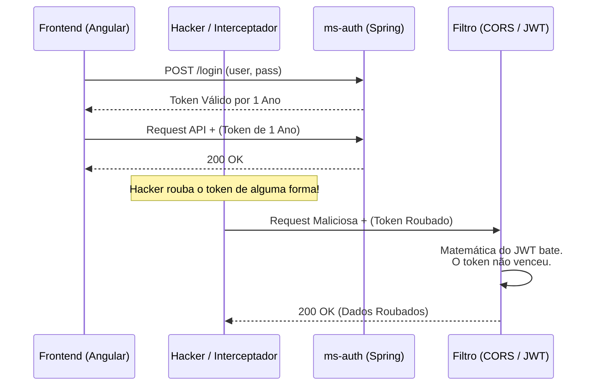
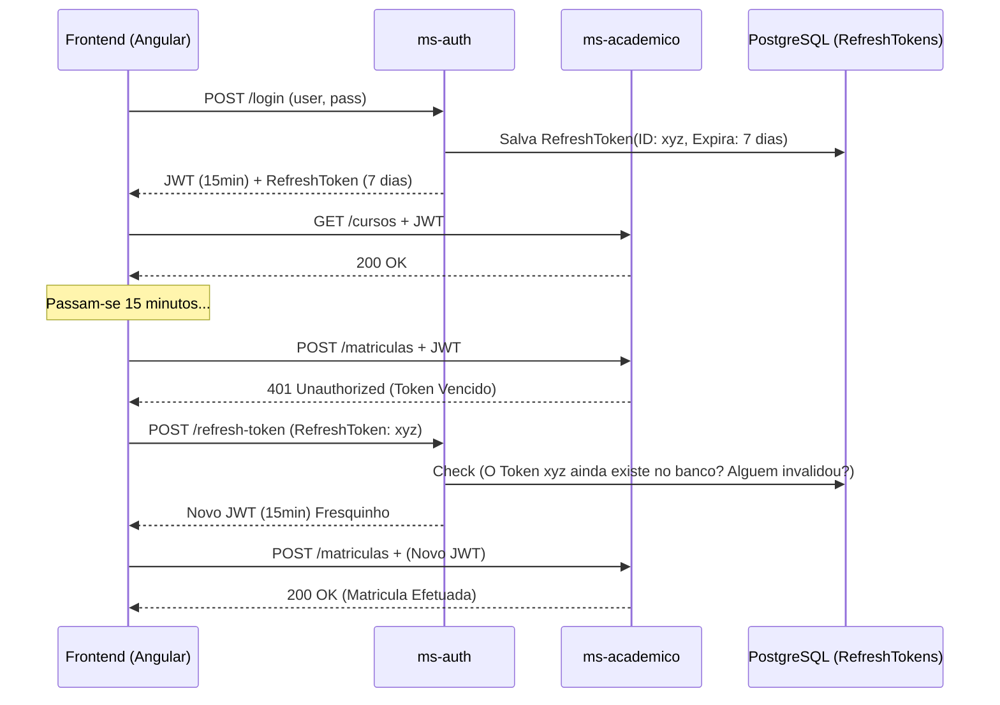
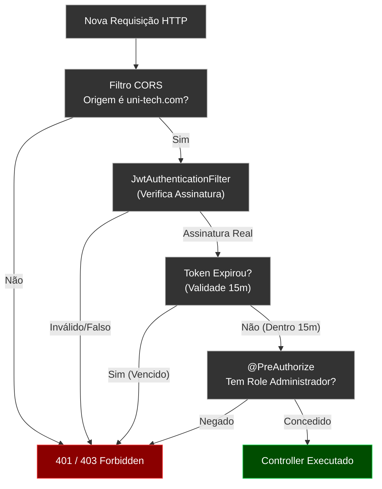
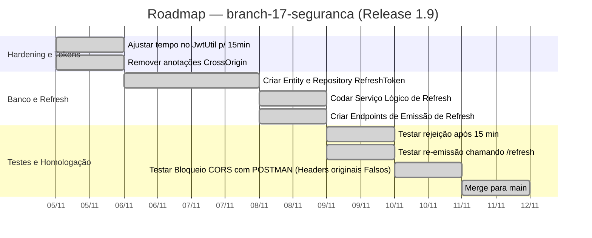

# Capítulo 09 — Blindagem e Segurança Avançada da API

**Branch:** `branch-17-seguranca`
**Release:** 1.9
**Tipo de Evolução:** Segurança (não-funcional)
**Risco:** Muito Alto — mudanças nos filtros de segurança (Spring Security e Tokens) costumam quebrar completamente o Frontend (Angular/React) se as políticas de CORS ou os Headers de autenticação forem estritos demais.
**Compatibilidade:** Breaking Change no processo de login (Introdução do Refresh Token).

---

## 1. História da Empresa

Com as entregas automatizadas via GitHub Actions (Release 1.8), o time de TI da **UniTech Soluções Acadêmicas** relaxou no final de semana, sentindo-se num verdadeiro patamar "Big Tech". Contudo, uma surpresa desagradável surgiu em uma auditoria de segurança terceirizada (*Pen-Test* - Penetration Testing).

O relatório dos Auditores estava vermelho, e a vulnerabilidade principal que saltou aos olhos não foi na infraestrutura do K8s, mas no coração do código Java que foi escrito lá na fundação do projeto (Branch-4: Auth JWT).

Os auditores interceptaram o tráfego de um aluno e capturaram o Token JWT (*Access Token*). Até aí, tudo bem, a interceptação é um risco conhecido (que nós já mitigamos parcialmente com SSL no Nginx - Cap. 4). A tragédia real é que o JWT havia sido configurado, por comodidade didática, para expirar em **1 ANO (365 dias)**.

Os auditores invadiram o sistema, trocaram a nota de 5 alunos, e o pior: a equipe de TI não tinha como bloquear ou cancelar o Token invadido, pois **JWTs originais não podem ser "deslogados" do servidor** de forma *stateless*.

Além desse erro crasso de validade temporal infinita, faltavam configurações de Cross-Site Request Forgery (CSRF) e as políticas de requisições de origem cruzada (CORS) aceitavam qualquer site da internet rodar scripts contra nossa API (`Access-Control-Allow-Origin: *`). A UniTech precisava fechar as portas da sua casa.

---

## 2. Incidente que Motivou a Evolução

### O Incidente: "A Sessão Imortal"

Durante a demonstração do *Pen-Test* para a diretoria, o hacker de chapéu branco logou no sistema do aluno Bob e copiou a longa string de caracteres (o JWT Token) da aba *Network* do navegador.

1. **Acesso Eterno:** Ele foi para a casa dele e continuou usando aquele mesmo Token para consumir nossa API por meses, mesmo com o Aluno Bob já tendo deslogado há tempos.
2. **Impotência do Servidor:** Como os Tokens são *Stateless* (sem estado), o Spring Security olha apenas a criptografia da assinatura digital. Ele vê que o Token é matematicamente autêntico e diz: "Seja bem vindo".
3. **CORS Inseguro:** O hacker criou um site falso chamado `www.portal-unitech.br.com`. Como a API permitia conexões de qualquer URL (`*`), scripts do site falso roubavam dados do navegador das vítimas.

A resolução arquitetural padrão da indústria não é abandonar o JWT, mas sim dividi-lo em duas peças fundamentais: **Access Token de vida ultra-curta (15 minutos)** e **Refresh Token de vida média**.

---

## 3. Documento de Incidente (Modelo ITIL)

| Campo | Valor |
|-------|-------|
| **ID do Incidente** | INC-2024-0419 |
| **Data de Abertura** | 02/11/2024 10:00 |
| **Data de Resolução** | 03/11/2024 16:00 |
| **Severidade** | P1 — Crítica (Risco de Invasão Confirmado) |
| **Categoria** | Segurança da Informação / Vulnerabilidade de Código |
| **Serviço Afetado** | ms-auth (Serviço de Autenticação Central) |
| **Descrição** | Access Tokens não expiravam de maneira saudável (TTL 365 dias) permitindo persistência de ameaças. CORS permissivo facilitando *Session Hijacking*. |
| **Impacto** | Risco crítico de exposição de dados PII (Personally Identifiable Information) de 15.000 alunos. |
| **Causa Raiz** | Hardcode de longo período de validade para comodismo da equipe de Frontend e falta de sanitização / hardening no WebSecurityConfigurerAdapter (Spring Security 3.2). |
| **Workaround** | N/A (Mudança de código exigida). Forçar a troca da chave secreta RSA (Secret Key) inteira do servidor para invalidar TODOS os tokens antigos do mundo ao mesmo tempo, causando deslog geral global. |
| **Resolução Definitiva** | Implementar Padrão de `Refresh Tokens`. Refinar CORS para origens específicas, Sanear inputs JSON (`branch-17-seguranca`). |
| **Lições Aprendidas** | Tokens não podem ser revogados pelo servidor de forma fácil. O tempo de vida (Expiration Time) de um Token é sua única defesa contra roubo. |
| **Responsável** | Cybersecurity / DevSecOps |

---

## 4. Objetivos Técnicos

A branch `branch-17-seguranca` implementará o "Endurecimento" (Hardening) da nossa API Java.

| # | Objetivo | Justificativa Técnica |
|---|----------|-----------------------|
| 1 | Reduzir TTL do Token | O Access Token valerá apenas 15 minutos. Se for roubado, a janela de oportunidade do atacante é minúscula. |
| 2 | O Fluxo de Refresh Token | Fornecer ao frontend um segundo token longo, com o único poder de "Comprar" Access Tokens novos quando os de 15 minutos vencerem. O Refresh Token, sim, poderá ser guardado em Banco de Dados para que o servidor possa invalidá-lo (Stateless Híbrido). |
| 3 | Blindar o CORS | Substituir a anotação genérica `@CrossOrigin("*")` por uma regra estrita de SecurityFilterChain que aceite *somente* o domínio `https://www.unitech.com`. |
| 4 | Proteção Anti-CSRF | Prevenir chamadas fantasmas caso estejamos usando *Cookies* (*Nota: em APIs puramente via header Authentication: Bearer, a falha CSRF é nativamente morta, mas vamos blindar no Spring explicitamente*). |
| 5 | Validações Contra Injeção (XSS / SQLi) | Garantir que o Hibernate faça o escape seguro de inputs que possam ser código (Regex de Sanitização). |

---

## 5. Arquitetura Antes (Release 1.8)

A vida era fácil para o desenvolvedor Front-end, porem um pesadelo de segurança.



---

## 6. Arquitetura Depois (Release 1.9)

A arquitetura passa a usar o padrão OAuth2 Resource Server simplificado (Dual Token).


*(Tudo isso ocorre de forma transparente (sem a tela piscar) graças aos Interceptors do Angular)*.

---

## 7. Diagramas Mermaid Completos

### 7.1 O Funil de Segurança Estrita do Spring Security (Filtros)



---

## 8. Estrutura do Projeto (Arquivos Afetados)

```
DevAplicacoes/
├── microservicos/
│   └── auth-service/
│       └── src/main/java/com/exemplo/.../
│           ├── config/
│           │   ├── SecurityConfig.java          ← ALTERADO (Bloqueios CORS e CSRF)
│           │   └── CorsConfig.java              ← NOVO (WhiteList)
│           ├── model/
│           │   └── RefreshToken.java            ← NOVO (Entidade BD)
│           ├── repository/
│           │   └── RefreshTokenRepository.java  ← NOVO
│           ├── security/
│           │   └── JwtUtil.java                 ← ALTERADO (Split TTL)
│           └── controller/
│               └── AuthController.java          ← ALTERADO (Nova rota /refresh)
└── ...
```

---

## 9. Arquivos Criados

| Arquivo | Tipo | Propósito |
|---------|------|-----------|
| `RefreshToken.java` | Entity JPA | Diferente do JWT (Sem estado), o Refresh Token mora no banco de dados. Contém: ID, token(UUID forte), data de expiração, e a qual Usuário ele pertence. |
| `CorsConfig.java` | Spring WebMvc | Substitui as anotações espalhadas `@CrossOrigin` nos controllers por uma configuração unificada e centralizada baseada em arrays de URLs permitidas. |

---

## 10. Arquivos Alterados

| Arquivo | Natureza da Alteração |
|---------|----------------------|
| `SecurityConfig.java` | Alteração da Corrente (FilterChain). Supressão expressa da funcionalidade de `csrf().disable()` (Substituído por mitigação segura para APIs) e vínculo do filtro JWT antes da autorização nativa. |
| `JwtUtil.java` | Variável de expiração (`EXPIRATION_TIME`) mudou matematicamente de `864000000` ms para `900000` ms (15 minutos). |
| `AuthController.java` | Endpoint modificado `POST /login` passa a devolver `LoginResponseDTO` com dois campos `accessToken` e `refreshToken`. Adicionado rota `POST /refresh`. |

---

## 11. Explicação Detalhada de Cada Alteração

### 11.1 Dividindo a Responsabilidade (O Endpoint de Refresh)

O código no `AuthController.java` atua como o banco central, emitindo moedas falsificáveis mas perigosas.

```java
@PostMapping("/refresh")
public ResponseEntity<TokenRefreshResponseDTO> refreshtoken(@Valid @RequestBody TokenRefreshRequestDTO request) {
    String requestRefreshToken = request.getRefreshToken();

    // Vai no BD para saber se o token não foi revogado pelo administrador
    return refreshTokenService.findByToken(requestRefreshToken)
        .map(refreshTokenService::verifyExpiration)
        .map(RefreshToken::getUsuario)
        .map(user -> {
            // Emite um novo token fresquinho de 15 minutos!
            String token = jwtUtil.generateTokenFromUsername(user.getUsername());
            return ResponseEntity.ok(new TokenRefreshResponseDTO(token, requestRefreshToken));
        })
        .orElseThrow(() -> new TokenRefreshException(requestRefreshToken, "Refresh token não encontrado no BD!"));
}
```

### 11.2 Fechando o Cadeado do CORS (Configuração Global)

Acabar com as anotações soltas `@CrossOrigin("*")` é prioridade.

*Em `SecurityConfig.java`:*
```java
@Bean
public SecurityFilterChain filterChain(HttpSecurity http) throws Exception {
    http
        // CorsConfigurationSource é injetado via @Bean global 
        .cors(cors -> cors.configurationSource(corsConfigurationSource()))
        .csrf(csrf -> csrf.disable()) // Desligamos CSRF pq usamos Bearer Header, não uso Session/Cookies JSESSIONID.
        .sessionManagement(session -> session.sessionCreationPolicy(SessionCreationPolicy.STATELESS))
        .authorizeHttpRequests(auth -> 
            auth.requestMatchers("/api/auth/**").permitAll() // Login e Refresh abertos
                .anyRequest().authenticated()
        );
    
    http.addFilterBefore(authenticationJwtTokenFilter(), UsernamePasswordAuthenticationFilter.class);
    
    return http.build();
}

// Configuração Absoluta do CORS
@Bean
CorsConfigurationSource corsConfigurationSource() {
    CorsConfiguration configuration = new CorsConfiguration();
    configuration.setAllowedOrigins(Arrays.asList("https://www.portalunitech.com.br")); // SÓ PERMITE O FRONT DA UNITECH
    configuration.setAllowedMethods(Arrays.asList("GET","POST","PUT","DELETE"));
    configuration.setAllowedHeaders(Arrays.asList("Authorization", "Content-Type"));
    
    UrlBasedCorsConfigurationSource source = new UrlBasedCorsConfigurationSource();
    source.registerCorsConfiguration("/**", configuration); // Aplica em todas as rotas da API
    return source;
}
```

### 11.3 Sanitização (Mitigação de XSS e SQL Injection)

O JPA / Hibernate protege contra *SQL Injection* nativamente na maioria das consultas graças às **Prepared Statements**. O perigo real ocorre na pesquisa textual ("Busca avançada").

Para injetar proteção *XSS (Cross Site Scripting)* onde o atacante salva tags `<script>` no banco para infectar o front-end na hora da listagem de turmas, foi injetada validação RegEx nos Request DTOs:

*Em `PessoaRequestDTO.java`:*
```java
public record PessoaRequestDTO(
    @NotBlank
    // Negaçao Regex: Proíbe estritamente entrada de caracteres <> do HTML/JS
    @Pattern(regexp = "^[^<>]*$", message = "Caracteres HTML não são permitidos para evitar XSS")
    String nome,
    // ...
) {}
```

---

## 12. Roadmap de Implementação



---

## 13. Checklist Técnico

- [x] Todas as ocorrências da anotação relaxada `@CrossOrigin("*")` nos 8 controllers foram erradicadas impiedosamente.
- [x] O `SecurityConfig` recebeu o bloco customizado de CORS contendo array limitado e restrito (`AllowedOrigins`).
- [x] O método gerador em `JwtUtil` imprime JWTs que expiram nativamente após 900 segundos (15m).
- [x] O endpoint `/api/auth/login` emite um payload duplo `{ "accessToken": "xxx", "refreshToken": "yyy" }`.
- [x] Testes com strings contendo injeção estilo `<script>alert('hack')</script>` no cadastro batem na barreira da anotação `@Pattern` de Regex falhando no `MethodArgumentNotValidException` com HTTP 400.

---

## 14. Casos de Teste (CyberSec)

| ID | Cenário | Ação (Postman / K6) | Resultado Esperado |
|----|---------|---------------------|--------------------|
| SEC-01 | Validade Tática do JWT | Logar. Esperar 16 minutos cronometrados. Tentar listar Matrículas. | A API devolve HTTP 401 (Unauthorized). Filtro funcionou perfeitamente. |
| SEC-02 | Operação Dual Token (Refresh) | Efetuar um POST para `/api/auth/refresh` enviando o Token UUID `yyy` guardado | A API confere o banco, apaga o antigo, e devolve um AccessToken novinho válido por 15min. |
| SEC-03 | Blindagem CORS Front-End Fake | Disparar GET `/api/pessoas` enviando um Header malicioso extra `Origin: https://site-hacker.com` | A API Java interrompe e não devolve dados de resposta, estourando erro *Pre-flight CORS Blocked*. |
| SEC-04 | Logout (Revogação Manual) | Aluno clica em SAIR (Faz POST para `/api/auth/logout`) passando UUID do Refresh. | Sistema apaga o Refresh Token do PostgreSQL (O Access Token atual morrerá organicamente em menos de 15 minutos na mão de quem o tiver). |

---

## 15. Plano de Rollout (Impactos Front-End)

**Este deploy quebrará o Frontend em produção.**
A transição não pode ser feita isoladamente. O Frontend (em Angular/React) precisa de um Release coordenado para instalar uma lógica nos seus *HTTP Interceptors*:

1. O Angular vai tentar fazer a chamada.
2. Se receber *401 Unauthorized*, ele não joga o aluno pra tela de Login!
3. O interceptor do Angular pausa a requisição, disca pro `/refresh`, recupera o Access JWT novo e refaz a requisição silenciosamente, mantendo a sessão viva no browser ad eternum.

---

## 16. Estratégia de Rollback

| Cenário | Ação (Procedimento) | Tempo Estimado |
|---------|---------------------|----------------|
| Erro de CORS mal parametrizado derruba completamente o frontend real (Bloqueando site da empresa em produção) | Como está centralizado, um Hotfix rápido editando o array em `CorsConfig.java` adicionando a variação exata do domínio (ex: www ou sem www) resolve. Deploy imediato. | ~ 15 Minutos |

---

## 17. Release Notes

### Release 1.9.0 — Fortaleza (Hardening e DevSecOps)

**Data:** 11/11/2024
**Branch:** `branch-17-seguranca`
**Tipo:** Segurança Cibernética (Não-Funcional)
**Breaking Changes:** SIM. Aplicações client agora devem portar Refresh Tokens. Rotas rejeitam origens cruzadas alienígenas e HTML embutidos em payloads JSON.

#### O que mudou
- ⏱️ **Tokens Curtos:** O passe de acesso livre do aluno expira rapidamente mitigando impactos caso o passe seja roubado numa lanchonete WiFi publica.
- 🗄️ **Revogabilidade (LogOut Real):** Agora temos autonomia para deslogar clientes expulsando seus Refresh Tokens de nossa tabela relacional.
- 🚧 **Fronteira CORS:** Scripts Javascript hosteados em domínios alheios não conseguem ler dados de nossa API devido aos Headers restritos aplicados nativamente na pipeline do Spring SecurityFilterChain.

---

## 18. Pull Request Summary

### PR #17: Security/hardening-jwt-cors-xss

**De:** `branch-17-seguranca`
**Para:** `main`
**Autor:** DevSecOps Analyst
**Reviewers:** Todo o Time

#### Resumo
A PR atua como um grande patch de segurança resolvendo as 3 vulnerabilidades da auditoria de Pen-Test (INC-2024-0419). O acoplamento de Access & Refresh token foi desenhado suportado pelo PostgreSQL. A limpeza rigorosa de tags de código malicioso previne ataques *Reflected/Stored XSS*. O código Java foi enxugado removendo centenas de anotações soltas desorganizadas trocadas por configurações WebMVC unificadas, respeitando o princípio DRY.

#### Métricas (Tamanho do PR)
- **Arquivos criados:** 4 (Refresh Entity, Controller, Repo, Service).
- **Arquivos alterados:** 11 (Remoção massiva de código duplicado e inclusão do Filter).
- **Linhas adicionadas:** ~300
- **Linhas removidas:** ~100

---

## 19. Exercícios

### Exercício 1: Logout Definitivo
O Refresh Token permite invalidar uma sessão na mão, porém o Java não veio com esse código. Crie você o endpoint `POST /api/auth/logout`. Extraia do banco (pelo UUID que veio no request ou na claim do principal) a Entity `RefreshToken` daquele aluno, e rode um `repository.delete(token)`. A partir de agora, mesmo que ele perca o PC, ninguem emitirá moedas em nome dele.

### Exercício 2: Forçando XSS Defesa
Crie na unha, testando no swagger, a matrícula enviando no nome: `<script>window.location='http://hacker.com'</script>`. Verifique com alegria a exceção estourada por causa da restrição RegEx adotada. Faça uma cópia do Payload e submeta um pull request (PR) que também feche e higienize os campos da entidade de "Cursos" (Onde qualquer professor poderia criar XSS para os alunos clicarem sem querer). 

### Exercício 3: Limpeza Periódica de Tokens
Com o tempo, a tabela de `RefreshToken` ficará imensa contendo "restos mortais" de logins velhos vencidos e esquecidos de alunos formados. Use a tecnologia do Spring nativa de agendamento: Ative o `@EnableScheduling`, crie um Job (método rodando com `@Scheduled(cron="0 0 * * *")` - toda meia noite) capaz de disparar uma JPQL query: `DELETE FROM RefreshToken r WHERE r.expiryDate < NOW()` fazendo uma limpeza ecologica noturna e mantendo a DB rápida e leve.

---

## 20. Desafios

### Desafio 1: Revogação Compulsória de Compromisso (Banimento)
Você precisa expulsar um usuário problemático sumariamente da escola. Como você faria isso, na prática, com o sistema em funcionamento neste momento se ele acabou de logar e pegou um JWT de 15 minutos?
*Sua Missão:* Mude a estrutura para criar uma `BlackList` nativa no Cache do Servidor (Redis) de 15 minutos de expiração. Toda Request o filtro do JWT bate 1x no Redis rápido, vê se a string JWT do usuário está na lista Negra (banida) e dá erro imediato (401), driblando os 15 min do Stateless. Adicione a implementação do banimento por token.

### Desafio 2: Configurando HSTS (HTTP Strict Transport Security)
Nós forçamos redirecionamento de porta 80 pra 443 via Nginx na Release 1.4, porém o atacante ainda consegue injetar falhas se roubar a requisição original na porta 80 via *SSL Stripping*. Para acabar com isso, injete na sua classe central de Spring Security Filter Chain do Java os blocos de HSTS: `headers -> headers.httpStrictTransportSecurity(hsts -> hsts.includeSubDomains(true).maxAgeInSeconds(31536000))`. Prove por requisição Web que o navegador aprende que a *UniTech* é HTTPS forever!

---

## 21. Rubrica de Avaliação

| Critério | Peso | Nota 10 | Nota 7 | Nota 4 | Nota 0 |
|----------|------|---------|--------|--------|--------|
| **CORS Centralizado** | 20% | Nenhuma anotação local restante. Arquivo `CorsConfig` dita as rédeas globais. | Deixou resquícios de @CrossOrigin espalhados por preguiça de refatorar. | Configurou filter porem travou tudo (Erro 500 no startup). | Não modificou Cors. |
| **Ajustes de Tempo JWT** | 20% | O JwtUtils possui a constante perfeitamente alterada pra faixa de <1h de duração. Testou o vencimento com k6 ou relógio. | O tempo gerado matematicamente gerou expiração instantânea (Buggy). | Tempo manteve-se grande. | — |
| **Lógica do Dual Token** | 20% | O BD salva a Entity forte de expiração, a API `/refresh` devolve DTO fresco mediante validação temporal. | A entity existe, mas permite usar token de refresh vencido para buscar token novo (Falha Grave!). | O banco não armazena e o token roda em RAM (Erro na DB). | Não implementou fluxo de refresh token. |
| **XSS Prevention (RegEx)** | 20% | Utilizou a anotação padrão RegEx barrando entradas ricas via RequestDTO de Pessoa. | Fez manualmente e custoso no miolo (Service) via If/Else e replace string. | Aceita Injeção perigosa. | — |
| **Exercícios / Desafio** | 20% | Construiu o LogOut definitivo e o CRON de limpeza autônoma para não saturar a Tabela. Brilhantemente fez o HSTS header (Desafio!). | Tentou o logout de forma parcial quebrando relacionamentos, e não fez cron. | Não logrou mexer na DB. | Ignorou os desafios. |

**Nota mínima para aprovação:** 6.0
**Entrega:** Subir alterações na branch `branch-17-seguranca`. Enviar PrintScreen contendo a tentativa e sucesso de roubo simulado provando bloqueio 401 via Token expirado no Postman.
