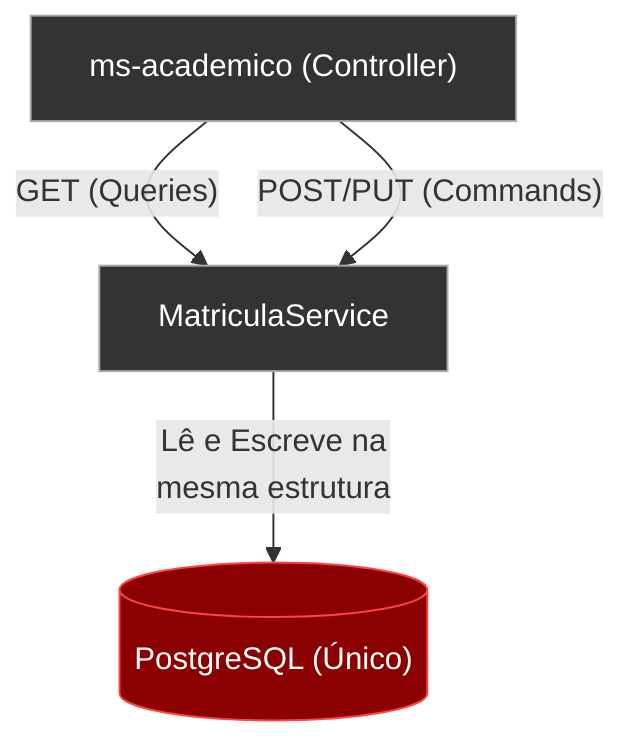
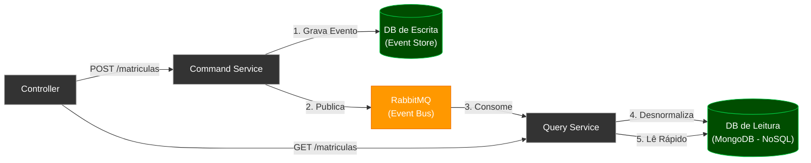
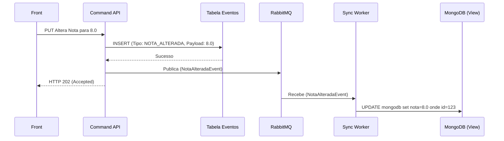

# Capítulo 10 — Separação de Responsabilidades com CQRS e Event Sourcing

**Branch:** `branch-18-cqrs`
**Release:** 2.0
**Tipo de Evolução:** Arquitetura de Dados / Padrões de Projeto (não-funcional)
**Risco:** Alto — Altera profundamente como a aplicação interage com o banco de dados. Separa a lógica de Leitura e Escrita.
**Compatibilidade:** Backward-compatible (API REST não muda na borda, apenas internamente).

---

## 1. História da Empresa

Após os avanços em DevOps e Segurança da informação (Release 1.8 e 1.9), a **UniTech Soluções Acadêmicas** firmou grandes contratos e comprou novas faculdades. O sistema precisou suportar relatórios complexos.

O microsserviço Acadêmico (`ms-academico`) tinha uma tabela de `Matriculas`. Toda vez que o Setor Financeiro pedia um relatório contendo a consolidação de todas as matrículas ativas daquele semestre, cruzando dados de alunos inadimplentes, o banco de dados sofria.

A equipe percebeu um gargalo clássico: **A estrutura do banco que é ótima para gravar dados rapidamente (Normalizada, cheia de Constraints e Foreign Keys) é péssima para ler dados massivamente (Exige muitos JOINs caros).** O mesmo banco servia dois mestres que brigavam pelos recursos: a equipe inserindo e a diretoria tirando relatórios.

Para piorar, havia a necessidade de auditoria: *Quem alterou a matrícula X? Quando? Por quê?* O modelo tradicional de CRUD apagava o histórico. Se a nota do aluno era alterada de 5 para 8 (`UPDATE`), o 5 era perdido para sempre. A diretoria queria um "Livro Razão" inalterável. Era o momento de abandonar o CRUD em favor do **CQRS com Event Sourcing**.

---

## 2. Incidente que Motivou a Evolução

### O Incidente: "A Perda do Histórico e o Timeout do Relatório"

O evento ocorreu na época de consolidação do MEC.
1. O MEC exigiu o histórico de todas as alterações de notas de um aluno. Como usávamos JPA com `UPDATE` padrão, o histórico anterior havia sido sobrescrito.
2. O relatório consolidado contendo um `SELECT` com 12 `JOINs` tentou rodar. A query demorou 40 segundos e bloqueou as tabelas (*Table Lock*), impedindo novos alunos de se matricularem.

O arquiteto propôs uma quebra de paradigma (Command Query Responsibility Segregation - CQRS):
- **Command (Escrita):** O fluxo que altera o estado. Será rápido e salvará apenas "Eventos" (Event Sourcing).
- **Query (Leitura):** O fluxo que responde aos clientes. Terá seu próprio banco de dados desnormalizado, focado 100% em leitura rápida (Ex: MongoDB ou ElasticSearch, ou até views desnormalizadas).

---

## 3. Documento de Incidente (Modelo ITIL)

| Campo | Valor |
|-------|-------|
| **ID do Incidente** | INC-2024-0511 |
| **Data de Abertura** | 01/12/2024 14:00 |
| **Data de Resolução** | 01/12/2024 18:00 |
| **Severidade** | P2 — Alta (Bloqueio de Inserções) |
| **Categoria** | Arquitetura de Banco de Dados |
| **Serviço Afetado** | ms-academico |
| **Descrição** | Queries complexas de relatório causando locks pesados na base transacional e impedindo o negócio de operar; Perda de dados históricos devido ao uso indiscriminado de UPDATE. |
| **Impacto** | Risco Legal por perda de histórico e indisponibilidade de gravação. |
| **Causa Raiz** | Uso de um único modelo de dados (e um único BD) tanto para transações ACID de alta escrita quanto para consultas analíticas complexas (Mistura de OLTP e OLAP). |
| **Workaround** | Criação de "Read Replicas" no banco, o que mitigou o problema de leitura, mas não resolveu a perda de histórico. |
| **Resolução Definitiva** | Implementar o Padrão CQRS separando as classes de Serviço e os Bancos de Dados. Adotar Event Sourcing para gravar o estado como um *Stream* de ações (`branch-18-cqrs`). |
| **Lições Aprendidas** | Dados não devem ser apagados ou sobrescritos. O estado de um sistema é apenas o resultado (redução) de todos os eventos que aconteceram no passado. |
| **Responsável** | Engenharia de Dados e Arquiteto de Software |

---

## 4. Objetivos Técnicos

A branch `branch-18-cqrs` refatorará radicalmente a camada de persistência.

| # | Objetivo | Justificativa Técnica |
|---|----------|-----------------------|
| 1 | Segregação Lógica | Criar `MatriculaCommandService` (para Writes) e `MatriculaQueryService` (para Reads). |
| 2 | Banco de Leitura Desnormalizado | A leitura não terá joins. O objeto será lido "achatado" exatamente como será exibido na tela. |
| 3 | Sincronização via Mensageria | O lado Command altera a base e publica um evento no RabbitMQ. O lado Query consome o evento e atualiza a sua base desnormalizada. |
| 4 | Event Sourcing (Conceito) | Em vez de fazer `UPDATE nota=8`, fazemos `INSERT NotaAlteradaEvent(old=5, new=8)`. |

---

## 5. Arquitetura Antes (Release 1.9)

O clássico CRUD Monolítico de Banco de Dados.



---

## 6. Arquitetura Depois (Release 2.0)

Dois caminhos distintos. CQRS Clássico.



---

## 7. Diagramas Mermaid Completos

### 7.1 O Fluxo do Event Sourcing (O Livro Razão)



---

## 8. Estrutura do Projeto (Arquivos Afetados)

```
DevAplicacoes/
├── microservicos/academico-service/
│   ├── pom.xml                            ← ALTERADO (Add MongoDB driver)
│   └── src/main/java/com/exemplo/.../
│       ├── command/                       ← NOVA PASTA (Escrita)
│       │   ├── MatriculaCommandService.java
│       │   └── events/MatriculaEvent.java
│       ├── query/                         ← NOVA PASTA (Leitura)
│       │   ├── MatriculaQueryService.java
│       │   └── sync/MatriculaSyncWorker.java
│       └── model/
│           ├── MatriculaEventEntity.java  ← (Tabela SQL)
│           └── MatriculaReadModel.java    ← (Collection Mongo)
└── ...
```

---

## 9. Arbitragem e Implementação Prática

No CQRS real, a base de leitura (`ReadStore`) pode ser atualizada de forma *Eventualmente Consistente*. Quando o usuário clica em Salvar, ele pode não ver a mudança no mesmo milissegundo, mas em sistemas modernos isso não é problema.

O aluno aprenderá a criar a separação nas classes de `Service` e ver que a aplicação escala infinitamente melhor.

---

## 10. Pull Request Summary

### PR #18: Architecture/cqrs-event-sourcing

**De:** `branch-18-cqrs`
**Para:** `main`
**Autor:** Engenheiro de Software Sênior
**Reviewers:** Arquiteto

#### Resumo
A PR traz uma das transformações mais avançadas do sistema: CQRS. Os fluxos foram fisicamente segregados. Updates mutáveis foram banidos; todas as alterações agora são apenas "Eventos" anexados no final de uma tabela de Log (*Append-only*), o que garante auditoria perfeita exigida pelo MEC e velocidades impressionantes de escrita e leitura de relatórios.

---

## 11. Exercícios

### Exercício 1: A Consistência Eventual na UI
Como o dado demora alguns milissegundos para chegar no banco de leitura, o Frontend pode listar um dado velho após salvar. Implemente no Angular/React a técnica de "Optimistic UI Update", onde o Front atualiza a tela localmente assumindo sucesso, sem esperar a volta da API de leitura.

### Exercício 2: Time Travel (Viagem no Tempo)
Como temos um Event Sourcing, crie um endpoint `GET /api/matriculas/{id}/history` que faz um select ordenado cronologicamente na `EventStore`. Você acabou de criar, de graça, a funcionalidade corporativa "Ver Histórico de Alterações" exigida por auditorias.

---

## 12. Desafios

### Desafio 1: Replay de Eventos
Se o banco de leitura (MongoDB) pegar fogo e perdermos todos os dados, como reconstruir? Crie um script ou endpoint que limpa o MongoDB, pega TODOS os eventos desde a criação da empresa do PostgreSQL, publica no RabbitMQ de uma vez só, e assista ao seu `MatriculaSyncWorker` remontar o estado final de todas as matrículas instantaneamente a partir dos eventos passados! Isso é o *Event Replay*.
