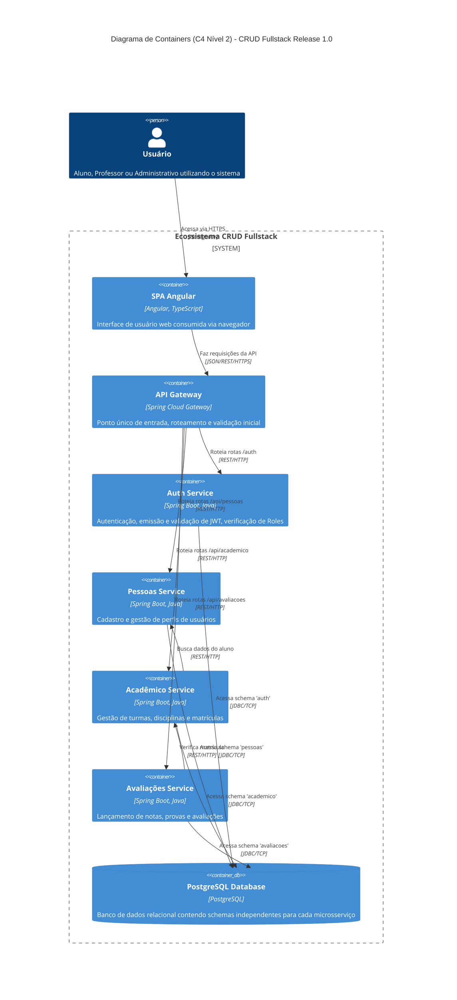

# Livro de Evolução de Software: CRUD Fullstack

## Introdução

Bem-vindo ao Livro de Evolução de Software do projeto **CRUD Fullstack**. Este documento foi criado com rigor técnico voltado para Engenharia de Software e Arquitetura de Soluções Corporativas. O objetivo é registrar, de forma profunda e justificada, cada decisão arquitetural que transformou um sistema baseado em microsserviços simples (Release 1.0) em uma plataforma escalável, observável, resiliente e impulsionada por Inteligência Artificial (Release 4.0).

Este material servirá como o guia para nós nessa disciplina de Desenvolvimento de Aplicações, demonstrando na prática como incidentes em produção motivam a evolução tecnológica.

---

## Roadmap e Diagrama de Evolução

A jornada arquitetural deste projeto passará por 4 grandes Releases, subdivididas em branches, cada uma atacando um problema específico de engenharia.

```mermaid
flowchart TD
    %% Estilos
    classDef release fill:#2b2b2b,stroke:#00f0ff,stroke-width:2px,color:#fff,font-weight:bold;
    classDef branch fill:#1c1c1c,stroke:#fff,stroke-width:1px,color:#ddd;
    classDef baseline fill:#003f5c,stroke:#fff,stroke-width:2px,color:#fff;

    %% Nós de Release
    R1[Baseline: Release 1.0<br/>Microsserviços REST Básico]:::baseline
    R1_1[Release 1.1<br/>Refatoração e Clean Arch]:::release
    R1_2[Release 1.2<br/>Performance e Tuning]:::release
    R1_3[Release 1.3<br/>Observabilidade]:::release
    R1_4[Release 1.4<br/>Proxy Reverso Nginx]:::release
    R1_5[Release 1.5<br/>Cache Distribuído]:::release
    R2_0[Release 2.0<br/>Mensageria Assíncrona]:::release
    R2_1[Release 2.1<br/>Resiliência e Chaos]:::release
    R2_2[Release 2.2<br/>Automação CI/CD]:::release
    R3_0[Release 3.0<br/>Kubernetes K8s]:::release
    R3_1[Release 3.1<br/>Event-Driven Arch EDA]:::release
    R4_0[Release 4.0<br/>Inteligência Artificial RAG]:::release

    %% Nós de Branch
    B9(branch-9-refatoracao):::branch
    B10(branch-10-performance):::branch
    B11(branch-11-observabilidade):::branch
    B12(branch-12-nginx):::branch
    B13(branch-13-cache):::branch
    B14(branch-14-mensageria):::branch
    B15(branch-15-resiliencia):::branch
    B16(branch-16-ci-cd):::branch
    B17(branch-17-kubernetes):::branch
    B18(branch-18-event-driven):::branch
    B19(branch-19-inteligencia-artificial):::branch

    %% Conexões
    R1 --> B9 --> R1_1
    R1_1 --> B10 --> R1_2
    R1_2 --> B11 --> R1_3
    R1_3 --> B12 --> R1_4
    R1_4 --> B13 --> R1_5
    R1_5 --> B14 --> R2_0
    R2_0 --> B15 --> R2_1
    R2_1 --> B16 --> R2_2
    R2_2 --> B17 --> R3_0
    R3_0 --> B18 --> R3_1
    R3_1 --> B19 --> R4_0
```

---

## Por que cada evolução existe?

Nenhuma tecnologia é adicionada por capricho. Cada branch nasce de um **incidente real em produção**, uma **métrica que ultrapassa o aceitável** ou uma **necessidade do negócio** que a arquitetura atual não consegue atender. O diagrama abaixo mapeia visualmente o problema que motivou cada evolução e a solução arquitetural adotada.

```mermaid
flowchart LR
    classDef problem fill:#8b0000,stroke:#ff4444,stroke-width:2px,color:#fff,font-weight:bold;
    classDef solution fill:#004d00,stroke:#00cc44,stroke-width:2px,color:#fff,font-weight:bold;
    classDef arrow stroke:#ffcc00,stroke-width:2px;

    subgraph R1_1["Release 1.1 — Refatoração"]
        P1["🔴 PROBLEMA<br/>Código acoplado, Controllers<br/>com lógica de negócio,<br/>entidades JPA expostas<br/>nas respostas REST"]:::problem
        S1["🟢 SOLUÇÃO<br/>DTOs, Mappers, SOLID,<br/>Controller Advice,<br/>Arquitetura Limpa"]:::solution
        P1 -->|"Dívida técnica<br/>insustentável"| S1
    end

    subgraph R1_2["Release 1.2 — Performance"]
        P2["🔴 PROBLEMA<br/>Período de matrículas:<br/>4x mais usuários,<br/>respostas acima de 5s,<br/>timeouts frequentes"]:::problem
        S2["🟢 SOLUÇÃO<br/>Testes de carga k6,<br/>tuning de pool JDBC,<br/>índices SQL, paginação,<br/>otimização de queries"]:::solution
        P2 -->|"Degradação<br/>mensurável"| S2
    end

    subgraph R1_3["Release 1.3 — Observabilidade"]
        P3["🔴 PROBLEMA<br/>Incidentes sem causa raiz,<br/>MTTR alto, equipe<br/>apagando incêndio<br/>sem visibilidade"]:::problem
        S3["🟢 SOLUÇÃO<br/>Actuator, Micrometer,<br/>Prometheus, Grafana,<br/>Dashboards, Alertas"]:::solution
        P3 -->|"Operação<br/>às cegas"| S3
    end

    subgraph R1_4["Release 1.4 — Nginx"]
        P4["🔴 PROBLEMA<br/>Gateway exposto na internet,<br/>frontend sem servidor web,<br/>sem compressão, sem TLS<br/>centralizado, sem cache HTTP"]:::problem
        S4["🟢 SOLUÇÃO<br/>Nginx como Reverse Proxy,<br/>servir SPA, Gzip,<br/>cache estático,<br/>headers de segurança"]:::solution
        P4 -->|"Exposição<br/>e ineficiência"| S4
    end

    subgraph R1_5["Release 1.5 — Cache"]
        P5["🔴 PROBLEMA<br/>Consultas repetidas ao banco,<br/>dados de catálogo lidos<br/>milhares de vezes sem<br/>alteração, latência alta"]:::problem
        S5["🟢 SOLUÇÃO<br/>Redis, Cache Aside,<br/>TTL, políticas de<br/>Eviction, cache<br/>distribuído"]:::solution
        P5 -->|"Banco<br/>sobrecarregado"| S5
    end

    subgraph R2_0["Release 2.0 — Mensageria"]
        P6["🔴 PROBLEMA<br/>Chamadas síncronas bloqueantes,<br/>envio de email trava a request,<br/>acoplamento temporal entre<br/>microsserviços"]:::problem
        S6["🟢 SOLUÇÃO<br/>RabbitMQ, filas,<br/>eventos assíncronos,<br/>DLQ, retry,<br/>notificações"]:::solution
        P6 -->|"Acoplamento<br/>temporal"| S6
    end

    subgraph R2_1["Release 2.1 — Resiliência"]
        P7["🔴 PROBLEMA<br/>Falha em um microsserviço<br/>derruba todos os outros,<br/>efeito cascata, sem<br/>fallback, sem isolamento"]:::problem
        S7["🟢 SOLUÇÃO<br/>Circuit Breaker, Retry,<br/>Bulkhead, Fallback,<br/>Rate Limiter,<br/>Chaos Engineering"]:::solution
        P7 -->|"Falha<br/>em cascata"| S7
    end

    subgraph R2_2["Release 2.2 — CI/CD"]
        P8["🔴 PROBLEMA<br/>Deploy manual propenso a erro,<br/>sem análise estática,<br/>vulnerabilidades desconhecidas,<br/>releases demoram dias"]:::problem
        S8["🟢 SOLUÇÃO<br/>GitHub Actions, SonarQube,<br/>OWASP, Docker Hub,<br/>deploy automatizado,<br/>SemVer"]:::solution
        P8 -->|"Processo<br/>artesanal"| S8
    end

    subgraph R3_0["Release 3.0 — Kubernetes"]
        P9["🔴 PROBLEMA<br/>Docker Compose não escala,<br/>sem auto-scaling, sem<br/>self-healing, rolling update<br/>manual, downtime em deploy"]:::problem
        S9["🟢 SOLUÇÃO<br/>K8s: Pods, Deployments,<br/>Services, Ingress, HPA,<br/>Rolling Update,<br/>Blue/Green, Canary"]:::solution
        P9 -->|"Infraestrutura<br/>não elástica"| S9
    end

    subgraph R3_1["Release 3.1 — Event-Driven"]
        P10["🔴 PROBLEMA<br/>Transações distribuídas falham,<br/>consistência eventual não<br/>gerenciada, perda de eventos,<br/>queries complexas cruzando serviços"]:::problem
        S10["🟢 SOLUÇÃO<br/>Kafka, Saga, Outbox,<br/>CQRS, introdução a<br/>Event Sourcing"]:::solution
        P10 -->|"Consistência<br/>quebrada"| S10
    end

    subgraph R4_0["Release 4.0 — IA"]
        P11["🔴 PROBLEMA<br/>Professores gastam horas<br/>criando planos de ensino,<br/>busca por conteúdo é<br/>keyword-based e limitada"]:::problem
        S11["🟢 SOLUÇÃO<br/>RAG, Embeddings,<br/>Busca Semântica,<br/>LLM Local, Assistente<br/>para professores"]:::solution
        P11 -->|"Produtividade<br/>docente"| S11
    end
```

### Narrativa de Causalidade

A tabela abaixo resume, de forma objetiva, a cadeia causal que justifica cada evolução:

| Release | Branch | Problema em Produção | Métrica Crítica | Solução Adotada | Tecnologias |
|---------|--------|---------------------|-----------------|-----------------|-------------|
| **1.1** | `branch-9` | Código acoplado, Controllers fazendo tudo, entidades JPA expostas na API | Tempo de onboarding de novos devs > 2 semanas; bugs por acoplamento | Refatoração para Arquitetura Limpa | DTO, MapStruct, Bean Validation, ControllerAdvice |
| **1.2** | `branch-10` | Período de matrículas quadruplicou a carga | p95 latência > 5s; throughput < 50 req/s; CPU > 90% | Otimização de performance guiada por testes de carga | k6, índices SQL, pool tuning, paginação |
| **1.3** | `branch-11` | Incidentes sem causa raiz identificável; MTTR > 4h | Tempo médio de detecção > 30min; zero dashboards | Observabilidade end-to-end | Actuator, Micrometer, Prometheus, Grafana |
| **1.4** | `branch-12` | Gateway Java exposto diretamente na internet; frontend sem servidor web | Zero cache HTTP; sem compressão; sem TLS centralizado | Proxy reverso como camada de borda | Nginx, Gzip, Cache-Control, Security Headers |
| **1.5** | `branch-13` | Consultas idênticas ao banco repetidas milhares de vezes/minuto | Hit ratio 0%; latência de leitura > 200ms para dados estáticos | Cache distribuído | Redis, Cache Aside, TTL, Eviction |
| **2.0** | `branch-14` | Envio de email e notificação bloqueiam a thread da request HTTP | p99 de rotas com email > 8s; usuários recebem timeout | Comunicação assíncrona via mensageria | RabbitMQ, Dead Letter Queue, Retry |
| **2.1** | `branch-15` | Falha no `ms-pessoas` derruba `ms-academico` e `ms-avaliacoes` em cascata | Disponibilidade < 95% durante falhas parciais | Padrões de resiliência e isolamento de falhas | Resilience4j, Circuit Breaker, Bulkhead, Chaos |
| **2.2** | `branch-16` | Deploy manual leva 2 dias; bugs chegam a produção sem análise | Zero cobertura de análise estática; 3 incidentes por vulnerabilidade | Pipeline automatizado com quality gates | GitHub Actions, SonarQube, OWASP, SemVer |
| **3.0** | `branch-17` | Docker Compose não escala horizontalmente; downtime em cada deploy | Zero auto-scaling; MTTR de restart > 5min; downtime em deploy | Orquestração de containers com Kubernetes | K8s, HPA, Rolling Update, Blue/Green, Canary |
| **3.1** | `branch-18` | Transações distribuídas falham silenciosamente; dados inconsistentes entre serviços | Taxa de inconsistência > 2% em operações cross-service | Arquitetura orientada a eventos | Kafka, Saga, Outbox, CQRS, Event Sourcing |
| **4.0** | `branch-19` | Professores gastam 4h+ por plano de ensino; busca por conteúdo é ineficaz | Satisfação docente < 60%; busca retorna resultados irrelevantes | Assistente de IA com busca semântica | RAG, Embeddings, LLM Local, Spring AI |

---

## Arquitetura Inicial (Release 1.0)

A aplicação encontra-se publicada em produção na sua Release 1.0, o resultado do _merge_ das branches 1 a 8. Ela é plenamente funcional e atende milhares de usuários com as seguintes características técnicas:

### Componentes Tecnológicos Base
- **Frontend:** Single Page Application (SPA) desenvolvida em **Angular**.
- **API Gateway:** **Spring Cloud Gateway**, responsável por centralizar o tráfego HTTP, rotear chamadas e tratar _Cross-Origin Resource Sharing_ (CORS).
- **Backend (Microsserviços):** 
  - `ms-auth`: Gerenciamento de Identidade, Login e emissão de tokens JWT.
  - `ms-pessoas`: Gerenciamento de usuários (Alunos, Professores, Administrativo).
  - `ms-academico`: Gerenciamento de disciplinas, turmas e matrículas.
  - `ms-avaliacoes`: Lançamento de notas e feedbacks.
- **Segurança:** Autenticação via **JWT** (JSON Web Token) e Autorização baseada em Roles (RBAC).
- **Documentação:** **OpenAPI** / Swagger configurado em todos os serviços.
- **Banco de Dados:** **PostgreSQL** rodando em container. Para garantir independência (isolamento de dados) e evitar acoplamento no nível do banco, utilizamos o padrão _Database-per-Service_ lógico: cada microsserviço possui e acessa unicamente seu próprio _schema_ isolado no PostgreSQL.
- **Infraestrutura:** Orquestração local de containers utilizando **Docker Compose**.
- **Comunicação:** Chamadas estritamente síncronas utilizando **REST** (HTTP/1.1) sobre a rede interna do Docker.

### C4 Model - Nível 2 (Container Diagram) - Release 1.0

O diagrama abaixo ilustra a visão de containers do sistema neste momento exato, antes de qualquer evolução ser aplicada.

---

## Índice de Capítulos

Conforme as necessidades do negócio evoluem e problemas operacionais (incidentes) ocorrem em produção, novas decisões arquiteturais são tomadas. Acesse os capítulos abaixo para estudar a fundo cada evolução.

- [Capítulo 01: Refatoração, Padronização e Arquitetura Limpa](capitulo_01_refatoracao.md) (Em breve)
- [Capítulo 02: Performance e Testes de Carga](capitulo_02_performance.md) (Em breve)
- [Capítulo 03: Observabilidade Corporativa](capitulo_03_observabilidade.md) (Em breve)
- [Capítulo 04: Proxy Reverso e Gateway com Nginx](capitulo_04_nginx.md) (Em breve)
- [Capítulo 05: Estratégias de Cache com Redis](capitulo_05_cache.md) (Em breve)
- [Capítulo 06: Mensageria Assíncrona com RabbitMQ](capitulo_06_mensageria.md) (Em breve)
- [Capítulo 07: Padrões de Resiliência e Chaos Engineering](capitulo_07_resiliencia.md) (Em breve)
- [Capítulo 08: Automação Total com CI/CD Pipelines](capitulo_08_ci_cd.md) (Em breve)
- [Capítulo 09: Orquestração e Escalabilidade com Kubernetes](capitulo_09_kubernetes.md) (Em breve)
- [Capítulo 10: Event-Driven Architecture, Saga e CQRS](capitulo_10_event_driven.md) (Em breve)
- [Capítulo 11: Integração de Inteligência Artificial e RAG](capitulo_11_inteligencia_artificial.md) (Em breve)
